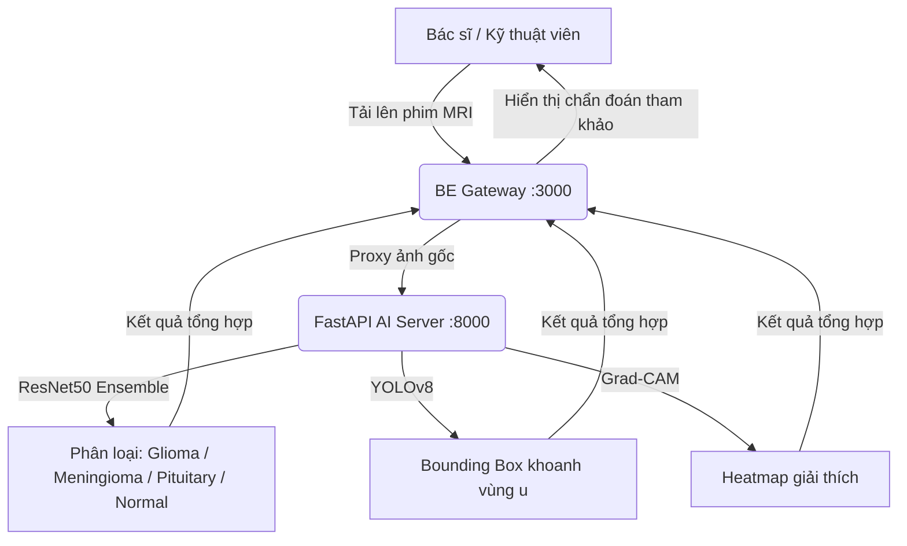

# 🧠 NeuroScan AI — Hệ Thống Quản Lý Y Tế Thông Minh

> Nền tảng y tế tích hợp **PACS đám mây**, **bệnh án điện tử (EMR)** và **AI chẩn đoán u não** với trợ lý RAG Chatbot y đức. Tuân thủ **HIPAA** và **Nghị định 13/2023/NĐ-CP** về bảo vệ dữ liệu cá nhân.

---

## 📋 Mục Lục

- [Tổng Quan Kiến Trúc](#-tổng-quan-kiến-trúc)
- [Cấu Trúc Thư Mục](#-cấu-trúc-thư-mục)
- [Công Nghệ Sử Dụng](#-công-nghệ-sử-dụng)
- [Hướng Dẫn Cài Đặt](#-hướng-dẫn-cài-đặt)
- [Hướng Dẫn Khởi Chạy](#-hướng-dẫn-khởi-chạy)
- [Luồng Hoạt Động](#-luồng-hoạt-động)
- [Phân Quyền 6 Vai Trò](#-phân-quyền-6-vai-trò)
- [Tài Khoản Test](#-tài-khoản-test)
- [Kịch Bản Test Trọng Tâm](#-kịch-bản-test-trọng-tâm)
- [Bảo Mật & Tuân Thủ Pháp Lý](#-bảo-mật--tuân-thủ-pháp-lý)
- [Tài Liệu Tham Khảo](#-tài-liệu-tham-khảo)

---

## 🏗️ Tổng Quan Kiến Trúc

```
┌─────────────────────────────────────────────────────────────────┐
│                        CLIENT (FE)                              │
│         Expo React Native Web  ·  http://localhost:8083         │
└──────────────────────────┬──────────────────────────────────────┘
                           │ REST API
┌──────────────────────────▼──────────────────────────────────────┐
│                  API GATEWAY (BE)                               │
│        Node.js Express  ·  http://localhost:3000                │
│   JWT Auth · RBAC 6 roles · Audit Log · MongoDB                 │
└────────────┬───────────────────────────┬────────────────────────┘
             │ HTTP Proxy                │ Firebase Storage
┌────────────▼────────────┐   ┌──────────▼──────────────────────┐
│   AI SERVER (FastAPI)   │   │     Firebase / MongoDB Atlas     │
│   http://localhost:8000  │   │   Cloud Storage · PACS Images   │
│  Ensemble DL · YOLOv8  │   └─────────────────────────────────┘
│  Gemini Vision · RAG    │
└─────────────────────────┘
```

---

## 📂 Cấu Trúc Thư Mục

```
team5/
├── BE/                          # Node.js Express API Gateway
│   ├── src/
│   │   ├── index.js             # Entry point (port 3000)
│   │   ├── routes/              # API routes phân quyền
│   │   ├── controllers/         # Business logic
│   │   ├── models/              # MongoDB Mongoose schemas
│   │   ├── middlewares/         # Auth JWT, RBAC, Audit Log
│   │   ├── services/            # Service layer
│   │   ├── utils/               # Helper functions
│   │   ├── seed.js              # Seed tài khoản mẫu
│   │   ├── seedAll.js           # Seed toàn bộ dữ liệu
│   │   ├── seedEMR.js           # Seed bệnh án mẫu
│   │   └── seedBiomarkers.js    # Seed chỉ số sinh hiệu
│   ├── package.json
│   └── .env                     # Cấu hình môi trường
│
├── FE/                          # Expo React Native (Web & Mobile)
│   ├── src/                     # Components, Screens, Navigation
│   ├── App.js
│   ├── update-ip.js             # Tự động cập nhật IP backend
│   └── package.json
│
├── MRIteam_team5/
│   └── MRIteam/                 # Python FastAPI AI Server
│       ├── main.py              # Entry point (port 8000)
│       ├── localization.py      # YOLOv8 bounding box
│       ├── preprocess.py        # Tiền xử lý ảnh MRI
│       ├── models/              # Trọng số model (.keras, .pt)
│       ├── hard_examples/       # Dữ liệu Active Learning
│       │   └── feedback_log.csv
│       ├── docs/                # Tài liệu RAG Chatbot
│       └── chatbot_config.json  # Cấu hình Chatbot & từ cấm
│
├── README.md                    # Tài liệu dự án (file này)
├── README_BENH_NHAN.md          # Luồng B2C - Bệnh nhân
└── README_BENH_VIEN.md          # Luồng B2B - Bệnh viện
```

---

## 🛠️ Công Nghệ Sử Dụng

### Backend (BE)
| Thành phần | Công nghệ | Phiên bản |
|---|---|---|
| Runtime | Node.js | v18+ |
| Framework | Express.js | ^4.19 |
| Database | MongoDB + Mongoose | ^8.3 |
| Auth | JWT + bcryptjs | ^9.0 / ^2.4 |
| Cloud Storage | Firebase Admin SDK | ^14.1 |
| File Upload | Multer | ^2.2 |
| Email | Nodemailer | ^9.0 |
| Testing | Jest + fast-check + mongodb-memory-server | — |

### Frontend (FE)
| Thành phần | Công nghệ | Phiên bản |
|---|---|---|
| Framework | Expo + React Native | ~54.0 / 0.81.5 |
| Web Support | React Native Web | ^0.21 |
| Navigation | React Navigation v6 | ^6.1 |
| Icons | Lucide React | ^0.546 |
| Styling | TailwindCSS v4 (CLI build) | ^4.1 |
| Storage | Firebase JS SDK | ^12.14 |
| Image Picker | expo-image-picker | ~17.0 |

### AI Server (MRIteam)
| Thành phần | Công nghệ |
|---|---|
| Framework | Python FastAPI + Uvicorn |
| Phân loại u | ResNet50 (Keras/TensorFlow) + EfficientNet + DenseNet |
| Khoanh vùng u | YOLOv8 (Ultralytics) |
| Giải thích AI | Grad-CAM Heatmap |
| Hội chẩn kiểm chéo | Gemini Vision API |
| Chatbot RAG | LangChain + Gemini + FAISS |
| Active Learning | feedback_log.csv + hard_examples/ |

---

## 🚀 Hướng Dẫn Cài Đặt

### Yêu cầu hệ thống
- **Node.js** v18 trở lên
- **Python** 3.9 – 3.11
- **MongoDB** (local hoặc MongoDB Atlas)
- **Git**

---

### 1. Clone dự án

```bash
git clone <repository-url>
cd team5
```

---

### 2. Cài đặt Backend (BE)

```bash
cd BE
npm install
```

Tạo file `.env` trong thư mục `BE/` với nội dung:

```env
MONGO_URI=mongodb://localhost:27017/neuroscan
JWT_SECRET=your_jwt_secret_key
PORT=3000
FIREBASE_PROJECT_ID=your_firebase_project_id
```

---

### 3. Cài đặt Frontend (FE)

```bash
cd FE
npm install
```

> **Lưu ý:** Script `npm run web` sẽ tự động chạy `update-ip.js` để cập nhật địa chỉ IP backend và build TailwindCSS trước khi khởi động Expo.

---

### 4. Cài đặt AI Server (Python FastAPI)

> Yêu cầu Python 3.9 – 3.11. Khuyến nghị dùng môi trường ảo.

```bash
cd MRIteam_team5/MRIteam

# Tạo môi trường ảo
python -m venv .venv

# Kích hoạt môi trường ảo
.venv\Scripts\activate      # Windows
source .venv/bin/activate   # macOS/Linux

# Cài đặt thư viện
pip install -r requirements.txt
```

Tạo file `.env` trong thư mục `MRIteam_team5/MRIteam/`:

```env
GEMINI_API_KEY=your_gemini_api_key
```

#### Chuẩn bị trọng số mô hình (Model Weights)

Do dung lượng lớn, các file trọng số **không** được lưu trên GitHub. Cần đặt thủ công:

| File | Vị trí |
|---|---|
| `best_resnet_model.keras` | `MRIteam_team5/MRIteam/models/` |
| `best.pt` (YOLO) | `MRIteam_team5/MRIteam/runs/detect/mri_tumor_det/weights/` |

---

## ▶️ Hướng Dẫn Khởi Chạy

### Bước 1 — Seed dữ liệu mẫu (Chỉ cần làm 1 lần)

```bash
cd BE
node src/seed.js          # Tạo tài khoản mẫu 6 vai trò
node src/seedEMR.js       # Tạo bệnh án mẫu
node src/seedBiomarkers.js # Tạo dữ liệu chỉ số sinh hiệu
# Hoặc seed toàn bộ cùng một lúc:
node src/seedAll.js
```

---

### Bước 2 — Khởi chạy AI Server (Cổng 8000)

```bash
cd MRIteam_team5/MRIteam
.venv\Scripts\activate          # Windows
python -m uvicorn main:app --host 0.0.0.0 --port 8000 --reload
```

---

### Bước 3 — Khởi chạy Backend API Gateway (Cổng 3000)

```bash
cd BE
npm start
# hoặc chế độ development
npm run dev
```

---

### Bước 4 — Khởi chạy Frontend (Cổng 8083)

```bash
cd FE
npm run web
```

Ứng dụng web sẽ chạy tại: **`http://localhost:8083`**

---

### Bước 5 — Chạy Unit & Integration Tests (Backend)

```bash
cd BE
# Windows PowerShell
$env:NODE_OPTIONS="--experimental-vm-modules"; npx jest

# Linux/macOS
NODE_OPTIONS="--experimental-vm-modules" npm test
```

> Tests sử dụng `mongodb-memory-server` (in-memory MongoDB) và `fast-check` (property-based testing). Không cần kết nối MongoDB thật để chạy test.

---

## 🔄 Luồng Hoạt Động

### 1. Luồng Chẩn Đoán AI (Doctor AI Diagnostic Flow)



### 2. Luồng Hiệu Chỉnh AI & Active Learning (Doctor Feedback Loop)

1. Bác sĩ mở bảng **"Hiệu chỉnh khoanh vùng & phân loại (AI sai?)"**.
2. Chọn nhãn thực tế đúng (`glioma`, `meningioma`, `pituitary`, `notumor`).
3. Kéo thả điều chỉnh tọa độ bounding box bị lệch ($X, Y, W, H$).
4. Nhấn **"Xác nhận & Gửi phản hồi AI học lại"**.
5. BE gọi FastAPI ghi ca bệnh vào `hard_examples/feedback_log.csv` và lưu ảnh gốc để phục vụ **Active Learning**.

### 3. Luồng Bệnh Nhân Tự Quét MRI (Patient Self-Scan Flow)

1. Bệnh nhân truy cập **"Tải ảnh MRI"** từ màn hình Home.
2. Chọn ảnh phim chụp từ thiết bị và bấm **"Chẩn đoán AI"**.
3. Hệ thống phân loại u và khoanh vùng bằng AI, tự điền kết quả vào form chuẩn (Findings & Conclusion).
4. Bệnh nhân bấm **"Lưu trữ phim & Báo cáo vào EMR"** để lưu vào hồ sơ cá nhân.

### 4. Luồng Giải Thích Y Đức Hippocratic AI (Patient AI Explanation)

1. Bệnh nhân xem chi tiết EMR → nhấn **"GIẢI THÍCH KẾT QUẢ BẰNG AI (Dễ hiểu & Y đức)"**.
2. BE chuyển tiếp toàn bộ báo cáo lâm sàng tới FastAPI (`/translate_for_patient`).
3. Gemini AI biên dịch thuật ngữ chuyên môn (glioma, meningioma, phù nề...) sang ngôn ngữ đời thường, **theo tinh thần Lời thề Hippocrates** — không gây lo lắng, luôn hướng bệnh nhân đến bác sĩ chuyên khoa.

### 5. Luồng Quản Trị AI & Retrain (Admin Active Learning Loop)

1. Admin vào **"Hệ Thống AI" → "Cấu hình AI"** để xem danh sách ca bệnh bác sĩ đã hiệu chỉnh.
2. Nhấn **"Kích hoạt Huấn luyện lại AI (Active Learning)"** để retrain trên dữ liệu khó mới.
3. Quản lý cấu hình Chatbot: thay đổi System Prompt, cập nhật danh sách từ cấm.
4. Xem **Audit Logs** — nhật ký ghi lại mọi thao tác sửa/xóa của tất cả người dùng.

---

## 👥 Phân Quyền 6 Vai Trò

| Vai Trò | Chức Năng Chính |
| :--- | :--- |
| **Administrator** | Quản lý toàn bộ cấu hình AI (retrain, chatbot); quản lý tài khoản; xem Audit Logs truy vết dữ liệu; duyệt Chứng chỉ hành nghề (CCHN) bác sĩ. |
| **Hospital Doctor (Bác sĩ)** | Xem & tham khảo kết quả chẩn đoán AI; **hiệu chỉnh AI nếu sai**; quản lý EMR; kê toa thuốc; hội chẩn; ký duyệt bệnh án. |
| **Patient (Bệnh nhân)** | **Tự tải MRI, phân tích AI và lưu vào EMR cá nhân**; xem giải thích y đức AI; trò chuyện RAG Chatbot. |
| **Nurse & Receptionist (Điều dưỡng & Lễ tân)** | Giao diện FE được gộp chung thành nhóm **"Điều dưỡng & Lễ tân"**.<br>• **Điều dưỡng** (`nurse`): Tạo phiếu chăm sóc, cập nhật sinh hiệu (HA, mạch, SpO₂), theo dõi diễn tiến lâm sàng nội trú.<br>• **Lễ tân** (`receptionist`): Tiếp nhận bệnh nhân mới, tạo hồ sơ EMR ban đầu, phân công Bác sĩ phụ trách, quản lý hóa đơn/viện phí. |
| **Technician (Kỹ thuật viên)** | Tải ảnh MRI/CT từ máy chụp lên hệ thống PACS; xác nhận kết quả kỹ thuật ban đầu; chuyển ca cho Bác sĩ CĐHA. |

---

## 🧪 Tài Khoản Test

Sau khi seed dữ liệu mẫu, sử dụng các tài khoản sau (mật khẩu chung: **`123456`**):

| Vai trò | Email | Phân quyền |
|---|---|---|
| **Admin** | `admin@neuroscan.com` | Quản trị toàn hệ thống |
| **Bác sĩ** | `doctor@neuroscan.com` | Khám bệnh, chẩn đoán AI |
| **Điều dưỡng** *(Nhóm Điều dưỡng & Lễ tân)* | `nurse@neuroscan.com` | Chăm sóc, sinh hiệu, phiếu chăm sóc |
| **Lễ tân** *(Nhóm Điều dưỡng & Lễ tân)* | `receptionist@neuroscan.com` | Tiếp đón, tạo hồ sơ, hóa đơn |
| **Kỹ thuật viên** | `technician@neuroscan.com` | PACS/RIS hình ảnh |
| **Bệnh nhân** | `patient@neuroscan.com` | Sổ sức khỏe cá nhân |

---

## 🎯 Kịch Bản Test Trọng Tâm

### Test Case 1 — Chẩn đoán AI & Active Learning *(Bác sĩ)*
- **Tài khoản:** `doctor@neuroscan.com`
- **Luồng:** Hồ sơ EMR → Tải ảnh MRI → Xem kết quả AI (phân loại + Bounding Box + Heatmap)
- **Kiểm tra hiệu chỉnh:** Mở "Hiệu chỉnh khoanh vùng & phân loại (AI sai?)" → Chọn nhãn đúng → Kéo thả box → "Xác nhận & Gửi phản hồi AI học lại"
- **Kỳ vọng:** Ca bệnh xuất hiện trong `hard_examples/feedback_log.csv`

### Test Case 2 — Tự Quét AI & Giải Thích Hippocratic *(Bệnh nhân)*
- **Tài khoản:** `patient@neuroscan.com`
- **Luồng:** Home → Tải ảnh MRI → Chẩn đoán AI → Lưu vào EMR → Chi tiết EMR → "GIẢI THÍCH KẾT QUẢ BẰNG AI"
- **Kỳ vọng:** Chatbot dịch thuật ngữ sang ngôn ngữ đơn giản, luôn khuyên gặp bác sĩ

### Test Case 3 — Quản Trị AI & Audit Log *(Admin)*
- **Tài khoản:** `admin@neuroscan.com`
- **Luồng:** Admin Dashboard → Hệ thống AI → Xem danh sách Active Learning → Kích hoạt Retrain → Chatbot Config → Audit Logs
- **Kỳ vọng:** Admin kiểm soát toàn bộ chất lượng AI và truy vết dữ liệu y tế nhạy cảm

### Test Case 4 — Cập Nhật Sinh Hiệu & Phiếu Chăm Sóc *(Điều dưỡng)*
- **Tài khoản:** `nurse@neuroscan.com`
- **Luồng:** Danh sách bệnh nhân nội trú → Chi tiết EMR → Tạo Phiếu Chăm Sóc → Nhập sinh hiệu (HA, mạch, SpO₂, nhiệt độ) → Lưu
- **Kỳ vọng:** Phiếu chăm sóc xuất hiện trong EMR, Bác sĩ có thể xem lịch sử diễn tiến

### Test Case 5 — Tiếp Nhận & Tải Phim MRI *(Kỹ thuật viên)*
- **Tài khoản:** `technician@neuroscan.com`
- **Luồng:** Quản lý PACS → Tạo ca chụp mới → Upload ảnh MRI/CT → Điền thông tin kỹ thuật → Chuyển trạng thái "Đã chụp xong"
- **Kỳ vọng:** Ảnh được phân bổ đúng vào EMR bệnh nhân để Bác sĩ đọc kết quả

### Test Case 6 — Tiếp Đón & Tạo Hồ Sơ Bệnh Nhân *(Lễ tân)*
- **Tài khoản:** `receptionist@neuroscan.com`
- **Luồng:** Quản lý Bệnh Nhân → Tiếp đón mới → Nhập thông tin hành chính → Phân công Bác sĩ phụ trách → Tạo hồ sơ EMR
- **Kỳ vọng:** Hồ sơ khởi tạo thành công, bệnh nhân xuất hiện trong hàng chờ của Bác sĩ được phân công

---

## 🔒 Bảo Mật & Tuân Thủ Pháp Lý

| Tiêu chuẩn | Biện pháp thực hiện |
|---|---|
| **HIPAA** | Mã hóa dữ liệu truyền tải HTTPS/TLS; ẩn danh hóa thông tin định danh cá nhân trong ảnh chụp. |
| **NĐ 13/2023/NĐ-CP** | Loại bỏ hoàn toàn các trường CCCD/CMND và số BHYT trên mọi biểu mẫu. Hệ thống OCR tự động strip các thông tin này trước khi lưu. |
| **Audit Log** | Ghi nhật ký mọi thao tác tạo/sửa/xóa tài liệu y tế vào `audit_logs.db` (SQLite) kèm timestamp và user ID. |
| **RBAC** | Phân quyền 6 vai trò chi tiết; bệnh nhân chỉ xuất hiện trên danh sách của Bác sĩ/Điều dưỡng được phân công. |
| **JWT Auth** | Token xác thực có thời hạn, ký bằng secret key, kiểm tra ở mọi endpoint nhạy cảm. |

---

## 📚 Tài Liệu Tham Khảo

| Tài liệu | Mô tả |
|---|---|
| [README_BENH_VIEN.md](./README_BENH_VIEN.md) | Luồng B2B: Chi tiết phân quyền, 14 loại tài liệu EMR bệnh viện, quy trình phê duyệt bệnh án |
| [README_BENH_NHAN.md](./README_BENH_NHAN.md) | Luồng B2C: Sổ sức khỏe đám mây, 12 tài liệu cá nhân, chia sẻ QR liên viện |
| [system_architecture.md](./MRIteam_team5/MRIteam/system_architecture.md) | Kiến trúc chi tiết AI Server, các endpoint FastAPI, mô hình ML |

---

## 🤝 Đội Ngũ Phát Triển

**MRI Team — Team 5**

> ⚠️ **Lưu ý Y Đức:** Hệ thống NeuroScan AI chỉ mang tính chất **hỗ trợ quyết định lâm sàng**. Mọi kết quả AI đều là tham khảo — quyết định chẩn đoán và điều trị cuối cùng **luôn thuộc về Bác sĩ chuyên khoa**.

**Giấy phép:** Dành cho mục đích nghiên cứu & học tập.
