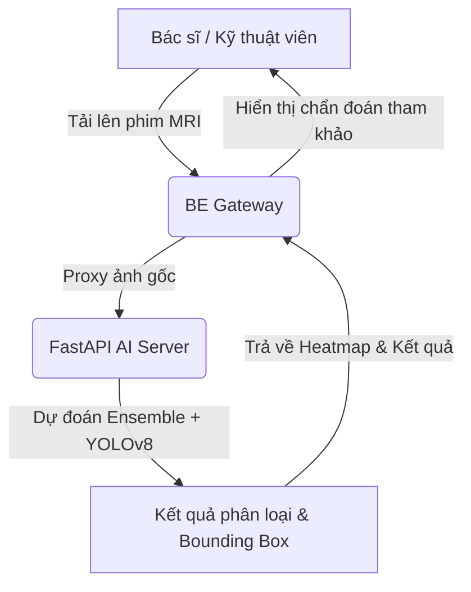

# Hướng Dẫn Sử Dụng & Tài Liệu Hệ Thống NeuroScan AI 🧠✨

Hệ thống y tế **NeuroScan AI** là nền tảng quản lý hình ảnh y khoa PACS, bệnh án điện tử EMR, tích hợp Trí tuệ nhân tạo (AI) hỗ trợ chẩn đoán u não (Glioma, Meningioma, Pituitary) và Trợ lý RAG Chatbot y khoa thông minh. Hệ thống tuân thủ nghiêm ngặt HIPAA và Nghị định 13/2023/NĐ-CP về bảo vệ dữ liệu cá nhân.

---

## 📂 Cấu Trúc Dự Án

Hệ thống được chia thành 3 phân hệ chính:
1. **BE (Node.js Express Gateway)**: Cổng API Gateway kết nối cơ sở dữ liệu MongoDB, xác thực JWT, ghi nhật ký kiểm toán (Audit Logs) và phân quyền 6 vai trò.
2. **FE (Expo React Native - Giao diện Web & Mobile)**: Ứng dụng client đa nền tảng tối ưu hóa hiển thị bệnh án và công cụ điều chỉnh vùng AI.
3. **MRIteam_team5/MRIteam (Python FastAPI AI Server)**: Dịch vụ xử lý mô hình học sâu (Deep Learning Ensemble ResNet50 + EfficientNet + DenseNet + YOLOv8) và mô hình RAG Chatbot.

---

## 🛠️ Hướng Dẫn Cài Đặt Thư Viện (Library Installation)

### 1. Phân Hệ Backend (BE)
Yêu cầu Node.js v18 trở lên.
```bash
cd BE
npm install
```
*Các thư viện cốt lõi:* `express`, `mongoose`, `jsonwebtoken`, `firebase-admin`, `bcryptjs`, `cors`, `dotenv`.

### 2. Phân Hệ Frontend (FE)
```bash
cd FE
npm install
```
*Các thư viện cốt lõi:* `expo`, `react-native`, `react-native-web`, `lucide-react`, `tailwindcss` (dành cho giao diện Web).

### 3. Phân Hệ AI Server (FastAPI)
Yêu cầu Python 3.9 - 3.11. Nên sử dụng môi trường ảo (virtual environment).
```bash
cd MRIteam_team5/MRIteam
python -m venv .venv
.venv\Scripts\activate      # Trên Windows
source .venv/bin/activate    # Trên macOS/Linux
pip install -r requirements.txt
```
*Các thư viện cốt lõi:* `fastapi`, `uvicorn`, `tensorflow`, `torch`, `ultralytics` (YOLO), `pandas`, `numpy`.

---

## 🚀 Hệ Thống Lệnh Chạy (Execution Commands)

### 1. Khởi tạo Cơ sở Dữ liệu mẫu (Database Seeding)
Trước khi khởi chạy hệ thống lần đầu, thực hiện nạp dữ liệu phân quyền mẫu và bệnh án mẫu:
```bash
cd BE
npm run seed       # Nạp tài khoản mẫu (Admin, Doctor, Patient, v.v...)
npm run seed:emr   # Nạp hồ sơ bệnh án mẫu và lịch sử khám
```

### 2. Khởi chạy Python FastAPI AI Server (Cổng 8000)
```bash
cd MRIteam_team5/MRIteam
.venv\Scripts\activate
python -m uvicorn main:app --host 0.0.0.0 --port 8000
```

### 3. Khởi chạy Express Backend Gateway (Cổng 3000)
```bash
cd BE
npm start
```

### 4. Khởi chạy Frontend React Native Web/Mobile
```bash
cd FE
npm run web
```
Ứng dụng web sẽ chạy tại địa chỉ: `http://localhost:8081` hoặc `http://localhost:19006` tùy thuộc vào phiên bản Expo.

### 5. Chạy Kiểm Thử Hệ Thống (Integration & Unit Tests)
Để chạy các bộ test kiểm nghiệm backend (bao gồm kiểm thử thuộc tính - Property-based Testing):
```bash
cd BE
$env:NODE_OPTIONS="--experimental-vm-modules"; npx jest   # Trên Windows PowerShell
NODE_OPTIONS="--experimental-vm-modules" npm test         # Trên Linux/macOS
```

---

## 🔄 Luồng Hoạt Động Của Hệ Thống (System Workflows)

### 1. Luồng Chẩn Đoán AI & Trợ Giúp Lâm Sàng (AI Reference Flow)


### 2. Luồng Bác Sĩ Hiệu Chỉnh Vùng & Phân Loại Sai (Doctor Feedback Loop)
Bác sĩ bệnh viện sử dụng kết quả AI để tham khảo. Nếu AI chẩn đoán sai loại u hoặc khoanh vùng bị lệch:
1. Bác sĩ mở bảng **Hiệu chỉnh khoanh vùng & phân loại (AI sai?)**.
2. Chọn loại u đúng thực tế (`glioma`, `meningioma`, `pituitary`, `notumor`).
3. Điều chỉnh tọa độ hộp giới hạn ($X, Y, W, H$).
4. Nhấn **Xác nhận & Gửi phản hồi AI học lại**.
5. BE gửi yêu cầu tới FastAPI ghi nhận ca bệnh vào file `hard_examples/feedback_log.csv` và lưu ảnh gốc phục vụ cho học máy chủ động (Active Learning).

### 3. Luồng Tự Quét & Lưu Trữ Phim AI Của Bệnh Nhân (Patient Self-Scan & AI Storage Flow)
Bệnh nhân có thể tự kiểm tra hình ảnh phim chụp MRI của mình:
1. Truy cập chức năng **Tải ảnh MRI** từ màn hình Home.
2. Chọn ảnh phim chụp từ thiết bị và bấm **Chẩn đoán AI**.
3. Hệ thống trả về kết quả gợi ý chẩn đoán phân loại và khoanh vùng u não từ AI.
4. Thông tin cá nhân của bệnh nhân (Họ tên, Mã y tế, Năm sinh, Giới tính) được tự động lấy từ tài khoản và khóa ở dạng chỉ đọc.
5. Kết quả chẩn đoán và phát hiện của AI sẽ tự động điền vào các phần Mô tả (Findings) và Kết luận (Conclusion) tương ứng theo docs form chuẩn.
6. Bệnh nhân bấm **Lưu trữ phim & Báo cáo vào EMR** để tự lưu trữ kết quả chẩn đoán vào hồ sơ bệnh án cá nhân.

### 4. Luồng Bác Sĩ AI Giải Thích Kết Quả Dễ Hiểu (Hippocratic AI EMR Interpretation Flow)
Khi bệnh nhân xem chi tiết bất kỳ kết quả chẩn đoán hình ảnh EMR nào:
1. Nhấn nút **GIẢI THÍCH KẾT QUẢ BẰNG AI (Dễ hiểu & Y đức)**.
2. BE chuyển tiếp yêu cầu cùng toàn bộ báo cáo lâm sàng chuyên môn tới FastAPI AI Server (`/translate_for_patient`).
3. AI biên dịch các thuật ngữ chuyên môn phức tạp (glioma, meningioma, phù nề,...) sang cách diễn giải trực quan, so sánh dễ hình dung theo tinh thần y đức **Lời thề Hippocrates** (không gây lo lắng hoang mang, tôn trọng quyền và hướng dẫn của bác sĩ điều trị, nhấn mạnh việc gặp bác sĩ chuyên khoa).
4. Phản hồi dễ hiểu được kết xuất ngay trên giao diện để hỗ trợ tâm lý và nâng cao kiến thức sức khỏe cho bệnh nhân.

### 5. Luồng Quản Lý & Retrain AI Của Admin (Active Learning Loop)
Chỉ **Administrator** mới có quyền quản trị hệ thống AI:
1. Admin truy cập tab **Hệ Thống AI** -> **Cấu hình AI**.
2. Xem danh sách toàn bộ các ca bệnh mà bác sĩ đã hiệu chỉnh sai sót của AI.
3. Nhấn **"Kích hoạt Huấn luyện lại AI (Active Learning)"** để kích hoạt tiến trình retrain trên nền mẫu dữ liệu khó mới.
4. Cập nhật cấu hình bộ lọc từ cấm của Chatbot và thay đổi System Prompt chỉ định hành vi tư vấn của AI.

---

## 👥 Vai Trò & Chức Năng Của Từng Role (6-Role Model)

Hệ thống phân quyền chi tiết cho 6 đối tượng người dùng:

| Vai Trò | Chức năng trên hệ thống |
| :--- | :--- |
| **Administrator (Admin)** | • Quản lý toàn bộ cấu hình AI (retrain, chatbot configuration).<br>• Quản lý tài khoản, xem Audit Logs truy vết dữ liệu. |
| **Hospital Doctor (Bác sĩ)** | • Xem kết quả chẩn đoán hình ảnh và tham khảo dự đoán AI.<br>• **Hiệu chỉnh kết quả AI nếu phân loại/khoanh vùng sai**.<br>• Quản lý bệnh án điện tử EMR, kê toa thuốc. |
| **Patient (Bệnh nhân)** | • **Tự tải lên phim chụp MRI, phân tích bằng AI và lưu vào bệnh án cá nhân (EMR)**.<br>• Trò chuyện với Chatbot AI RAG y đức. |
| **Nurse (Điều dưỡng/Y tá)** | • Tạo phiếu chăm sóc (Care Sheet).<br>• Cập nhật các chỉ số sinh hiệu, theo dõi diễn tiến lâm sàng của bệnh nhân nội trú. |
| **Technician (Kỹ thuật viên)** | • Tải ảnh MRI/CT gốc lên hệ thống RIS/PACS.<br>• Tiếp nhận ca chụp và xác nhận kết quả ban đầu trước khi chuyển Bác sĩ. |
| **Receptionist (Lễ tân)** | • Tiếp nhận bệnh nhân, tạo hồ sơ mới.<br>• Chỉ định phân luồng phòng khám. |

---

## 🔒 Tuân Thủ Bảo Mật & Quy Định Pháp Luật
- **HIPAA**: Mã hóa dữ liệu truyền tải thông qua HTTPS/TLS, ẩn danh hóa thông tin định danh cá nhân nhạy cảm trong ảnh chụp.
- **Nghị định 13/2023/NĐ-CP**: Loại bỏ các trường định danh dư thừa như Số CCCD/BHYT trên toàn bộ biểu mẫu quản lý bệnh nhân để bảo mật thông tin tối đa.

---

## 🧪 Hướng Dẫn Test Hệ Thống (Testing Scenarios)

### 1. Tài Khoản Test (Đã Seed Database)
Sau khi khởi chạy hệ thống và nạp dữ liệu mẫu (`npm run seed`), bạn có thể sử dụng các tài khoản mặc định sau để test (Mật khẩu chung cho tất cả là: **123456**):
- **Admin**: `admin@neuroscan.com` (Phân quyền Quản trị hệ thống)
- **Bác sĩ**: `doctor@neuroscan.com` (Phân quyền Bác sĩ)
- **Điều dưỡng**: `nurse@neuroscan.com` (Phân quyền Điều dưỡng / Y tá)
- **Kỹ thuật viên**: `technician@neuroscan.com` (Phân quyền Kỹ thuật viên)
- **Lễ tân**: `receptionist@neuroscan.com` (Phân quyền Lễ tân)
- **Bệnh nhân**: `patient@neuroscan.com` (Phân quyền Bệnh nhân)

### 2. Các Màn Hình & Chức Năng Cần Test Trọng Tâm

#### 🎯 Test Case 1: Chẩn đoán AI & Active Learning (Dành cho Bác sĩ)
- **Tài khoản sử dụng:** Bác sĩ (`doctor@neuroscan.com`)
- **Màn hình:** Hồ sơ bệnh án (EMR) -> Tải ảnh chụp MRI / Cập nhật hình ảnh y khoa.
- **Thao tác:**
  1. Tải lên một ảnh MRI não để AI chẩn đoán.
  2. Đợi hệ thống xử lý, hiển thị kết quả phân loại (vd: Glioma) kèm Bounding Box và bản đồ nhiệt (Heatmap).
  3. Mở chức năng **"Hiệu chỉnh khoanh vùng & phân loại (AI sai?)"**.
  4. Chọn lại nhãn thực tế đúng hoặc kéo thả sửa tọa độ khung bị lệch, sau đó ấn **"Xác nhận & Gửi phản hồi AI học lại"**.
- **Kỳ vọng:** Dữ liệu chuẩn được đưa vào kho Active Learning (thư mục `hard_examples/feedback_log.csv`) phục vụ cho kỹ sư AI tái huấn luyện mô hình.

#### 🎯 Test Case 2: Tự Quét AI & Giải Thích Bác Sĩ Ảo (Dành cho Bệnh nhân)
- **Tài khoản sử dụng:** Bệnh nhân (`patient@neuroscan.com`)
- **Màn hình:** Trang chủ Bệnh nhân -> Quét ảnh MRI (Self-Scan) -> Xem EMR.
- **Thao tác:**
  1. Bệnh nhân tự tải lên ảnh MRI của bản thân và bấm **"Chẩn đoán AI"**. 
  2. Hệ thống phân tích, sau đó bệnh nhân có thể lưu trữ kết quả này vào hồ sơ bệnh án cá nhân.
  3. Khi xem chi tiết EMR, bấm nút **"GIẢI THÍCH KẾT QUẢ BẰNG AI"** (Tính năng Hippocratic AI).
- **Kỳ vọng:** Trợ lý RAG Chatbot dịch thuật tự động các thuật ngữ chuyên khoa phức tạp thành ngôn ngữ dễ hiểu, mang tính trấn an, và tuân thủ y đức (luôn khuyên bệnh nhân tham vấn bác sĩ).

#### 🎯 Test Case 3: Quản Lý Hệ Thống AI & Truy Vết (Dành cho Admin)
- **Tài khoản sử dụng:** Admin (`admin@neuroscan.com`)
- **Màn hình:** Bảng điều khiển Quản trị (Admin Dashboard) -> Hệ thống AI / Cấu hình Chatbot.
- **Thao tác:**
  1. Kiểm tra danh sách các ca bệnh được bác sĩ dán nhãn lại (dữ liệu Active Learning).
  2. Test tính năng **Kích hoạt Huấn luyện lại AI (Retrain)**.
  3. Quản lý cấu hình Chatbot (thay đổi System Prompt, từ khóa cấm).
  4. Kiểm tra Audit Logs (Nhật ký kiểm toán) ghi lại mọi thao tác sửa/xóa của người dùng.
- **Kỳ vọng:** Admin kiểm soát được chất lượng mô hình AI, theo dõi sát luồng dữ liệu y tế nhạy cảm (tuân thủ HIPAA và Audit Log).

#### 🎯 Test Case 4: Theo Dõi & Cập Nhật Sinh Hiệu Bệnh Nhân (Dành cho Điều dưỡng)
- **Tài khoản sử dụng:** Điều dưỡng (`nurse@neuroscan.com`)
- **Màn hình:** Danh sách bệnh nhân nội trú -> Chi tiết EMR -> Phiếu Chăm Sóc / Chỉ số Sinh Hiệu.
- **Thao tác:**
  1. Chọn một bệnh án nội trú đang điều trị (ví dụ bệnh nhân chờ mổ u não).
  2. Tạo mới Phiếu Chăm Sóc: Nhập các chỉ số sinh hiệu (Huyết áp, Nhịp tim, Nhiệt độ, SpO2).
  3. Ghi chú diễn tiến bệnh lý (ví dụ: Bệnh nhân bớt đau đầu, tri giác GCS 15đ) và các y lệnh chăm sóc thực hiện.
  4. Lưu phiếu chăm sóc vào hồ sơ bệnh án.
- **Kỳ vọng:** Phiếu chăm sóc được thêm thành công vào EMR của bệnh nhân. Bác sĩ điều trị có thể xem được lịch sử diễn tiến này để điều chỉnh kế hoạch phẫu thuật/điều trị.

#### 🎯 Test Case 5: Tiếp Nhận Phim & Cập Nhật Kết Quả Chụp Mới (Dành cho Kỹ thuật viên)
- **Tài khoản sử dụng:** Kỹ thuật viên (`technician@neuroscan.com`)
- **Màn hình:** Quản lý Hình Ảnh (PACS/RIS) / Lịch sử Khám.
- **Thao tác:**
  1. Tạo hoặc chọn ca chụp mới cho bệnh nhân đã có trên hệ thống.
  2. Cập nhật file ảnh (MRI/CT) từ máy chụp lên hệ thống PACS/RIS.
  3. Điền thông tin kỹ thuật ban đầu (loại máy, vùng chụp) và chuyển trạng thái "Đã chụp xong".
- **Kỳ vọng:** Ảnh được phân bổ đúng vào hồ sơ EMR của bệnh nhân. Bác sĩ chuyên khoa có thể xem ảnh và dùng AI để chẩn đoán tiếp theo.

#### 🎯 Test Case 6: Tiếp Đón & Tạo Hồ Sơ Bệnh Nhân Ban Đầu (Dành cho Lễ tân)
- **Tài khoản sử dụng:** Lễ tân (`receptionist@neuroscan.com`)
- **Màn hình:** Quản lý Bệnh Nhân -> Tiếp đón (Đăng ký khám mới).
- **Thao tác:**
  1. Nhập thông tin hành chính của bệnh nhân mới (Họ tên, Năm sinh, Số điện thoại).
  2. Khởi tạo Hồ sơ bệnh án (EMR) và điều phối bệnh nhân vào phòng khám.
  3. Quản lý danh sách bệnh nhân chờ khám trong ngày.
- **Kỳ vọng:** Hồ sơ bệnh án được khởi tạo thành công, xuất hiện ở danh sách chờ khám của đúng Bác sĩ và Điều dưỡng để tiến hành đo sinh hiệu.
