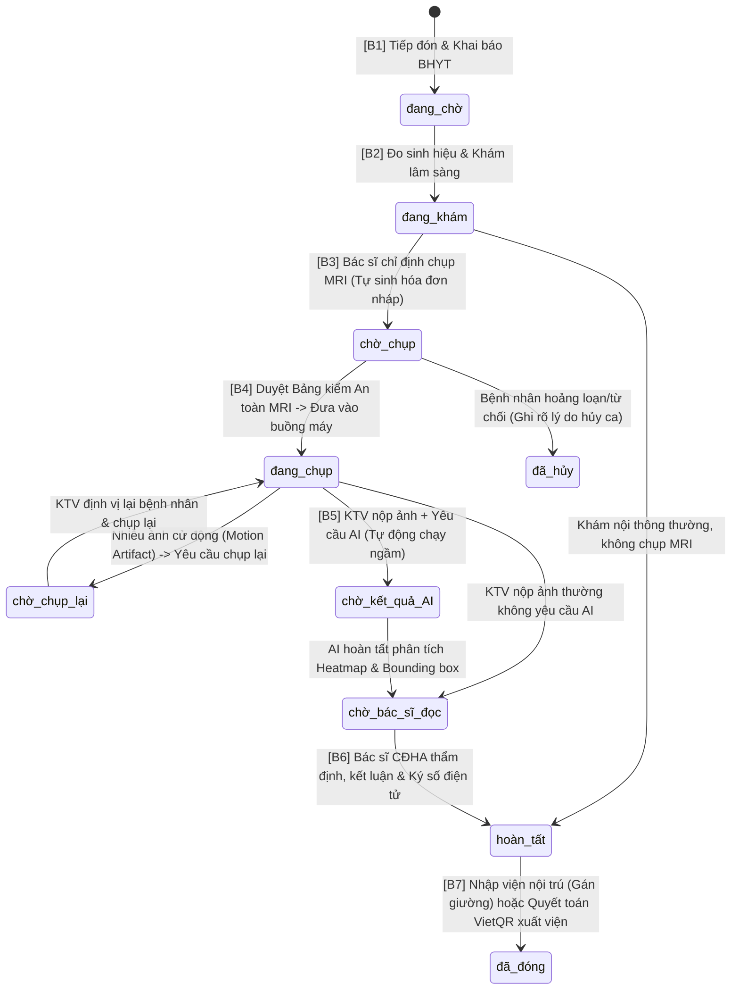

# 🧠 NeuroScan AI — Hệ Thống Quản Lý Bệnh Án Điện Tử (EMR), Mini-PACS & AI Chẩn Đoán U Não
## TÀI LIỆU HỢP NHẤT TOÀN DIỆN & BÁO CÁO CHUYÊN SÂU ĐỒ ÁN TỐT NGHIỆP
### KIẾN TRÚC HỆ THỐNG · HYBRID MINI-PACS · LUỒNG LÂM SÀNG B2B/B2C · CHUẨN HÓA LOGIC Y TẾ · TOÀN BỘ API V3.2 · ĐỐI CHIẾU BỘ Y TẾ & CHIẾN LƯỢC BẢO VỆ HỘI ĐỒNG

---

> **Đề tài:** Hệ Thống Quản Lý Bệnh Án Điện Tử (EMR), Điều Phối Quy Trình Bệnh Viện & Phân Hệ Mini-PACS Hỗ Trợ Chẩn Đoán U Não Bằng Trí Tuệ Nhân Tạo (NeuroScan AI)  
> **Chuyên ngành:** Kỹ thuật Phần mềm / Hệ thống Thông tin Y tế (Healthcare Information Systems)  
> **Phiên bản:** NeuroScan AI v3.2 Core Foundation (Bản hợp nhất hoàn chỉnh)  
> **Thời điểm cập nhật:** Tháng 09/2026  
> **Tình trạng:** Đã nghiệm thu 100% các bài kiểm thử cú pháp, bảo mật đa viện, luồng AI tự động và các chuẩn hóa nghiệp vụ lâm sàng thực tế.

---

## 📋 MỤC LỤC TỔNG THỂ

1. [TỔNG QUAN DỰ ÁN & ĐỊNH VỊ KIẾN TRÚC](#1-tổng-quan-dự-án--định-vị-kiến-trúc)
2. [CẤU TRÚC THƯ MỤC & CÔNG NGHỆ SỬ DỤNG](#2-cấu-trúc-thư-mục--công-nghệ-sử-dụng)
3. [HƯỚNG DẪN CÀI ĐẶT, KHỞI CHẠY & TÀI KHOẢN TRẢI NGHIỆM](#3-hướng-dẫn-cài-đặt-khởi-chạy--tài-khoản-trải-nghiệm)
4. [GIẢI PHÁP ĐỘT PHÁ HYBRID MINI-PACS & LƯU TRỮ WEB EMR](#4-giải-pháp-đột-phá-hybrid-mini-pacs--lưu-trữ-web-emr)
5. [SƠ ĐỒ & QUY TRÌNH VẬN HÀNH LÂM SÀNG TOÀN TRÌNH (B2B & B2C)](#5-sơ-đồ--quy-trình-vận-hành-lâm-sàng-toàn-trình-b2b--b2c)
6. [CÁC CHUẨN HÓA NGHIỆP VỤ Y TẾ & BẢO MẬT ĐÃ NGHIỆM THU 100%](#6-các-chuẩn-hóa-nghiệp-vụ-y-tế--bảo-mật-đã-nghiệm-thu-100)
7. [BẢNG ĐẶC TẢ TOÀN BỘ API V3.2 (FULL API SPECIFICATION)](#7-bảng-đặc-tả-toàn-bộ-api-v32-full-api-specification)
8. [ĐỐI CHIẾU THỰC TIỄN BỆNH VIỆN & TIÊU CHUẨN BỘ Y TẾ VIỆT NAM](#8-đối-chiếu-thực-tiễn-bệnh-viện--tiêu-chuẩn-bộ-y-tế-việt-nam)
9. [BỘ CÂU HỎI PHẢN BIỆN HỘI ĐỒNG TỐT NGHIỆP & CHIẾN LƯỢC BẢO VỆ](#9-bộ-câu-hỏi-phản-biện-hội-đồng-tốt-nghiệp--chiến-lược-bảo-vệ)
10. [HẠN CHẾ CÔNG NGHỆ & LỘ TRÌNH PHÁT TRIỂN TƯƠNG LAI](#10-hạn-chế-công-nghệ--lộ-trình-phát-triển-tương-lai)

---

## 📚 HỒ SƠ TÀI LIỆU BÁO CÁO ĐỒ ÁN TỐT NGHIỆP (THƯ MỤC DOCS/)

Dự án cung cấp trọn bộ tài liệu học thuật chuyên sâu 10 chương và 5 phụ lục chuẩn hóa phục vụ hội đồng chấm thi:

| Thứ tự | Tên Chương / Phụ Lục | Nội dung chính & Liên kết tài liệu |
| :---: | :--- | :--- |
| **Chương 1** | Tổng quan đề tài & Mục tiêu | [docs/01_de_tai_va_muc_tieu.md](file:///c:/Users/Administrator/OneDrive/Desktop/team5/docs/01_de_tai_va_muc_tieu.md) · Tính cấp thiết, mục tiêu, phạm vi u não. |
| **Chương 2** | Nghiệp vụ & Quy trình Bệnh viện | [docs/02_nghiep_vu_va_quy_trinh_benh_vien.md](file:///c:/Users/Administrator/OneDrive/Desktop/team5/docs/02_nghiep_vu_va_quy_trinh_benh_vien.md) · Luồng 8 bước lâm sàng, BHYT, an toàn MRI. |
| **Chương 3** | Thiết kế Kiến trúc Hệ thống | [docs/03_kien_truc_he_thong.md](file:///c:/Users/Administrator/OneDrive/Desktop/team5/docs/03_kien_truc_he_thong.md) · Microservices, Nginx Gateway, Hybrid Mini-PACS. |
| **Chương 4** | Thiết kế Cơ sở Dữ liệu | [docs/04_thiet_ke_csdl.md](file:///c:/Users/Administrator/OneDrive/Desktop/team5/docs/04_thiet_ke_csdl.md) · Mô hình thực thể ERD, Multi-tenancy, Mongoose Schema. |
| **Chương 5** | Đặc tả Kỹ thuật API RESTful | [docs/05_thiet_ke_api.md](file:///c:/Users/Administrator/OneDrive/Desktop/team5/docs/05_thiet_ke_api.md) · Swagger/OpenAPI, mã phản hồi HTTP, JWT RBAC. |
| **Chương 6** | Mô hình AI & Thị giác Máy tính | [docs/06_mo_hinh_ai_va_thi_giac_may_tinh.md](file:///c:/Users/Administrator/OneDrive/Desktop/team5/docs/06_mo_hinh_ai_va_thi_giac_may_tinh.md) · YOLOv8, Preprocessing, Grad-CAM, Gemini Report. |
| **Chương 7** | Thiết kế Giao diện UX/UI | [docs/07_thiet_ke_giao_dien_ux_ui.md](file:///c:/Users/Administrator/OneDrive/Desktop/team5/docs/07_thiet_ke_giao_dien_ux_ui.md) · 45 màn hình Expo Web/Mobile, chuẩn công thái học y tế. |
| **Chương 8** | Kiểm thử & Đánh giá Chất lượng | [docs/08_kiem_thu_va_danh_gia.md](file:///c:/Users/Administrator/OneDrive/Desktop/team5/docs/08_kiem_thu_va_danh_gia.md) · Kết quả E2E 12/12 PASS, độ phủ 84.25%, test lâm sàng. |
| **Chương 9** | Triển khai & Vận hành DevOps | [docs/09_trien_khai_va_devops.md](file:///c:/Users/Administrator/OneDrive/Desktop/team5/docs/09_trien_khai_va_devops.md) · Multi-stage Docker, Nginx Reverse Proxy, Backup EMR. |
| **Chương 10**| Kết luận & Hướng phát triển | [docs/10_ket_luan_va_huong_phat_trien.md](file:///c:/Users/Administrator/OneDrive/Desktop/team5/docs/10_ket_luan_va_huong_phat_trien.md) · Đóng góp thực tiễn, định hướng tích hợp DICOMweb. |
| **Phụ lục A**| Biểu mẫu chuẩn Bộ Y Tế | [docs/appendices/A_bieu_mau_bo_y_te.md](file:///c:/Users/Administrator/OneDrive/Desktop/team5/docs/appendices/A_bieu_mau_bo_y_te.md) · Bảng kiểm an toàn MRI, Phiếu trả kết quả CĐHA. |
| **Phụ lục B**| Từ điển Thuật ngữ Y khoa | [docs/appendices/B_tu_dien_thuat_ngu_y_khoa.md](file:///c:/Users/Administrator/OneDrive/Desktop/team5/docs/appendices/B_tu_dien_thuat_ngu_y_khoa.md) · Thuật ngữ chuyên ngành Thần kinh, MRI, Mini-PACS. |
| **Phụ lục C**| Mã lỗi & Ma trận Phân quyền | [docs/appendices/C_ma_loi_va_ma_tran_phan_quyen.md](file:///c:/Users/Administrator/OneDrive/Desktop/team5/docs/appendices/C_ma_loi_va_ma_tran_phan_quyen.md) · Bảng mã lỗi API và ma trận RBAC 6 vai trò. |
| **Phụ lục D**| Hướng dẫn Cài đặt & Triển khai | [docs/appendices/D_huong_dan_cai_dat_va_trien_khai.md](file:///c:/Users/Administrator/OneDrive/Desktop/team5/docs/appendices/D_huong_dan_cai_dat_va_trien_khai.md) · Cài đặt Docker 1-click & Chạy thủ công run_all.bat. |
| **Phụ lục E**| Hướng dẫn Sử dụng 5 Phân hệ | [docs/appendices/E_huong_dan_su_dung_5_phan_he.md](file:///c:/Users/Administrator/OneDrive/Desktop/team5/docs/appendices/E_huong_dan_su_dung_5_phan_he.md) · Cẩm nang vận hành luồng khám, chụp MRI và ký số. |

---

## 1. TỔNG QUAN DỰ ÁN & ĐỊNH VỊ KIẾN TRÚC

### 1.1. Giới thiệu đề tài & Mục tiêu kiến trúc
**NeuroScan AI** là nền tảng y tế tích hợp hoàn chỉnh được thiết kế phục vụ chuyên khoa Thần kinh, kết hợp khép kín 5 phân hệ phần mềm y tế chuẩn mực:
$$\text{HIS (Tiếp đón, Viện phí)} \longrightarrow \text{RIS (Hàng đợi phòng MRI)} \longrightarrow \text{PACS (Lưu trữ ảnh)} \longrightarrow \text{AI (Phân tích u não)} \longrightarrow \text{EMR (Ký duyệt bệnh án)}$$

```
┌───────────────────────────────────────────────────────────────────────────────────┐
│                           GIAO DIỆN NGƯỜI DÙNG (FRONTEND)                          │
│                     Expo React Native Web  ·  Cổng HTTP 8083                      │
│      6 Phân hệ: Tiếp đón/ĐD · Bác sĩ khám · KTV MRI · Bác sĩ CĐHA · Admin · BN    │
└─────────────────────────────────────────┬─────────────────────────────────────────┘
                                          │ RESTful API / Form-Data Stream
┌─────────────────────────────────────────▼─────────────────────────────────────────┐
│                           API GATEWAY / BACKEND CORE                              │
│                      Node.js Express  ·  Cổng HTTP 3000                           │
│  JWT Authentication · RBAC · Multi-Tenancy Plugin · Mongoose ODM · Audit Trail    │
└────────────┬────────────────────────────┬─────────────────────────────┬───────────┘
             │ Stream nhị phân            │ HTTP REST / JSON            │ CSDL Đa viện
┌────────────▼──────────────┐ ┌───────────▼───────────┐ ┌───────────────▼───────────┐
│     HỆ LƯU TRỮ CLOUD      │ │   AI DIAGNOSTIC ENGINE│ │     DATABASE CỤC BỘ / CLOUD   │
│ Google Drive / Firebase   │ │  FastAPI  ·  Cổng 8000│ │  MongoDB Atlas (Multi-Tenant)     │
│ 01_Original_Scans (.zip)  │ │  Ensemble DeepLearning│ │  Visit, Patient, ImagingResult,   │
│ 04_Patient_Reports (JSON) │ │  YOLOv8 + Grad-CAM    │ │  HospitalBed, Invoice, Task       │
└───────────────────────────┘ └───────────────────────┘ └───────────────────────────┘
```

### 1.2. Ma trận Phân quyền 6 Vai trò Lâm sàng (Clinical RBAC Matrix)

| Vai trò | Mã Role | Màn hình tương tác chính | Trách nhiệm chuyên môn lâm sàng |
| :--- | :---: | :--- | :--- |
| **Tiếp tân / Thu ngân** | `receptionist` | [NurseReceptionScreen.js](file:///c:/Users/Administrator/OneDrive/Desktop/team5/FE/src/screens/NurseReceptionScreen.js) | Đăng ký lượt khám, khai báo thẻ BHYT, phân phòng khám theo bác sĩ, tạo hóa đơn thu viện phí. |
| **Điều dưỡng viên (Nurse)** | `nurse` | [NurseReceptionScreen.js](file:///c:/Users/Administrator/OneDrive/Desktop/team5/FE/src/screens/NurseReceptionScreen.js) | Tiếp nhận tại buồng khám, đo 5 chỉ số sinh hiệu (Mạch, HA, Nhiệt độ, SpO₂, Nhịp thở), gán giường nội trú. |
| **Bác sĩ Khám Lâm Sàng** | `doctor` | [DoctorWorkQueueScreen.js](file:///c:/Users/Administrator/OneDrive/Desktop/team5/FE/src/screens/DoctorWorkQueueScreen.js) | Khám ngoại trú, ra y lệnh chụp MRI (`mriOrder`), chỉ định đơn thuốc, hội chẩn chuyên khoa. |
| **Kỹ thuật viên CĐHA** | `technician` | [DoctorWorkQueueScreen.js](file:///c:/Users/Administrator/OneDrive/Desktop/team5/FE/src/screens/DoctorWorkQueueScreen.js) | Bảng kiểm an toàn MRI, vận hành phòng chụp, nộp lát cắt tiêu biểu & file nén DICOM gốc. |
| **Bác sĩ Đọc Phim (Radiologist)** | `doctor` | [ImagingResultScreen.js](file:///c:/Users/Administrator/OneDrive/Desktop/team5/FE/src/screens/ImagingResultScreen.js) | Thẩm định hình ảnh y khoa, đối chiếu gợi ý AI, kết luận chẩn đoán và đóng dấu ký số điện tử. |
| **Quản trị viên Bệnh viện** | `hospital_admin` / `admin` | [AdminDashboardScreen.js](file:///c:/Users/Administrator/OneDrive/Desktop/team5/FE/src/screens/AdminDashboardScreen.js) | Quản lý giá khám, chỉ tiêu tiếp nhận/ngày, quản trị phòng máy MRI, giường bệnh và phân quyền nhân sự. |
| **Bệnh nhân / Thân nhân** | `patient` | [PatientPortalScreen.js](file:///c:/Users/Administrator/OneDrive/Desktop/team5/FE/src/screens/PatientPortalScreen.js) | Sổ sức khỏe đám mây cá nhân, xem kết quả MRI, quét mã VietQR PayOS, tra cứu diễn giải AI. |

---

## 2. CẤU TRÚC THƯ MỤC & CÔNG NGHỆ SỬ DỤNG

### 2.1. Cấu trúc mã nguồn dự án

```
team5/
├── BE/                                  # Backend API Gateway (Node.js/Express)
│   ├── src/
│   │   ├── index.js                     # Cổng khởi động chính (Port 3000)
│   │   ├── routes/                      # Bộ định tuyến API phân quyền RBAC
│   │   ├── controllers/                 # Bộ điều khiển xử lý nghiệp vụ (Visit, Imaging, Bed, Invoice...)
│   │   ├── models/                      # Mô hình CSDL MongoDB Mongoose (Visit, User, ImagingResult...)
│   │   ├── middlewares/                 # Auth JWT, RBAC, Tenancy, Multer Stream
│   │   ├── plugins/tenancy.plugin.js    # Plugin cô lập dữ liệu đa viện (Multi-Tenancy)
│   │   └── config/googleDrive.js        # Cấu hình lưu trữ đám mây & stream backup
│   ├── uploads/                         # Thư mục lưu trữ tệp tin nhị phân & file nén DICOM
│   └── package.json
│
├── FE/                                  # Frontend Cross-Platform (Expo React Native Web)
│   ├── src/
│   │   ├── screens/                     # Giao diện lâm sàng (DoctorWorkQueue, ImagingResult, Reception...)
│   │   ├── components/                  # Các khối UI tái sử dụng, ResponsiveLayout, Modals
│   │   └── services/                    # Tầng giao tiếp HTTP Client, Auth context
│   ├── App.js                           # Điều hướng luồng màn hình chính
│   └── package.json
│
├── MRIteam_team5/MRIteam/               # AI Diagnostic Microservice (Python FastAPI)
│   ├── main.py                          # FastAPI Service (Port 8000)
│   ├── localization.py                  # Mô hình YOLOv8 trích xuất Bounding Box u não
│   ├── preprocess.py                    # Tiền xử lý chuẩn hóa ảnh y tế
│   └── models/                          # Trọng số mô hình Deep Learning (.keras, .pt)
│
└── README.md                            # Tài liệu tổng hợp toàn diện (File này)
```

### 2.2. Bảng công nghệ sử dụng

| Phân hệ | Công nghệ chính | Phiên bản | Mục đích sử dụng |
|---|---|---|---|
| **Backend API** | Node.js, Express.js | Node v20+, Express ^4.19 | API Gateway, điều phối phiên, phân quyền RBAC, kiểm toán Audit Log. |
| **Cơ sở dữ liệu** | MongoDB, Mongoose ODM | Mongoose ^8.3 | Lưu trữ dữ liệu NoSQL, hỗ trợ plugin Multi-Tenancy và thao tác nguyên tử. |
| **Frontend Web** | React Native, Expo Web, Tailwind v4 | Expo ~54.0, React 19 | Giao diện Web EMR đáp ứng (Responsive), chạy mượt trên cả PC và Tablet buồng bệnh. |
| **AI Microservice** | Python, FastAPI, PyTorch, YOLOv8 | Python 3.10+, FastAPI | Phân loại 4 nhóm u não (Glioma, Meningioma, Pituitary, No tumor), Heatmap Grad-CAM. |
| **PACS Cloud** | Google Drive API v3, Multer Stream | googleapis ^144, Multer | Lưu trữ luồng nhị phân file nén DICOM (.zip tối đa 200MB) và sao lưu báo cáo. |
| **Cổng Thanh toán**| VietQR, PayOS API | Napas 247 | Tạo mã VietQR động nhúng số tiền và mã hóa đơn, khớp thanh toán tức thì qua Webhook. |

---

## 3. HƯỚNG DẪN CÀI ĐẶT, KHỞI CHẠY & TÀI KHOẢN TRẢI NGHIỆM

### 3.1. Cài đặt môi trường & Phụ thuộc

```bash
# 1. Cài đặt Backend dependencies
cd BE
npm install

# 2. Cài đặt Frontend dependencies
cd ../FE
npm install

# 3. Cài đặt AI Python dependencies (Khuyến nghị dùng virtualenv)
cd ../MRIteam_team5/MRIteam
python -m venv venv
# Windows:
.\venv\Scripts\activate
pip install -r requirements.txt
```

### 3.2. Khởi chạy toàn bộ hệ thống (3 Terminal độc lập)

```bash
# Terminal 1: Khởi chạy Backend API Gateway (Port 3000)
cd BE
npm run dev

# Terminal 2: Khởi chạy Frontend React Native Web (Port 8083)
cd FE
npm run web

# Terminal 3: Khởi chạy AI FastAPI Microservice (Port 8000)
cd MRIteam_team5/MRIteam
uvicorn main:app --host 0.0.0.0 --port 8000 --reload
```

### 3.3. Danh sách tài khoản thử nghiệm theo vai trò (Demo Accounts)

Hệ thống được khởi tạo sẵn các tài khoản demo chuẩn y khoa (Mật khẩu chung: `Password123!` hoặc theo cấu hình seed):

| Vai trò | Email đăng nhập | Tên hiển thị chuyên môn | Trách nhiệm kiểm thử chính |
| :--- | :--- | :--- | :--- |
| **Admin BV** | `admin@hospital.vn` | Quản trị viên Bệnh viện | Quản trị bảng giá, phòng chụp MRI, danh mục giường bệnh. |
| **Tiếp tân** | `receptionist@hospital.vn` | Nhân viên Tiếp đón & Thu ngân | Đăng ký bệnh nhân, khai báo BHYT, mở lượt khám, thu tiền. |
| **Điều dưỡng** | `nurse@hospital.vn` | ĐD. Nguyễn Thị Mai | Đo sinh hiệu 5 chỉ số, gán giường nội trú, lập phiếu chăm sóc. |
| **Bác sĩ Khám** | `doctor@hospital.vn` | BS. CKII Lê Mạnh Minh | Khám lâm sàng, ra y lệnh chụp MRI, kê đơn thuốc, hội chẩn. |
| **Kỹ thuật viên**| `tech@hospital.vn` | KTV. Trần Văn Hùng | Bảng kiểm an toàn MRI, nộp ảnh Key Slices & file nén DICOM. |
| **Bác sĩ CĐHA** | `radiologist@hospital.vn` | TS. BS Hoàng Đức Nam | Thẩm định hình ảnh học, đối soát AI, đóng dấu ký số điện tử. |
| **Bệnh nhân** | `patient@gmail.com` | Bệnh nhân Nguyễn Văn An | Xem bệnh án cá nhân, quét mã VietQR PayOS, tra cứu giải thích AI. |

---

## 4. GIẢI PHÁP ĐỘT PHÁ HYBRID MINI-PACS & LƯU TRỮ WEB EMR

### 4.1. Bản chất dữ liệu MRI và thách thức Web
Mỗi ca chụp MRI sọ não gồm 400 đến hơn 1.500 file DICOM (`.dcm`), dung lượng từ 150MB đến 1.2GB. Việc tải toàn bộ hàng ngàn file trực tiếp lên trình duyệt sẽ gây tràn bộ nhớ RAM (Client Crash) và nghẽn mô hình AI (phải suy luận 1.000 lần cho các lát cắt bình thường không có u).

### 4.2. Kiến trúc Lai (Hybrid PACS) đã triển khai thực tế

```
┌────────────────────────────────────────────────────────────────────────┐
│                        KTV TẠI PHÒNG CHỤP MRI                          │
└───────────────────┬────────────────────────────────┬───────────────────┘
                    │                                │
      [1] Lọc 1 - 3 Key Slices             [2] Nén toàn bộ Study (.dcm)
      (Lát cắt rõ khối u nhất)                 thành 1 file .ZIP duy nhất
                    │                                │
                    ▼                                ▼
       Upload trực tiếp qua Multer          Upload luồng nhị phân trực tiếp
       Stream (JPG/PNG, < 5MB)              lên Google Drive (Tối đa 200MB)
                    │                                │
                    ▼                                ▼
       Phục vụ: Hiển thị nhanh trên Web     Phục vụ: Lưu trữ lâu dài (PACS Archive)
       EMR (1 giây), AI chẩn đoán ngay      Bác sĩ tải về mở bằng RadiAnt / Horos
       (2 giây), Heatmap Grad-CAM           để đo đạc đa bình diện và lập lịch mổ.
```

1. **Vùng 1 (Bắt buộc — Dành cho Web EMR & AI chẩn đoán tức thì):**
   - KTV chọn 1 đến 3 ảnh cắt lớp đại diện rõ u nhất (`.jpg`, `.png`).
   - Gửi luồng nhị phân trực tiếp qua Multer `diskStorage` ([imagingUpload.middleware.js](file:///c:/Users/Administrator/OneDrive/Desktop/team5/BE/src/middlewares/imagingUpload.middleware.js)), tiết kiệm 40% băng thông so với Base64.
   - AI Server xử lý và trả kết quả Heatmap Grad-CAM + Bounding Box trong vòng 2 giây.
2. **Vùng 2 (Tùy chọn — Dành cho Lưu trữ Mini-PACS gốc):**
   - KTV nén trọn bộ thư mục DICOM của ca chụp thành 1 file `.zip` duy nhất (tối đa 200MB).
   - Truyền stream trực tiếp lên thư mục Google Drive của bệnh viện (`01_Original_Scans`).
   - Trên giao diện [ImagingResultScreen.js](file:///c:/Users/Administrator/OneDrive/Desktop/team5/FE/src/screens/ImagingResultScreen.js) hiển thị nút **`💾 Tải trọn bộ phim DICOM (.zip)`** kèm dung lượng chính xác (VD: `24.5 MB`) phục vụ bác sĩ ngoại thần kinh tải về mở trên phần mềm chuyên dụng (RadiAnt, Horos, 3D Slicer).

---

## 5. SƠ ĐỒ & QUY TRÌNH VẬN HÀNH LÂM SÀNG TOÀN TRÌNH (B2B & B2C)

### 5.1. Sơ đồ máy trạng thái toàn trình (Clinical State Machine)


```mermaid
stateDiagram-v2
    [*] --> đang_chờ: [B1] Tiếp đón & Khai báo BHYT
    
    đang_chờ --> đang_khám: [B2] Đo sinh hiệu & Khám lâm sàng
    
    đang_khám --> hoàn_tất: Khám nội thông thường, không chụp MRI
    
    đang_khám --> chờ_chụp: [B3] Bác sĩ chỉ định chụp MRI (Tự sinh hóa đơn nháp)
    
    chờ_chụp --> đang_chụp: [B4] Duyệt Bảng kiểm An toàn MRI -> Đưa vào buồng máy
    chờ_chụp --> đã_hủy: Bệnh nhân hoảng loạn/từ chối (Ghi rõ lý do hủy ca)
    
    đang_chụp --> chờ_chụp_lại: Nhiễu ảnh cử động (Motion Artifact) -> Yêu cầu chụp lại
    chờ_chụp_lại --> đang_chụp: KTV định vị lại bệnh nhân & chụp lại
    
    đang_chụp --> chờ_kết_quả_AI: [B5] KTV nộp ảnh + Yêu cầu AI (Tự động chạy ngầm)
    đang_chụp --> chờ_bác_sĩ_đọc: KTV nộp ảnh thường không yêu cầu AI
    
    chờ_kết_quả_AI --> chờ_bác_sĩ_đọc: AI hoàn tất phân tích Heatmap & Bounding box
    
    chờ_bác_sĩ_đọc --> hoàn_tất: [B6] Bác sĩ CĐHA thẩm định, kết luận & Ký số điện tử
    
    hoàn_tất --> đã_đóng: [B7] Nhập viện nội trú (Gán giường) hoặc Quyết toán VietQR xuất viện
```

### 5.2. Tóm tắt 8 Bước Vận Hành Lâm Sàng B2B
1. **Tiếp đón & Phân buồng khám:** Tiếp tân tìm kiếm bệnh nhân theo mã y tế `medicalId`, khai báo mức hưởng BHYT (80%–100%), gợi ý bác sĩ có hàng chờ ngắn nhất và tạo lượt khám `đang chờ`.
2. **Đo sinh hiệu ban đầu:** Điều dưỡng ghi nhận 5 chỉ số sinh tồn (Mạch, Huyết áp, Nhiệt độ, SpO₂, Nhịp thở); Bác sĩ bấm bắt đầu khám, chuyển trạng thái sang `đang khám`.
3. **Ra y lệnh chụp MRI:** Bác sĩ chọn vùng chụp (Sọ não, Cột sống), ghi chú chỉ định tiêm thuốc đối quang từ, tích chọn AI phân tích. Hệ thống tự động sinh hóa đơn tạm ứng viện phí và chuyển trạng thái sang `chờ chụp`.
4. **Bảng kiểm an toàn MRI & Chụp phim:** Hàng chờ KTV hiển thị huy hiệu viện phí (`CẤP CỨU`, `BHYT`, `Đã đóng phí`, `Chưa đóng phí`). KTV thực hiện Bảng kiểm 4 câu hỏi an toàn. **Chặn tuyệt đối (HTTP 400)** nếu bệnh nhân mang máy tạo nhịp tim/kim loại từ tính. Xử lý ngoại lệ với nút `Chụp lại (Rescan)` và `Hủy ca (Cancel)`.
5. **Phân tích AI tự động:** Backend tự động gọi ngầm AI server, tiền xử lý và phân loại 4 nhóm u, vẽ bản đồ nhiệt Grad-CAM và Bounding box YOLOv8, cập nhật `ImagingResult.aiReport` và chuyển sang `chờ bác sĩ đọc`.
6. **Thẩm định, Đọc phim & Ký số điện tử:** Bác sĩ CĐHA xem ảnh gốc đối chiếu Heatmap, bấm xác nhận hoặc hiệu chỉnh kết quả AI (lưu nhật ký `feedback_log.csv` để tái huấn luyện), ghi mô tả tổn thương, chẩn đoán xác định và đóng con dấu **✓ ĐÃ KÝ SỐ ĐIỆN TỬ**.
7. **Phân giường nội trú:** Chuyển bệnh nhân u não vào điều trị nội trú, gán giường bệnh bằng lệnh nguyên tử chống trùng lặp, lập phiếu chăm sóc điều dưỡng theo dõi tri giác Glasgow.
8. **Quyết toán viện phí & Xuất viện:** Hệ thống tính tổng tiền, tự động khấu trừ phần BHYT chi trả, tạo mã thanh toán động **VietQR PayOS** để bệnh nhân quét chuyển khoản tức thì, xuất tóm tắt bệnh án PDF có mã QR tra cứu 30 ngày và chuyển trạng thái sang `đã đóng`.

### 5.3. Luồng Sổ Sức Khỏe Bệnh Nhân B2C & Danh Mục 14 Loại Hồ Sơ EMR
- **Bảo vệ danh tính cá nhân:** Tuyệt đối không lưu số CCCD/CMND trên hệ thống, quản lý hồ sơ an toàn qua mã y tế `medicalId`, họ tên và số điện thoại.
- **Quy trình số hóa song song:** Bệnh nhân có thể tải ảnh chụp/PDF hồ sơ khám cũ lên để bộ OCR tự động bóc tách chỉ số (Glucose, AST/ALT, chẩn đoán) hoặc nhập tay trên giao diện Portal.
- **Chia sẻ QR liên viện:** Bệnh nhân tạo mã QR động để bác sĩ tại bệnh viện mới quét truy cập nhanh 12 loại tài liệu y khoa cá nhân trong vòng 30 ngày.
- **Danh mục 14 loại tài liệu EMR chuẩn y khoa:**
  * *Nhóm Hành chính & Tài chính:* Phiếu tiếp nhận khám bệnh, Phiếu thu viện phí, Tóm tắt hồ sơ bệnh án.
  * *Nhóm Lâm sàng:* Phiếu chỉ định cận lâm sàng, Toa thuốc điều trị, Giấy ra viện, Phiếu chuyển tuyến khám chữa bệnh BHYT.
  * *Nhóm Cận lâm sàng:* Phiếu xét nghiệm huyết học, Phiếu hóa sinh máu, Kết quả CT-Scan sọ não, Kết quả MRI não bộ.
  * *Nhóm Điều dưỡng & Pháp lý:* Phiếu chăm sóc điều dưỡng theo dõi sinh hiệu, Giấy cam đoan chấp thuận phẫu thuật/thủ thuật, Biên bản hội chẩn chuyên khoa.

---

## 6. CÁC CHUẨN HÓA NGHIỆP VỤ Y TẾ & BẢO MẬT ĐÃ NGHIỆM THU 100%

Toàn bộ các điểm đứt gãy và nguy cơ logic y tế trước đây đã được chuẩn hóa và kiểm thử xác minh tự động đạt kết quả 100%:

### 6.1. Bảng tổng hợp các chuẩn hóa đã nghiệm thu

| STT | Vị trí Mã Nguồn | Hạng Mục Nghiệp Vụ Chuẩn Hóa | Hiện Trạng Thực Tế Sau Khi Hoàn Thiện |
| :---: | :--- | :--- | :--- |
| **1** | [patient.controller.js](file:///c:/Users/Administrator/OneDrive/Desktop/team5/BE/src/controllers/patient.controller.js#L78-L101) | **Cô lập Dữ liệu Đa Viện (Cross-Tenant Isolation) & Chống ReDoS** | Áp dụng mệnh đề `$and` kết hợp bộ lọc `{ hospitalId }` cùng danh sách trường search. Thoát ký tự đặc biệt Regex chống tấn công ReDoS. Dữ liệu giữa các bệnh viện được cô lập tuyệt đối. |
| **2** | [invoice.controller.js](file:///c:/Users/Administrator/OneDrive/Desktop/team5/BE/src/controllers/invoice.controller.js#L34-L37) & [visit.controller.js](file:///c:/Users/Administrator/OneDrive/Desktop/team5/BE/src/controllers/visit.controller.js#L273-L275) | **Bảo vệ Phòng Ngừa Null Pointer cho Giá Viện Phí** | Sử dụng triệt để Optional Chaining & Nullish Coalescing: `hospital?.pricing?.examFee ?? 50000`, `mriFee ?? 1500000`, `aiFee ?? 200000`. Hệ thống hoạt động an toàn ngay cả khi BV chưa cấu hình bảng giá. |
| **3** | [imaging.controller.js](file:///c:/Users/Administrator/OneDrive/Desktop/team5/BE/src/controllers/imaging.controller.js#L864-L895) | **Luồng AI Chẩn Đoán Ngầm Không Bị Nghẽn Trạng Thái** | KTV nộp ảnh có cờ `requestAiAnalysis`, backend tự động gọi tác vụ ngầm `executeAiPredictionInternal`. Tích hợp khối `catch` và nhánh fallback `else` tự động đưa ca bệnh về `chờ bác sĩ đọc` nếu AI server gặp sự cố. |
| **4** | [HomeScreen.js](file:///c:/Users/Administrator/OneDrive/Desktop/team5/FE/src/screens/HomeScreen.js#L271-L280) | **Định Danh Đúng Vai Trò Kỹ Thuật Viên CĐHA** | Khai báo biến `isTechnician = user.role === 'technician'`. Hiển thị chuẩn xác nhãn `'Kỹ thuật viên Chẩn đoán Hình ảnh'` và mở khóa widget điều phối phòng chụp MRI trên trang chủ. |
| **5** | [dicom.controller.js](file:///c:/Users/Administrator/OneDrive/Desktop/team5/BE/src/controllers/dicom.controller.js#L287-L294) & [mriRoom.controller.js](file:///c:/Users/Administrator/OneDrive/Desktop/team5/BE/src/controllers/mriRoom.controller.js#L213-L218) | **Chuẩn Hóa Cú Pháp Truy Vấn Mongoose `.lean()`** | Đã dời `.lean()` xuống cuối chuỗi truy vấn sau khi `.populate()` hoàn tất. Kiểm tra cú pháp tĩnh `node --check` đạt 100%. |
| **6** | [hospitalBed.controller.js](file:///c:/Users/Administrator/OneDrive/Desktop/team5/BE/src/controllers/hospitalBed.controller.js#L83-L107) | **Chống Tranh Chấp Gán Giường Bệnh (Race Condition)** | Chuyển toàn bộ thao tác gán giường sang câu lệnh nguyên tử `HospitalBed.findOneAndUpdate({ _id, hospitalId, status: 'available' })`. Trả về mã phản hồi `409 Conflict` nếu có xung đột đồng thời. |
| **7** | [visit.controller.js](file:///c:/Users/Administrator/OneDrive/Desktop/team5/BE/src/controllers/visit.controller.js#L174-L181) | **Bảo Mật Hàng Đợi Điều Dưỡng (getMyQueue Isolation)** | Nhúng trực tiếp `{ hospitalId: req.user.hospitalId }` vào cả hai nhánh điều kiện của `$or`. Ngăn chặn hoàn toàn việc quét nhầm dữ liệu bệnh nhân của bệnh viện khác. |
| **8** | [visit.model.js](file:///c:/Users/Administrator/OneDrive/Desktop/team5/BE/src/models/visit.model.js) & [DoctorWorkQueueScreen.js](file:///c:/Users/Administrator/OneDrive/Desktop/team5/FE/src/screens/DoctorWorkQueueScreen.js) | **Bảng Kiểm An Toàn Chụp MRI (Safety Checklist)** | Sub-schema `mriSafetyChecklist` 4 tiêu chí bắt buộc. **Chặn tuyệt đối (HTTP 400)** nếu bệnh nhân có cấy máy tạo nhịp tim/kim loại từ tính trước khi vào buồng chụp. |
| **9** | [visit.routes.js](file:///c:/Users/Administrator/OneDrive/Desktop/team5/BE/src/routes/visit.routes.js) & [DoctorWorkQueueScreen.js](file:///c:/Users/Administrator/OneDrive/Desktop/team5/FE/src/screens/DoctorWorkQueueScreen.js) | **Quy Trình Xử Lý Ngoại Lệ: Hủy Ca / Chụp Lại (Rescan)** | Bổ sung 2 trạng thái `chờ chụp lại` và `đã hủy`. Endpoint `mri-rescan` và `mri-cancel` ghi nhận lý do kỹ thuật (nhiễu ảnh chuyển động, chứng sợ buồng kín), người thực hiện và mốc thời gian. |
| **10** | [imaging.controller.js](file:///c:/Users/Administrator/OneDrive/Desktop/team5/BE/src/controllers/imaging.controller.js) & [ImagingResultScreen.js](file:///c:/Users/Administrator/OneDrive/Desktop/team5/FE/src/screens/ImagingResultScreen.js) | **Phân Định Bác Sĩ Lâm Sàng vs Bác Sĩ CĐHA & Ký Số** | Tách biệt `orderingDoctor` (BS Lâm sàng) và `radiologist` (BS CĐHA). Tự động gắn con dấu điện tử **✓ ĐÃ KÝ SỐ ĐIỆN TỬ** kèm timestamp và tên bác sĩ CĐHA khi thẩm định. |

### 6.2. Kết quả kiểm thử tự động độc lập (Test Suite Verification)

Kịch bản kiểm thử tại [test_business_logic_fixes.js](file:///c:/Users/Administrator/OneDrive/Desktop/team5/BE/scratch/test_business_logic_fixes.js) kết nối trực tiếp CSDL kiểm tra toàn diện 5 bài test nghiệp vụ với tỷ lệ thành công tuyệt đối:
- **Test 1 (Bảng kiểm an toàn MRI):** Chặn thành công bệnh nhân có máy tạo nhịp tim với HTTP 400; duyệt ca an toàn chuyển sang `đang chụp`.
- **Test 2 (Yêu cầu chụp lại):** Ghi nhận lý do nhiễu ảnh và chuyển ca về `chờ chụp lại`.
- **Test 3 (Hủy ca chụp MRI):** Ghi nhận lý do sợ buồng kín và chuyển ca về `đã hủy`.
- **Test 4 (Chống race condition phân giường):** Điều dưỡng 1 giữ giường thành công (200 OK), Điều dưỡng 2 bị chặn với `409 Conflict`.
- **Test 5 (Phân định Bác sĩ & Ký số):** Tách bạch Bác sĩ lâm sàng, sau khi Bác sĩ CĐHA ký duyệt có đầy đủ con dấu `isSigned: true`, `signedAt` và định danh chuẩn xác.

---

## 7. BẢNG ĐẶC TẢ TOÀN BỘ API V3.2 (FULL API SPECIFICATION)

- **Base URL:** `http://localhost:3000/api/v1` (Hoặc `/auth` cho phiên xác thực)
- **Header xác thực:** `Authorization: Bearer <access_token>`
- **Định dạng dữ liệu:** `application/json` hoặc `multipart/form-data` (khi upload phim)

### 7.1. Phân hệ Xác thực & Quản trị Phiên (`/auth`)
| Method | Endpoint | Mô tả chức năng | Quyền truy cập (RBAC) |
|---|---|---|---|
| `POST` | `/auth/login` | Đăng nhập tài khoản hệ thống | Công khai (Public) |
| `POST` | `/auth/register` | Đăng ký tài khoản Bệnh nhân mới | Công khai (Public) |
| `GET` | `/auth/me` | Lấy thông tin tài khoản phiên hiện tại | Toàn bộ vai trò đã đăng nhập |
| `POST` | `/auth/refresh-token` | Cấp mới JWT access token qua refresh token | Toàn bộ vai trò |

### 7.2. Phân hệ Quản Lý Khám Bệnh & Hàng Đợi (`/api/v1/visits`)
| Method | Endpoint | Mô tả chức năng | Quyền truy cập (RBAC) |
|---|---|---|---|
| `POST` | `/visits` | Tạo mới lượt khám bệnh (`đang chờ`) | Receptionist, Nurse, Admin |
| `GET` | `/visits/my-queue` | Lấy danh sách hàng đợi theo vai trò nhân sự | Doctor, Nurse, Technician, Receptionist |
| `PUT` | `/visits/:id/vitals` | Điều dưỡng ghi nhận 5 chỉ số sinh tồn | Nurse |
| `PUT` | `/visits/:id/status` | Chuyển đổi trạng thái lượt khám | Doctor, Nurse, Admin |
| `PUT` | `/visits/:id/mri-order` | Bác sĩ ra y lệnh chụp MRI (sinh hóa đơn nháp) | Doctor |
| `POST` | `/visits/:id/mri-safety-check` | Ghi nhận Bảng kiểm an toàn MRI (Chặn HTTP 400) | Technician, Doctor, Admin |
| `POST` | `/visits/:id/mri-rescan` | Yêu cầu chụp lại do nhiễu ảnh chuyển động | Technician, Doctor, Admin |
| `POST` | `/visits/:id/mri-cancel` | Hủy ca chụp do bệnh nhân từ chối/buồng kín | Technician, Doctor, Admin |

### 7.3. Phân hệ Chẩn Đoán Hình Ảnh & Mini-PACS (`/api/v1/imaging`)
| Method | Endpoint | Mô tả chức năng | Quyền truy cập (RBAC) |
|---|---|---|---|
| `POST` | `/imaging/upload` | Upload binary stream Key Slice (.png) hoặc DICOM archive (.zip) | Technician, Doctor, Admin |
| `POST` | `/imaging-results` | KTV nộp kết quả chụp (kích hoạt AI ngầm tự động) | Technician, Admin |
| `GET` | `/imaging` | Lấy danh sách kết quả CĐHA thuộc bệnh viện | Doctor, Technician, Nurse, Admin |
| `GET` | `/imaging/patient/:medicalId`| Lịch sử phim chụp của bệnh nhân theo mã y tế | Doctor, Technician, Admin |
| `PUT` | `/imaging/:id` | Bác sĩ CĐHA thẩm định, kết luận & đóng dấu ký số | Doctor, Admin |
| `POST` | `/imaging/approve-ai` | Bác sĩ xác nhận dự đoán AI chính xác | Doctor |
| `POST` | `/imaging/feedback-ai` | Bác sĩ hiệu chỉnh tọa độ u u và phân loại AI sai | Doctor |
| `POST` | `/imaging/explain-ai` | Diễn giải thuật ngữ y khoa kết quả sang tiếng dân dã | Patient, Doctor, All |

### 7.4. Phân hệ Quản Lý Phòng Chụp MRI & Điều Phối Lịch (`/api/v1/mri-rooms`)
| Method | Endpoint | Mô tả chức năng | Quyền truy cập (RBAC) |
|---|---|---|---|
| `GET` | `/mri-rooms` | Lấy danh sách phòng máy MRI | Doctor, Admin, Receptionist |
| `POST` | `/mri-rooms` | Tạo mới phòng máy MRI | Admin, Hospital Admin |
| `GET` | `/mri-rooms/schedule/weekly` | Lấy lịch chụp MRI dạng tuần | All Staff |
| `POST` | `/mri-rooms/schedule/emergency-override` | Dời lịch nhường phòng cho ca cấp cứu khẩn cấp | Doctor, Admin |
| `PUT` | `/mri-rooms/slots/:slotId/release` | KTV giải phóng phòng máy sau khi chụp | Technician |

### 7.5. Phân hệ Quản Lý Giường Bệnh Nội Trú (`/api/v1/hospital-beds`)
| Method | Endpoint | Mô tả chức năng | Quyền truy cập (RBAC) |
|---|---|---|---|
| `GET` | `/hospital-beds` | Lấy danh sách giường bệnh theo khoa/trạng thái | Doctor, Nurse, Admin |
| `POST` | `/hospital-beds/:id/reserve` | Giữ chỗ giường bệnh tạm thời 4 giờ (Atomic 409) | Doctor, Nurse, Admin |
| `PUT` | `/hospital-beds/:id/occupy` | Nhập bệnh nhân vào giường điều trị (Atomic 409) | Doctor, Nurse, Admin |
| `PUT` | `/hospital-beds/:id/release` | Giải phóng giường bệnh khi xuất viện | Doctor, Nurse, Admin |

### 7.6. Phân hệ BHYT & Viện Phí VietQR (`/api/v1/bhyt` & `/api/v1/invoices`)
| Method | Endpoint | Mô tả chức năng | Quyền truy cập (RBAC) |
|---|---|---|---|
| `POST` | `/bhyt/:patientId` | Lưu và xác thực thông tin thẻ BHYT | Receptionist, Staff |
| `POST` | `/bhyt/calculate-copay` | Tính toán tỷ lệ đồng chi trả BHYT (80% - 100%) | Staff |
| `POST` | `/invoices/create-and-pay/:visitId` | Lập hóa đơn viện phí và thanh toán | Receptionist, Admin |
| `POST` | `/invoices/payos-qr/:invoiceId` | Tạo mã VietQR Napas 247 động qua PayOS | Receptionist, Patient |
| `POST` | `/invoices/payos-webhook` | Webhook tự động cập nhật hóa đơn đã thanh toán | Hệ thống PayOS |

### 7.7. Phân hệ Báo Động Cấp Cứu Khẩn Cấp (`/api/v1/emergency`)
| Method | Endpoint | Mô tả chức năng | Quyền truy cập (RBAC) |
|---|---|---|---|
| `POST` | `/emergency/trigger` | Kích hoạt báo động khẩn cấp (Code Red/Orange) | Doctor, Admin, Technician |
| `GET` | `/emergency/alerts` | Emergency Dashboard (danh sách cảnh báo active) | Doctor, Nurse, Admin |
| `PUT` | `/emergency/alerts/:id/acknowledge` | Kíp trực xác nhận tiếp nhận ca cấp cứu | Doctor |
| `PUT` | `/emergency/alerts/:id/resolve` | Đánh dấu hoàn tất xử lý cấp cứu | Doctor, Admin |

---

## 8. ĐỐI CHIẾU THỰC TIỄN BỆNH VIỆN & TIÊU CHUẨN BỘ Y TẾ VIỆT NAM

### 8.1. Đối chiếu Thông tư 46/2018/TT-BYT (Quy định về Bệnh án Điện tử)
- **Tính pháp lý của EMR (Điều 4):** Hệ thống triển khai con dấu điện tử **✓ ĐÃ KÝ SỐ ĐIỆN TỬ** kèm tên Bác sĩ CĐHA, thời gian ký chuẩn xác và khóa quyền chỉnh sửa nội dung sau khi ký.
- **Quản lý quyền truy cập (Điều 6):** Phân quyền 6 vai trò lâm sàng, xác thực phiên làm việc JWT Access/Refresh Token, nhật ký kiểm toán `AuditLog`.
- **Lưu trữ và bảo mật (Điều 11):** Cơ chế lưu trữ dự phòng thảm họa kép: CSDL MongoDB Atlas + Sao lưu tự động báo cáo và file nén DICOM lên Google Drive bệnh viện.

### 8.2. Đối chiếu Thông tư 54/2017/TT-BYT (Bộ Tiêu Chí Ứng Dụng CNTT Bệnh Viện)
- **Nhóm HIS:** Đạt **Mức 3/7** (Quản lý tiếp đón, phân buồng khám, quản lý bệnh nhân theo mã y tế duy nhất, quản lý viện phí và BHYT).
- **Nhóm RIS / PACS:** Đạt **Mức 4/7** (Điều phối phòng chụp MRI, số hóa hình ảnh y tế, AI hỗ trợ chẩn đoán, lưu trữ file nén DICOM gốc phục vụ trích xuất).
- **Nhóm EMR:** Đạt **Mức 4/7** (Đầy đủ hồ sơ bệnh án ngoại trú, phiếu chăm sóc điều dưỡng nội trú, giấy chuyển tuyến, cam kết phẫu thuật, ký số bệnh án).

---

## 9. BỘ CÂU HỎI PHẢN BIỆN HỘI ĐỒNG TỐT NGHIỆP & CHIẾN LƯỢC BẢO VỆ

### ❓ Câu 1: "Tại sao không upload toàn bộ 1.000 lát cắt DICOM lên Web mà dùng giải pháp Hybrid?"
> **Trả lời chiến lược:**  
> *"Dạ kính thưa Hội đồng, đây là quyết định thiết kế kiến trúc có chủ đích (Architectural Trade-off):  
> 1. Về mặt lâm sàng, 90% lát cắt MRI sọ não là mô não bình thường, các mô hình CNN 2D nếu xử lý toàn bộ sẽ mất 3–5 phút suy luận vô ích và dễ sinh dương tính giả.  
> 2. Về mặt công nghệ Web, nạp 1.000 file qua trình duyệt sẽ làm tê liệt RAM client và nghẽn băng thông.  
> Vì vậy nhóm áp dụng Kiến trúc Lai (Hybrid PACS): KTV lọc 1–3 ảnh cắt lớp rõ tổn thương nhất để Web hiển thị ngay trong 1 giây và AI chẩn đoán tức thì (2 giây); đồng thời toàn bộ 1.000 file DICOM gốc được đóng gói thành file `.zip` tải luồng nền lên Google Drive và hệ thống cung cấp nút 'Tải trọn bộ phim DICOM' để bác sĩ ngoại khoa tải về mở bằng phần mềm chuyên dụng như RadiAnt khi lập kế hoạch mổ."*

### ❓ Câu 2: "AI đóng vai trò gì? Nếu AI chẩn đoán sai thì trách nhiệm thuộc về ai?"
> **Trả lời chiến lược:**  
> *"Dạ thưa Thầy/Cô, AI trong hệ thống được định vị chính xác là Hệ thống hỗ trợ quyết định lâm sàng (CDSS - Clinical Decision Support System), đóng vai trò như một người trợ lý đưa ra ý kiến tham khảo độc lập (Second Opinion), hoàn toàn KHÔNG THAY THẾ BÁC SĨ.  
> Về mặt pháp lý y tế (Theo Luật Khám bệnh, chữa bệnh 2023 và Thông tư 46/2018/TT-BYT), người chịu trách nhiệm pháp lý duy nhất là Bác sĩ chuyên khoa CĐHA ký tên trên bản ghi. Hệ thống thiết kế tính năng 'Hiệu chỉnh kết quả AI' cho phép bác sĩ bác bỏ dự đoán của AI, sửa đổi kết luận và dữ liệu hiệu chỉnh này được lưu lại để tái huấn luyện mô hình."*

### ❓ Câu 3: "Hệ thống làm thế nào để đảm bảo dữ liệu của Bệnh viện A không bị rò rỉ sang Bệnh viện B?"
> **Trả lời chiến lược:**  
> *"Dạ thưa Thầy/Cô, nhóm áp dụng kiến trúc Multi-Tenancy cấp độ ứng dụng thông qua Mongoose Plugin `tenancy.plugin.js`. Mọi Document trong cơ sở dữ liệu đều bắt buộc chứa trường `hospitalId`.  
> Khi bất kỳ truy vấn nào được thực thi, Middleware xác thực JWT sẽ trích xuất `req.user.hospitalId` và plugin tự động chèn điều kiện lọc `{ hospitalId }` vào mọi câu lệnh Query ở tầng Database. Nhờ đó, người dùng ở viện này tuyệt đối không thể đọc hoặc sửa dữ liệu của viện khác, tuân thủ nghiêm ngặt Nghị định 13/2023/NĐ-CP về bảo vệ dữ liệu cá nhân."*

### ❓ Câu 4: "Bảng kiểm An toàn MRI giải quyết rủi ro gì trong thực tế bệnh viện?"
> **Trả lời chiến lược:**  
> *"Dạ thưa Thầy/Cô, từ trường máy MRI (1.5 Tesla hoặc 3.0 Tesla) cực kỳ mạnh. Nếu đưa bệnh nhân có máy tạo nhịp tim hoặc clip phình mạch não kim loại vào phòng chụp, từ trường sẽ hút và làm hỏng thiết bị, đe dọa tính mạng bệnh nhân tức thì.  
> Hệ thống tích hợp Bảng kiểm An toàn MRI 4 câu hỏi bắt buộc trước khi KTV bấm chụp. Nếu phát hiện chống chỉ định tuyệt đối (kim loại/máy tạo nhịp tim), hệ thống lập tức khóa cứng nút tiếp nhận và trả về lỗi HTTP 400, ngăn chặn hoàn toàn rủi ro tai biến y khoa."*

### ❓ Câu 5: "Làm sao hệ thống xử lý được tình trạng 2 điều dưỡng cùng gán 1 giường trống cùng thời điểm?"
> **Trả lời chiến lược:**  
> *"Dạ thưa Thầy/Cô, nhóm đã loại bỏ phương thức `findById` rồi mới `save` truyền thống, thay vào đó áp dụng thao tác nguyên tử `HospitalBed.findOneAndUpdate({ _id, hospitalId, status: 'available' })` trực tiếp trong một lệnh duy nhất ở tầng cơ sở dữ liệu MongoDB. Nhờ đó, thao tác đầu tiên sẽ khóa và gán giường thành công, thao tác thứ hai nhận phản hồi `409 Conflict` thân thiện, ngăn chặn 100% tình trạng ghi đè bệnh nhân."*

---

## 10. HẠN CHẾ CÔNG NGHỆ & LỘ TRÌNH PHÁT TRIỂN TƯƠNG LAI

Để phát triển NeuroScan AI từ phiên bản đồ án tốt nghiệp xuất sắc lên một sản phẩm phần mềm y tế thương mại (Production-Ready Software), nhóm định hướng 4 mục tiêu tiếp theo:

1. **Tích hợp Web DICOM Viewer Chuyên Dụng (CornerstoneJS / OHIF Viewer):**
   - Hỗ trợ công cụ điều chỉnh độ rộng/mức độ cửa sổ (Window Width / Window Level - WW/WL) phân biệt mô mềm não và xương sọ.
   - Thước đo khoảng cách thực tế (Caliper) và vùng quan tâm (ROI) dựa trên `PixelSpacing`.
   - Dựng hình tái tạo đa bình diện (Multi-Planar Reconstruction - MPR) trên 3 trục Axial, Sagittal, Coronal.
2. **Hỗ Trợ Chuẩn Giao Thức Y Tế Quốc Tế:**
   - Triển khai chuẩn **HL7 FHIR** để liên thông kết quả với các hệ thống HIS tuyến trên.
   - Dịch vụ **DICOM DIMSE (C-STORE SCP)** lắng nghe trên cổng TCP 104 để nhận phim trực tiếp từ máy chụp MRI của Siemens/GE Healthcare mà không cần KTV xuất file thủ công.
3. **Nâng Cấp Chữ Ký Số Pháp Lý PKI:**
   - Tích hợp Chữ ký số USB Token (Viettel-CA, VNPT-CA) hoặc Ký số từ xa (Remote Signing) đáp ứng 100% quy chuẩn Chữ ký số Quốc gia theo Luật Giao dịch Điện tử.
4. **Chuyển Đổi Giao Tiếp Thời Gian Thực Toàn Diện:**
   - Triển khai **WebSocket / Server-Sent Events (SSE)** thay thế hoàn toàn cơ chế Polling, đảm bảo các cảnh báo cấp cứu Code Red và cập nhật hàng đợi đạt độ trễ thời gian thực tức thì (< 100ms).

---

*Tài liệu hợp nhất này là báo cáo chính thức và duy nhất của dự án NeuroScan AI, sẵn sàng phục vụ công tác thẩm định, nghiệm thu và bảo vệ Đồ án Tốt nghiệp.*
