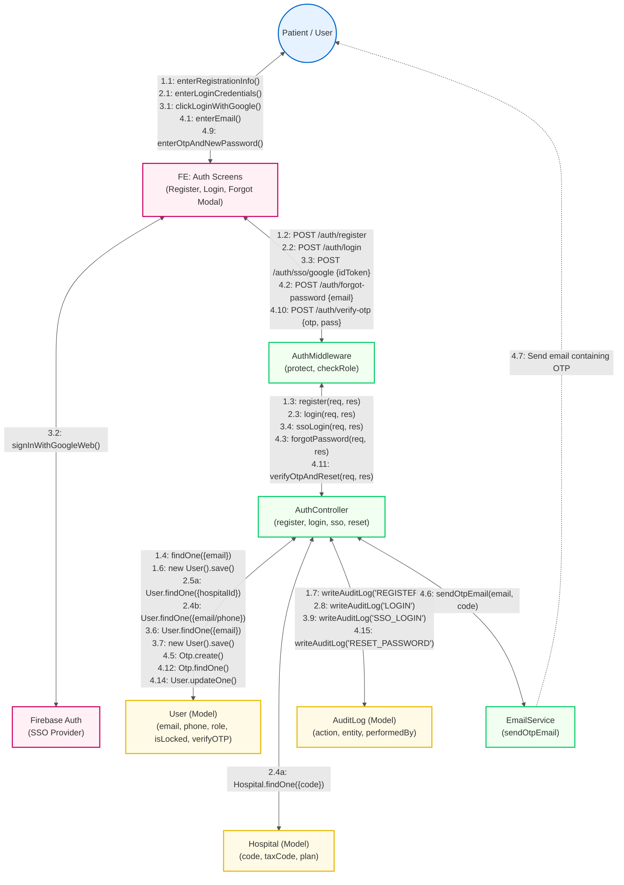
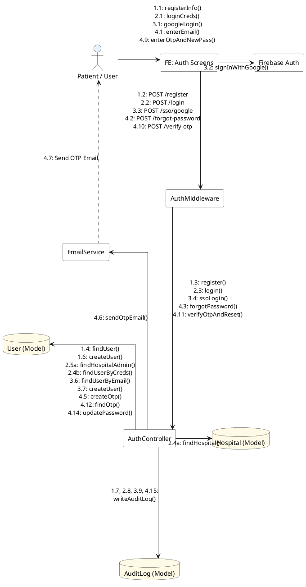

# Unified Authentication Communication Diagram (Biểu đồ Giao tiếp tổng thể phần Authentication)

Tài liệu này cung cấp **Communication Diagram** (Biểu đồ Giao tiếp/Cộng tác) tổng thể cho phân hệ Authentication của dự án. Biểu đồ này được xây dựng bằng cách kết hợp:
1. **Luồng điều hướng** từ [Activity Diagram](hình_a) (liên kết Đăng ký -> Đăng nhập -> SSO -> Quên mật khẩu -> Điều hướng theo Vai trò).
2. **Cấu trúc lớp** từ [Class Diagram](hình_b) (sử dụng các lớp `AuthMiddleware`, `User`, `Hospital`, `AuditLog`).
3. **Các thông điệp chi tiết** từ [Sequence Diagram](auth_sequence_diagram.md).

---

## 1. Bản vẽ dạng Mermaid (Hiển thị trực quan trong IDE)

---

## 2. Bản vẽ dạng PlantUML (Đầy đủ chú thích chuẩn hóa)

Bạn có thể sao chép đoạn mã PlantUML dưới đây để kết xuất sơ đồ giao tiếp dạng lưới phẳng:

---

## 3. Bảng tra cứu thông điệp (Message Legend)

Để sơ đồ PlantUML không bị chồng chéo chữ, các đường liên kết được đánh số thứ tự tương ứng với các lời gọi hàm dưới đây:

| Mã số | Lời gọi hàm / Thông điệp | Nguồn $\to$ Đích | Chi tiết Use Case |
| :--- | :--- | :--- | :--- |
| **1.1** | `enterRegistrationInfo()` | User $\to$ FE | **UC-01**: Patient Registration |
| **1.2** | `POST /auth/register` | FE $\to$ Middleware | **UC-01**: Patient Registration |
| **1.3** | `register(req, res)` | Middleware $\to$ Controller | **UC-01**: Patient Registration |
| **1.4** | `findOne({email})` | Controller $\to$ User (Model) | **UC-01**: Patient Registration |
| **1.6** | `new User({...}).save()` | Controller $\to$ User (Model) | **UC-01**: Patient Registration |
| **1.7** | `writeAuditLog('REGISTER')` | Controller $\to$ AuditLog | **UC-01**: Patient Registration |
| **2.1** | `enterLoginCredentials()` | User $\to$ FE | **UC-02**: User Login |
| **2.2** | `POST /auth/login` | FE $\to$ Middleware | **UC-02**: User Login |
| **2.3** | `login(req, res)` | Middleware $\to$ Controller | **UC-02**: User Login |
| **2.4a** | `Hospital.findOne({code})` | Controller $\to$ Hospital | **UC-02**: User Login (Mã bệnh viện) |
| **2.4b** | `User.findOne({$or: [email, phone]})`| Controller $\to$ User (Model) | **UC-02**: User Login (Email/SĐT) |
| **2.5a** | `User.findOne({hospitalId})` | Controller $\to$ User (Model) | **UC-02**: User Login (Mã bệnh viện) |
| **2.8** | `writeAuditLog('LOGIN')` | Controller $\to$ AuditLog | **UC-02**: User Login |
| **3.1** | `clickLoginWithGoogle()` | User $\to$ FE | **UC-03**: SSO Login |
| **3.2** | `signInWithGoogleWeb()` | FE $\to$ Firebase | **UC-03**: SSO Login |
| **3.3** | `POST /auth/sso/google {idToken}` | FE $\to$ Middleware | **UC-03**: SSO Login |
| **3.4** | `ssoLogin(req, res)` | Middleware $\to$ Controller | **UC-03**: SSO Login |
| **3.6** | `User.findOne({email})` | Controller $\to$ User (Model) | **UC-03**: SSO Login |
| **3.7** | `new User({role: 'patient'}).save()` | Controller $\to$ User (Model) | **UC-03**: SSO Login |
| **3.9** | `writeAuditLog('SSO_LOGIN')` | Controller $\to$ AuditLog | **UC-03**: SSO Login |
| **4.1** | `enterEmail()` (Forgot Modal) | User $\to$ FE | **UC-04**: Forgot Password |
| **4.2** | `POST /auth/forgot-password {email}`| FE $\to$ Middleware | **UC-04**: Forgot Password |
| **4.3** | `forgotPassword(req, res)` | Middleware $\to$ Controller | **UC-04**: Forgot Password |
| **4.5** | `Otp.create({email, code, expiresAt})`| Controller $\to$ User (Model) | **UC-04**: Forgot Password |
| **4.6** | `sendOtpEmail(email, code)` | Controller $\to$ EmailService | **UC-04**: Forgot Password |
| **4.7** | Gửi email chứa OTP | EmailService $\to$ User | **UC-04**: Forgot Password |
| **4.9** | `enterOtpAndNewPassword()` | User $\to$ FE | **UC-04**: Forgot Password |
| **4.10** | `POST /auth/verify-otp {otp, pass}` | FE $\to$ Middleware | **UC-04**: Forgot Password |
| **4.11** | `verifyOtpAndReset(req, res)` | Middleware $\to$ Controller | **UC-04**: Forgot Password |
| **4.12** | `Otp.findOne({email, code})` | Controller $\to$ User (Model) | **UC-04**: Forgot Password |
| **4.14** | `User.updateOne({email}, {password})`| Controller $\to$ User (Model) | **UC-04**: Forgot Password |
| **4.15** | `writeAuditLog('RESET_PASSWORD')` | Controller $\to$ AuditLog | **UC-04**: Forgot Password |

---

## 3. Bản chất ánh xạ từ Class Diagram và Activity Diagram

### Ánh xạ từ Class Diagram
1. **`AuthMiddleware`**: Đóng vai trò lớp chắn bảo vệ các Route và trung chuyển dữ liệu từ Frontend (`FE`) đến `AuthController`. Lớp này thực hiện kiểm tra mã token và định dạng dữ liệu đầu vào.
2. **`User` và `Hospital`**: Là các Entity chính. Khi `AuthController` tiếp nhận đăng ký hoặc đăng nhập:
   * Nếu có mã bệnh viện (`hospitalId`), Controller sẽ thực hiện kết nối sang lớp `Hospital` để lấy cấu hình bệnh viện và kiểm tra quyền admin.
   * Sử dụng hàm `login(creds)` và `verifyOTP(otp)` được đặc tả trực tiếp trong thực thể `User`.
3. **`AuditLog`**: Hệ thống gọi lớp tiện ích dùng chung để lưu vết mọi hành động thành công/thất bại của User nhằm phục vụ việc kiểm toán bảo mật.

### Ánh xạ từ Activity Diagram
* **Cơ chế rẽ nhánh (Decision / Alternative Flows)**: Luồng đi từ `User` qua màn `FE` được rẽ làm 4 luồng ứng với 4 lựa chọn của người dùng trong **Activity Diagram** (Chưa có tài khoản -> Đăng ký; Có tài khoản -> Chọn SSO Google hoặc Đăng nhập thường; Quên mật khẩu -> Gửi OTP). Mọi nhánh sau khi xác thực thành công đều quy tụ về bước sinh Token của hệ thống và điều hướng về Home theo vai trò.
