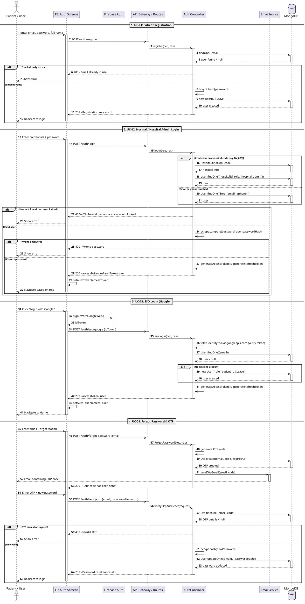

# Unified Authentication Sequence Diagram (Sơ đồ Sequence tổng thể phần Authentication)

Tài liệu này cung cấp sơ đồ Sequence tổng thể tích hợp cả 4 chức năng Authentication của hệ thống, được phân tách rõ ràng bằng các đường phân vùng (Dividers) giống như định dạng trong tài liệu mẫu của bạn.

> [!NOTE]
> Bản vẽ sử dụng hai định dạng phổ biến là **Mermaid** (tự động hiển thị trực quan trong các trình đọc Markdown như VS Code, GitHub) và **PlantUML** (chuẩn hóa doanh nghiệp với các đường gạch phân khu đẹp mắt).

---

## 1. Bản vẽ dạng Mermaid (Hiển thị trực quan)

```mermaid
sequenceDiagram
    autonumber
    actor User as Patient / User
    participant FE as FE: Auth Screens
    participant Firebase as Firebase Auth
    participant API as API Gateway / Routes
    participant Ctrl as AuthController
    participant Email as EmailService
    participant DB as MongoDB

    %% ==========================================
    %% UC-01: Patient Registration
    %% ==========================================
    rect rgb(240, 245, 255)
        Note over User, DB: PHÂN KHU 1 - UC-01: Patient Registration (Đăng ký bệnh nhân)
    end
    User ->> FE: Nhập email, password, full name
    activate FE
    FE ->> API: POST /auth/register
    activate API
    API ->> Ctrl: register(req, res)
    activate Ctrl
    Ctrl ->> DB: findOne({email})
    activate DB
    DB -->> Ctrl: user found / null
    deactivate DB
    
    alt Email already exists (Đã tồn tại)
        Ctrl -->> FE: 400 - Email already in use
        FE -->> User: Hiển thị lỗi trùng email
    else Email is valid (Hợp lệ)
        Note over Ctrl: bcrypt.hash(password)
        Ctrl ->> DB: new User({...}).save()
        activate DB
        DB -->> Ctrl: user created
        deactivate DB
        Ctrl -->> FE: 201 - Registration successful
        deactivate Ctrl
        deactivate API
        FE -->> User: Chuyển hướng sang màn Login
        deactivate FE
    end

    %% ==========================================
    %% UC-02: User Login
    %% ==========================================
    rect rgb(245, 240, 255)
        Note over User, DB: PHÂN KHU 2 - UC-02: Login (Đăng nhập hệ thống)
    end
    User ->> FE: Nhập credentials (email/phone/hospital code) + password
    activate FE
    FE ->> API: POST /auth/login
    activate API
    API ->> Ctrl: login(req, res)
    activate Ctrl
    
    alt Credential is a hospital code (e.g. BV_003)
        Ctrl ->> DB: Hospital.findOne({code})
        activate DB
        DB -->> Ctrl: hospital info
        deactivate DB
        Ctrl ->> DB: User.findOne({hospitalId, role: 'hospital_admin'})
        activate DB
        DB -->> Ctrl: user (admin bệnh viện)
        deactivate DB
    else Email or phone number
        Ctrl ->> DB: User.findOne({$or: [{email}, {phone}]})
        activate DB
        DB -->> Ctrl: user
        deactivate DB
    end
    
    alt User not found / account locked
        Ctrl -->> FE: 400/403 - Invalid credentials or account locked
        FE -->> User: Hiển thị lỗi tài khoản/khóa
    else Valid user (Tài khoản hợp lệ)
        Note over Ctrl: bcrypt.compare(password, user.passwordHash)
        alt Wrong password
            Ctrl -->> FE: 400 - Wrong password
            FE -->> User: Hiển thị lỗi sai mật khẩu
        else Correct password
            Note over Ctrl: generateAccessToken() / generateRefreshToken()
            Ctrl -->> FE: 200 - accessToken, refreshToken, user
            deactivate Ctrl
            deactivate API
            FE -> FE: setAuthToken(accessToken)
            FE -->> User: Điều hướng dựa trên Vai trò (Role)
            deactivate FE
        end
    end

    %% ==========================================
    %% UC-03: SSO Login
    %% ==========================================
    rect rgb(240, 255, 245)
        Note over User, DB: PHÂN KHU 3 - UC-03: SSO Login (Đăng nhập Google)
    end
    User ->> FE: Nhấn "Login with Google"
    activate FE
    FE ->> Firebase: signInWithGoogleWeb()
    activate Firebase
    Firebase -->> FE: idToken
    deactivate Firebase
    FE ->> API: POST /auth/sso/google {idToken}
    activate API
    API ->> Ctrl: ssoLogin(req, res)
    activate Ctrl
    Note over Ctrl: fetch identitytoolkit.googleapis.com (verify token)
    Ctrl ->> DB: User.findOne({email})
    activate DB
    DB -->> Ctrl: user / null
    deactivate DB
    
    alt No existing account (Chưa có tài khoản)
        Ctrl ->> DB: new User({role: 'patient', ...}).save()
        activate DB
        DB -->> Ctrl: user created
        deactivate DB
    end
    
    Note over Ctrl: generateAccessToken() / generateRefreshToken()
    Ctrl -->> FE: 200 - accessToken, user
    deactivate Ctrl
    deactivate API
    FE -> FE: setAuthToken(accessToken)
    FE -->> User: Điều hướng về màn Home
    deactivate FE

    %% ==========================================
    %% UC-04: Forgot Password
    %% ==========================================
    rect rgb(255, 245, 240)
        Note over User, DB: PHÂN KHU 4 - UC-04: Forgot Password (Quên mật khẩu & OTP)
    end
    User ->> FE: Nhập email (Forgot Modal)
    activate FE
    FE ->> API: POST /auth/forgot-password {email}
    activate API
    API ->> Ctrl: forgotPassword(req, res)
    activate Ctrl
    Note over Ctrl: Tạo mã OTP ngẫu nhiên
    Ctrl ->> DB: Otp.create({email, code, expiresAt})
    activate DB
    DB -->> Ctrl: Đã tạo bản ghi OTP
    deactivate DB
    Ctrl ->> Email: sendOtpEmail(email, code)
    activate Email
    Email -->> User: Email chứa mã OTP
    deactivate Email
    Ctrl -->> FE: 200 - "OTP code has been sent"
    deactivate Ctrl
    deactivate API
    
    User ->> FE: Nhập OTP + mật khẩu mới
    FE ->> API: POST /auth/verify-otp {email, code, newPassword}
    activate API
    API ->> Ctrl: verifyOtpAndReset(req, res)
    activate Ctrl
    Ctrl ->> DB: Otp.findOne({email, code})
    activate DB
    DB -->> Ctrl: OTP details / null
    deactivate DB
    
    alt OTP invalid or expired (OTP sai hoặc hết hạn)
        Ctrl -->> FE: 400 - Invalid OTP
        FE -->> User: Hiển thị lỗi OTP không hợp lệ
    else OTP valid (OTP chính xác)
        Note over Ctrl: bcrypt.hash(newPassword)
        Ctrl ->> DB: User.updateOne({email}, {passwordHash})
        activate DB
        DB -->> Ctrl: Cập nhật mật khẩu thành công
        deactivate DB
        Ctrl -->> FE: 200 - Password reset successful
        deactivate Ctrl
        deactivate API
        FE -->> User: Chuyển hướng về đăng nhập
        deactivate FE
    end
```

---

## 2. Bản vẽ dạng PlantUML (Đầy đủ dải ngăn cách)

Nếu bạn dùng các công cụ chuyên dụng của PlantUML (như PlantText, các plugin IDE), bạn có thể copy đoạn mã dưới đây để sinh ra bản vẽ có đường ngăn cách giống hệt 2 bức ảnh mẫu:

