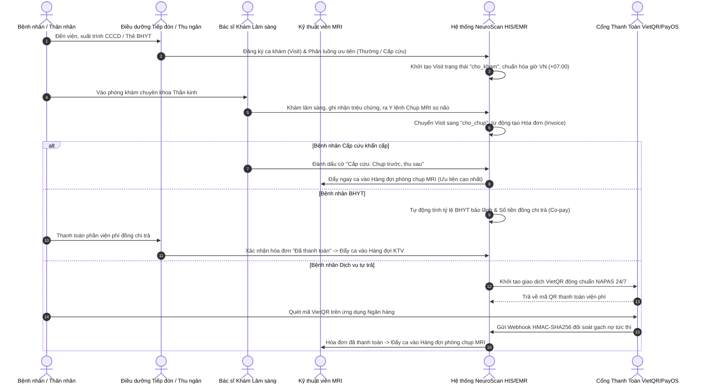
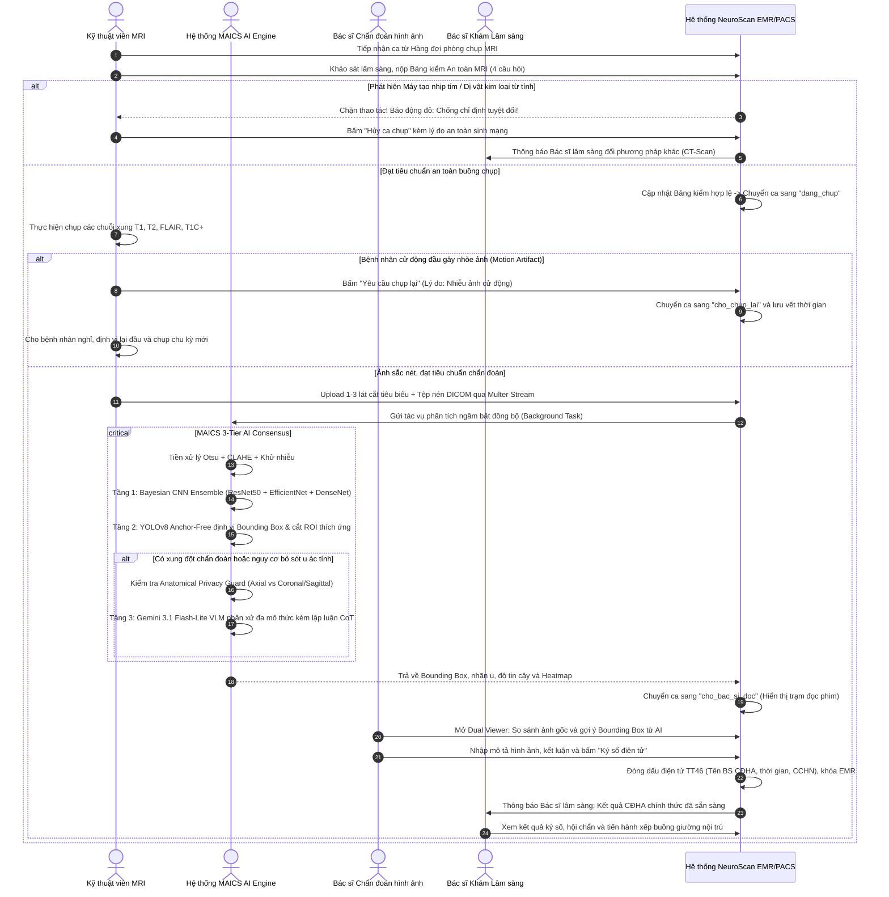
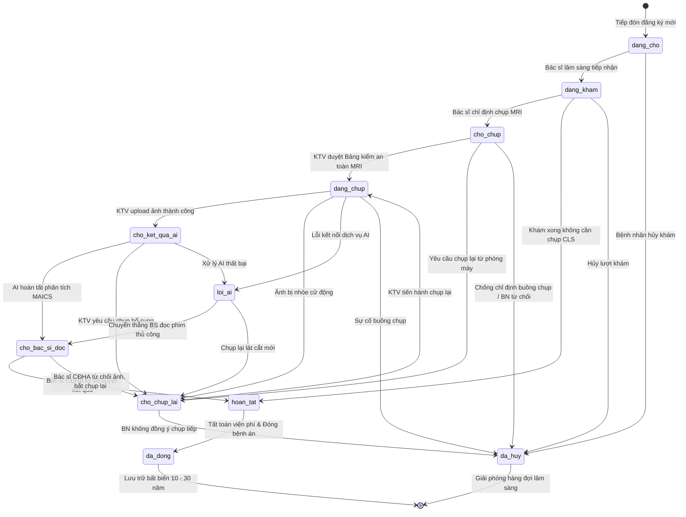

# BÁO CÁO ĐỒ ÁN TỐT NGHIỆP KỸ SƯ CÔNG NGHỆ THÔNG TIN
# CHƯƠNG 2: PHÂN TÍCH NGHIỆP VỤ VÀ QUY TRÌNH BỆNH VIỆN

---

## 2.1. CƠ SỞ PHÁP LÝ VÀ TIÊU CHUẨN Y TẾ VIỆT NAM

Hệ thống **NeuroScan AI** được thiết kế bám sát các khung tiêu chuẩn, quy chế chuyên môn và văn bản quy phạm pháp luật do Bộ Y Tế và Nhà nước Việt Nam ban hành:

1. **Thông tư số 46/2018/TT-BYT:** Quy định về hồ sơ bệnh án điện tử (Electronic Medical Record - EMR). Đòi hỏi hệ thống phải:
   - Lưu trữ đầy đủ lịch sử khám chữa bệnh, diễn biến lâm sàng, chỉ định cận lâm sàng và kết quả hình ảnh học.
   - Bắt buộc có chữ ký số hoặc chữ ký điện tử của người hành nghề có chứng chỉ hành nghề (CCHN) hợp lệ.
   - **Quy tắc bất biến (Immutability):** Nghiêm cấm xóa cứng (Hard Delete) hồ sơ bệnh án. Khi đã ký số hoặc hoàn tất xuất viện, hồ sơ phải được khóa bất biến; mọi bổ sung thông tin sau đó bắt buộc phải thực hiện thông qua Phụ lục bệnh án (Append-Only Addendum).
   - Thời hạn lưu trữ tối thiểu: 10 năm đối với hồ sơ thông thường, 20 năm đối với bệnh án nội trú, và tối thiểu 30 năm đối với bệnh nhân ung thư não.
2. **Luật Khám bệnh, chữa bệnh số 15/2023/QH15:**
   - Quy định nghiêm ngặt về quyền bí mật thông tin của người bệnh (Điều 66).
   - Quy định nguyên tắc ưu tiên cấp cứu ("Cứu người trước, thủ tục sau" - Điều 3).
   - Quy định rõ thẩm quyền và phạm vi hoạt động chuyên môn của từng chức danh nghề nghiệp y tế.
3. **Thông tư số 54/2017/TT-BYT:** Quy định bộ tiêu chí ứng dụng công nghệ thông tin tại các cơ sở khám bệnh, chữa bệnh, bao gồm tiêu chí quản lý thông tin bệnh viện (HIS), quản lý thông tin chẩn đoán hình ảnh (RIS) và hệ thống lưu trữ - truyền tải hình ảnh y tế (PACS).
4. **Quy chế Chẩn đoán hình ảnh (Ban hành theo Quyết định số 1895/1997/QĐ-BYT):**
   - Phân định rõ trách nhiệm, quyền hạn giữa Bác sĩ chỉ định (Ordering Doctor) và Bác sĩ thực hiện kỹ thuật/đọc phim (Radiologist).
   - Bắt buộc tuân thủ quy trình an toàn phòng chụp cộng hưởng từ và quy chế lưu trữ kết quả.
5. **Thông tư số 30/2018/TT-BYT & Luật Bảo hiểm Y tế:**
   - Quy định danh mục và tỷ lệ, điều kiện thanh toán đối với thuốc, hóa chất, vật tư y tế.
   - Quy định điều kiện duyệt trước (Prior Authorization) đối với các thuốc ung bướu đặc trị giá trị cao (như Bevacizumab cho u thần kinh đệm tái phát).
   - Quy định mức hưởng BHYT đúng tuyến (80%, 95%, 100%), trái tuyến nội trú/ngoại trú, và mức thanh toán vượt trần 40 tháng lương cơ sở (~72 triệu VNĐ/năm).
6. **Tiêu chuẩn An toàn Dữ liệu Y tế Quốc tế (HIPAA & WHO CNS5):**
   - Tiêu chuẩn HIPAA Safe Harbor: Khử định danh 18 nhóm thông tin định danh cá nhân trên ảnh DICOM và gom nhóm tuổi trên 89 thành danh mục `90+`.
   - Cơ chế Break-Glass cấp cứu (HIPAA §164.312(a)(2)(ii)) cho phép bác sĩ truy cập khẩn cấp hồ sơ bệnh án có kiểm soát (tối đa 3 lần/ngày) và ghi vết kiểm toán.
   - Hướng dẫn phân loại u hệ thần kinh trung ương WHO CNS5 (2021) dựa trên chỉ dấu sinh học phân tử (IDH1/2, MGMT, 1p/19q).

---

## 2.2. PHÂN TÍCH CÁC NGHỊCH LÝ THỰC TẾ VÀ GIẢI PHÁP CHUẨN HÓA LÂM SÀNG

Trong quá trình phát triển phần mềm y tế, các hệ thống thường gặp phải những sai lầm logic nghiêm trọng do sự khác biệt lớn giữa tư duy CRUD thông thường và thực tế vận hành lâm sàng tại bệnh viện. Bảng sau tổng hợp 12 nghịch lý y tế tiêu biểu và giải pháp đã được hiện thực hóa trong NeuroScan AI:

| STT | Nghịch lý / Sai sót thường gặp | Thực tế lâm sàng tại Bệnh viện | Giải pháp chuẩn hóa trong NeuroScan AI |
| :---: | :--- | :--- | :--- |
| **1** | **Bệnh nhân chưa nộp tiền vẫn được chụp MRI** | Bệnh nhân dịch vụ bắt buộc phải đóng tiền trước; tuy nhiên ca **Cấp cứu** phải được chụp ngay lập tức để cứu sống tính mạng. | Phân loại trạng thái viện phí đa kênh: Huy hiệu `🚨 CẤP CỨU: Chụp trước, thu sau`, `🟢 BHYT: Đã bảo lãnh`, và `⚠️ CHƯA ĐÓNG PHÍ MRI`. |
| **2** | **Bác sĩ khám lâm sàng tự ký kết quả đọc phim MRI** | Bác sĩ khám (Nội/Ngoại thần kinh) không có chứng chỉ hành nghề CĐHA, không có thẩm quyền pháp lý ký duyệt phiếu kết quả hình ảnh. | Phân định rạch ròi 2 bác sĩ: **Bác sĩ chỉ định** và **Bác sĩ CĐHA**. Chỉ Bác sĩ CĐHA mới có quyền duyệt mô tả tổn thương và đóng dấu `✓ ĐÃ KÝ SỐ ĐIỆN TỬ`. |
| **3** | **Bỏ qua sàng lọc an toàn buồng chụp MRI** | Từ trường cực mạnh của máy MRI (1.5T - 3.0T) biến kim loại thành đạn bắn và làm hỏng máy tạo nhịp tim, đe dọa sinh mạng bệnh nhân. | Bắt buộc KTV hoàn thành **Bảng kiểm an toàn buồng MRI** (4 câu hỏi sinh mạng) trước khi hệ thống cho phép chuyển ca sang `dang_chup`. |
| **4** | **Không có quy trình xử lý ảnh bị mờ/nhiễu** | Khi bệnh nhân cử động đầu hoặc hoảng loạn, ảnh MRI bị nhòe (Motion Artifact) không thể đọc được tổn thương. | Bổ sung trạng thái `chờ chụp lại` (Rescan) và `đã hủy` (Cancel) kèm lưu vết lý do lâm sàng và nhân sự thao tác. |
| **5** | **Cướp giường bệnh giữ chỗ tạm thời (Bed Hijacking)** | Giường đã được giữ chỗ riêng cho bệnh nhân cấp cứu trong 4 giờ bị nhân viên khoa khác xếp đè bệnh nhân khác vào. | Áp dụng khóa nguyên tử có kiểm tra chủ quyền sở hữu: Giường chỉ được nhận nếu `status: available` HOẶC (`status: reserved` VÀ đúng `patientId` được giữ chỗ). |
| **6** | **Tràn RAM máy chủ khi gửi ảnh Base64** | Gửi ảnh DICOM/Slices dạng Base64 qua JSON làm phình 33% kích thước và gây tràn bộ nhớ (OOM) khi nhiều KTV cùng nộp ảnh. | Chuyển sang **Multer Multipart Stream ghi trực tiếp xuống đĩa**, giải phóng hoàn toàn bộ nhớ đệm RAM của Node.js. |
| **7** | **Xóa cứng bệnh án vi phạm Thông tư 46/2018** | Sử dụng lệnh `deleteOne()` xóa mất dữ liệu bệnh án trong CSDL và file trên đám mây, vi phạm luật lưu trữ 10 - 30 năm. | Chuyển toàn bộ sang **Soft Delete**: Thêm cờ `isDeleted`, `deletedAt`, `deletedBy`; cấm xóa ca khám đã hoàn tất hoặc đã thanh toán viện phí. |
| **8** | **Lệch múi giờ UTC/GMT+7 làm mất ca khám đêm** | Máy chủ chạy UTC khiến ca khám từ 00:00 - 06:59 sáng giờ VN bị đẩy lùi về ngày hôm trước, làm rỗng hàng đợi sáng sớm. | Chuẩn hóa hàm `getDayRangeVN` sử dụng múi giờ `Asia/Ho_Chi_Minh` (+07:00), xác định chính xác ranh giới đầu ngày và cuối ngày theo giờ Việt Nam. |
| **9** | **Nhảy cóc trạng thái ca khám bất thường** | Gọi API cập nhật thẳng từ "đang chờ" sang "hoàn tất", bỏ qua chỉ định, chụp phim và ký số. | Cài đặt **Finite State Machine (FSM)** với ma trận chuyển trạng thái hợp lệ `ALLOWED_TRANSITIONS`; từ chối ngay lập tức (400 Bad Request) các bước nhảy sai quy trình. |
| **10**| **Giả mạo chữ ký cam đoan phẫu thuật** | Client gửi `req.body.role: "doctor"` để tự ý ký duyệt cam kết phẫu thuật thay bác sĩ điều trị. | Loại bỏ hoàn toàn `role` từ body; trích xuất vai trò từ JWT (`req.user.role`). Bác sĩ chỉ ký phần chuyên môn; bệnh nhân chỉ ký khi sở hữu hồ sơ. |
| **11**| **Bypass thanh toán qua redirect URL công khai** | Cập nhật trạng thái "đã thanh toán" tại đường dẫn returnUrl `GET /payment/success` mà không qua cổng PayOS. | Xóa bỏ toàn bộ mutation tại route GET công khai; bắt buộc mọi xác nhận thanh toán phải qua **PayOS Webhook có kiểm tra chữ ký HMAC-SHA256**. |
| **12**| **Thất thoát kho dược khi hủy/hoàn tiền hóa đơn** | Tiền viện phí được hoàn trả nhưng số lượng thuốc trong kho không tăng trở lại, gây âm hoặc lệch kho dược. | Tự động kích hoạt chu trình đối ứng: Duyệt các mục thuốc trong hóa đơn và gửi lệnh `$inc: { "stock.quantity": qty }` để hồi vị kho tức thời. |

---

## 2.3. CÁC QUY TRÌNH NGHIỆP VỤ LÂM SÀNG CỐT LÕI

### 2.3.1. Quy trình Khám bệnh, Chỉ định MRI và Viện phí



### 2.3.2. Quy trình An toàn Buồng chụp, Chụp phim, Chẩn đoán AI và Ký số CĐHA



---

## 2.4. SƠ ĐỒ MÁY TRẠNG THÁI CA KHÁM (FINITE STATE MACHINE - FSM)

Toàn bộ vòng đời của một ca khám bệnh trong hệ thống NeuroScan AI được quản trị bằng một Máy trạng thái hữu hạn tất định (Deterministic Finite State Machine), ngăn chặn hoàn toàn việc can thiệp trái phép hoặc nhảy cóc trạng thái:



### Ma Trận Quy Tắc Chuyển Đổi Trạng Thái Hợp Lệ (`ALLOWED_TRANSITIONS`):

```javascript
const ALLOWED_TRANSITIONS = {
  'đang chờ': ['đang khám', 'đã hủy'],
  'đang khám': ['chờ chụp', 'hoàn tất', 'đã hủy'],
  'chờ chụp': ['đang chụp', 'chờ chụp lại', 'đã hủy'],
  'đang chụp': ['chờ kết quả AI', 'chờ chụp lại', 'lỗi AI', 'đã hủy'],
  'chờ kết quả AI': ['chờ bác sĩ đọc', 'chờ chụp lại', 'lỗi AI'],
  'lỗi AI': ['chờ bác sĩ đọc', 'chờ chụp lại'],
  'chờ chụp lại': ['đang chụp', 'đã hủy'],
  'chờ bác sĩ đọc': ['hoàn tất', 'chờ chụp lại'],
  'hoàn tất': ['đã đóng'],
  'đã đóng': [], // Trạng thái kết thúc - Khóa bất biến
  'đã hủy': []   // Trạng thái kết thúc
};
```
> [!NOTE]
> Bất kỳ yêu cầu API nào cố tình chuyển trạng thái không nằm trong danh sách `ALLOWED_TRANSITIONS[currentStatus]` đều bị tầng Service từ chối ngay lập tức với mã lỗi `400 Bad Request`. Đối với ca khám đã ở trạng thái `'hoàn tất'`, `'đã đóng'` hoặc `'đã hủy'`, hệ thống khóa chặn mọi thao tác sửa đổi trực tiếp để bảo toàn tính nguyên vẹn của hồ sơ bệnh án theo Thông tư 46/2018/TT-BYT.

---

## 2.5. QUY TRÌNH QUẢN LÝ BUỒNG GIƯỜNG NỘI TRÚ VÀ CHỐNG CƯỚP GIƯỜNG

Trong điều kiện các khoa Phẫu thuật Thần kinh luôn trong tình trạng khan hiếm giường bệnh, quy trình điều chuyển và bố trí giường bệnh nội trú được quản lý theo cơ chế sở hữu chủ thể nghiêm ngặt:

1. **Giữ chỗ tạm thời (Bed Reservation):**
   - Khi bác sĩ chỉ định nhập viện điều trị u não, điều dưỡng thực hiện thao tác giữ chỗ giường bệnh trống (`available`).
   - Thời hạn giữ chỗ mặc định: **4 giờ** (đảm bảo đủ thời gian vận chuyển bệnh nhân cấp cứu và làm thủ tục hành chính).
   - Hệ thống ghi nhận chính xác: ID bệnh nhân được giữ chỗ (`reservedForPatientId`), ID nhân viên giữ chỗ và mốc thời gian hết hạn (`reservedUntil`).
2. **Cơ chế chống cướp giường (Anti-Hijacking Protection):**
   - Khi điều dưỡng tiến hành nhận giường (`occupy`), hệ thống thực thi kiểm tra nguyên tử:
     - Giường phải đang ở trạng thái `available`; **HOẶC**
     - Giường đang ở trạng thái `reserved` nhưng `reservedForPatientId` **phải trùng khớp chính xác** với bệnh nhân đang làm thủ tục nhập buồng.
   - Trường hợp nhân viên khoa khác cố tình đưa bệnh nhân khác vào giường đang giữ chỗ, hệ thống trả về mã lỗi `409 Conflict: Giường bệnh đang được giữ chỗ hợp lệ cho bệnh nhân khác!`.
3. **Quy trình Khử khuẩn và Tái sử dụng (Bed Sanitization Cycle):**
   - Khi bệnh nhân xuất viện: Giường chuyển sang trạng thái `cleaning` (Đang khử khuẩn).
   - Chỉ khi hộ lý hoàn thành việc vệ sinh, thay ga trải giường và bấm "Xác nhận buồng bệnh sạch", giường mới quay trở lại trạng thái `available` cho các ca tiếp theo.

---

## 2.6. QUY TRÌNH LIÊN THÔNG VÀ CHUYỂN TUYẾN Y TẾ (CROSS-HOSPITAL TRANSFER)

Để giải quyết bài toán "đảo dữ liệu" nhưng vẫn bảo vệ tuyệt đối bí mật y tế cá nhân:

1. **Lập Phiếu Chuyển Tuyến (Transfer Form):** Bác sĩ tuyến dưới tạo phiếu chuyển viện theo Mẫu số 01/BV của Bộ Y Tế, ghi rõ lý do chuyển tuyến (vượt quá khả năng chuyên môn phẫu thuật thần kinh).
2. **Cấp Quyền Tiếp Cận Hồ Sơ Chéo Viện Có Thời Hạn (`grant-cross-view`):**
   - Khi bệnh viện tuyến trên chấp thuận tiếp nhận, hệ thống phát hành một mã khóa truy cập mật mã học (Crypto Token) sử dụng thư viện `crypto` chuẩn của Node.js.
   - Token này cho phép bác sĩ bệnh viện tuyến trên xem toàn bộ bệnh án, các chuỗi ảnh MRI và biên bản hội chẩn của bệnh viện tuyến dưới trong thời hạn tối đa **7 ngày**.
   - Hết thời hạn 7 ngày, quyền truy cập tự động bị thu hồi để bảo vệ quyền riêng tư của người bệnh.

---

## 2.7. QUY TRÌNH HỘI CHẨN ĐA CHUYÊN KHOA VÀ THEO DÕI TÁI PHÁT (TUMOR BOARD & SURVEILLANCE)

Đối với bệnh lý u não ác tính (High-Grade Glioma):
1. **Hội chẩn Đa chuyên khoa (Tumor Board Review):**
   - Sự phối hợp bắt buộc giữa 4 chuyên khoa: Phẫu thuật Thần kinh, Chẩn đoán Hình ảnh, Giải phẫu bệnh (xét nghiệm chỉ dấu sinh học phân tử) và Ung bướu/Xạ trị.
   - Biên bản hội chẩn được ghi nhận đồng thời vào hệ thống, lưu vết kiểm toán và bảo vệ bằng chuỗi băm mật mã Tamper-Evident Hash Chain.
2. **Quy trình Đánh giá Hậu phẫu 72 Giờ (Extent of Resection - EOR):**
   - Chụp MRI não có tiêm thuốc đối quang từ trong vòng 72 giờ sau mổ để đánh giá chính xác thể tích u còn sót lại trước khi hiện tượng phù não và mô hạt sau mổ gây nhiễu ảnh.
3. **Quy trình Theo dõi Định kỳ (Surveillance Protocol):**
   - Thiết lập lịch chụp MRI tái khám định kỳ mỗi 2 - 3 tháng nhằm phát hiện sớm dấu hiệu tái phát hoặc phân biệt giữa tái phát u thực sự và hiện tượng giả tiến triển (Pseudoprogression) do xạ trị.
