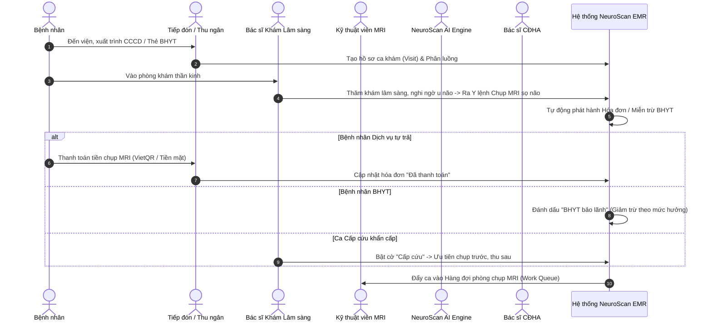
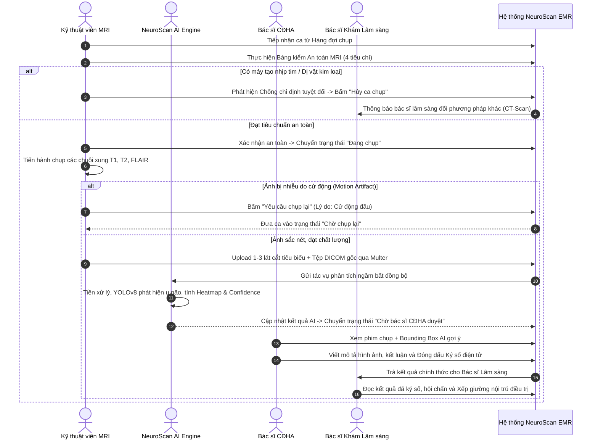
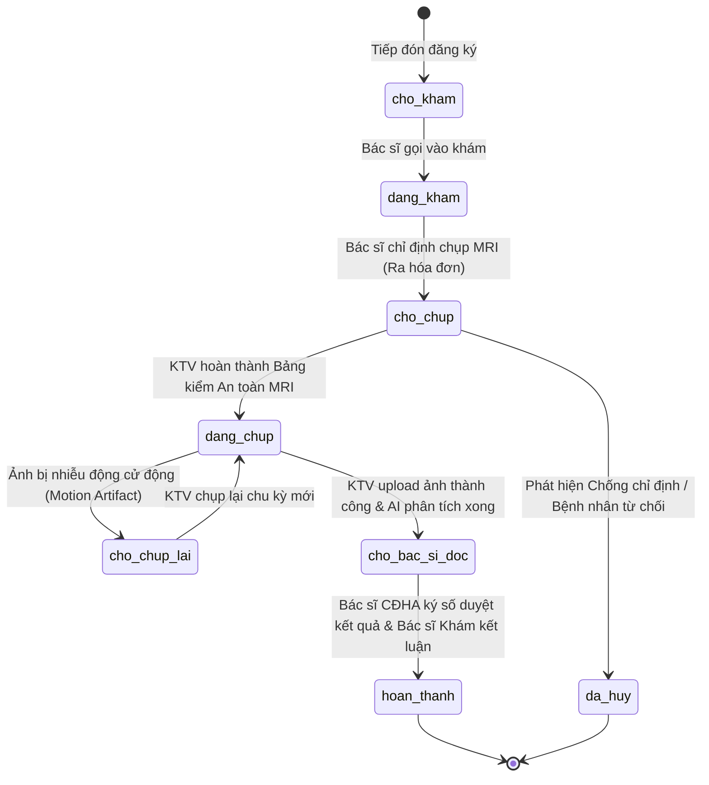

# BÁO CÁO ĐỒ ÁN TỐT NGHIỆP KỸ SƯ CÔNG NGHỆ THÔNG TIN
# CHƯƠNG 2: PHÂN TÍCH NGHIỆP VỤ VÀ QUY TRÌNH BỆNH VIỆN

---

## 2.1. CƠ SỞ PHÁP LÝ VÀ TIÊU CHUẨN Y TẾ VIỆT NAM

Hệ thống **NeuroScan AI** được thiết kế bám sát các khung tiêu chuẩn và quy chế chuyên môn do Bộ Y Tế Việt Nam ban hành:

1. **Thông tư số 46/2018/TT-BYT:** Quy định về hồ sơ bệnh án điện tử (Electronic Medical Record - EMR). Đòi hỏi hệ thống phải lưu trữ đầy đủ lịch sử khám bệnh, kết quả chẩn đoán hình ảnh kèm chữ ký điện tử hoặc chữ ký số của người hành nghề có thẩm quyền, hướng tới bệnh viện không sử dụng bệnh án giấy và phim nhựa.
2. **Thông tư số 54/2017/TT-BYT:** Quy định bộ tiêu chí ứng dụng công nghệ thông tin tại các cơ sở khám bệnh, chữa bệnh. Trong đó, hệ thống đáp ứng các nhóm tiêu chí quản lý thông tin bệnh viện (HIS), quản lý thông tin chẩn đoán hình ảnh (RIS) và lưu trữ - truyền tải hình ảnh y tế (PACS).
3. **Quy chế Chẩn đoán hình ảnh (Ban hành theo Quyết định số 1895/1997/QĐ-BYT):** Quy định rõ trách nhiệm, quyền hạn giữa bác sĩ chỉ định và bác sĩ thực hiện kỹ thuật, quy trình an toàn phòng chụp và lưu trữ phim/kết quả.
4. **Luật Khám bệnh, chữa bệnh số 15/2023/QH15:** Quy định nghiêm ngặt về quyền bí mật thông tin của người bệnh, nguyên tắc ưu tiên cấp cứu ("Cứu người trước, thủ tục sau"), và quyền tự chủ chuyên môn của người hành nghề y.

---

## 2.2. PHÂN TÍCH CÁC NGHỊCH LÝ THỰC TẾ VÀ GIẢI PHÁP CHUẨN HÓA

Trong các đồ án phần mềm y tế thông thường, sinh viên thường mắc phải các sai lầm logic nghiêm trọng do thiếu hiểu biết về thực tế bệnh viện. Bảng sau đây phân tích các "nghịch lý" thường gặp và giải pháp đã được hiện thực hóa trong NeuroScan AI:

| STT | Vấn đề / Nghịch lý thường gặp | Thực tế lâm sàng tại Bệnh viện | Giải pháp chuẩn hóa trong NeuroScan AI |
| :---: | :--- | :--- | :--- |
| **1** | **Bệnh nhân chưa đóng tiền vẫn được chụp MRI** | Quy định tài chính yêu cầu bệnh nhân dịch vụ phải nộp tiền trước. Tuy nhiên, ca **Cấp cứu** phải được ưu tiên chụp ngay lập tức. | Tích hợp hệ thống phân loại trạng thái viện phí: Huy hiệu `🚨 CẤP CỨU: Chụp trước, thu sau`, `🟢 BHYT: Đã bảo lãnh`, và `⚠️ CHƯA ĐÓNG PHÍ MRI`. |
| **2** | **Bác sĩ khám lâm sàng tự ký kết quả đọc phim MRI** | Bác sĩ khám (Nội/Ngoại thần kinh) không có chứng chỉ hành nghề CĐHA nên không có thẩm quyền pháp lý ký duyệt phiếu kết quả chẩn đoán hình ảnh. | Phân định rạch ròi 2 bác sĩ: **Bác sĩ chỉ định (Ordering Doctor)** và **Bác sĩ CĐHA (Radiologist)**. Chỉ Bác sĩ CĐHA mới có quyền duyệt mô tả tổn thương và đóng dấu `✓ ĐÃ KÝ SỐ ĐIỆN TỬ`. |
| **3** | **Bỏ qua sàng lọc an toàn buồng chụp MRI** | Từ trường cực mạnh của máy MRI (1.5T - 3.0T) sẽ hút các vật kim loại hoặc làm hỏng máy tạo nhịp tim, đe dọa trực tiếp tính mạng bệnh nhân. | Bắt buộc KTV phải hoàn thành **Bảng kiểm an toàn MRI (MRI Safety Screening Checklist)** với 4 câu hỏi sinh mạng trước khi cho bệnh nhân vào buồng máy. |
| **4** | **Không có quy trình chụp lại khi ảnh bị mờ/nhiễu** | Khi bệnh nhân cử động đầu hoặc hoảng loạn, ảnh MRI bị nhòe (Motion Artifact) không thể chẩn đoán được. | Bổ sung trạng thái `chờ chụp lại` (Rescan) và `đã hủy` (Cancel) kèm trường lưu vết lý do lâm sàng và nhân sự thực hiện. |
| **5** | **Tranh chấp xếp giường bệnh nội trú** | 2 điều dưỡng tại 2 khoa/phòng khác nhau bấm giữ chỗ cùng 1 giường bệnh trống dẫn đến xung đột (Race Condition). | Áp dụng cơ chế khóa nguyên tử `findOneAndUpdate` trên MongoDB, trả về mã lỗi `409 Conflict` nếu giường vừa được nhân viên khác tiếp nhận. |
| **6** | **Tràn RAM máy chủ khi gửi ảnh Base64** | Gửi ảnh DICOM/Slices dạng Base64 qua JSON làm phình 33% dung lượng mạng và làm sập (OOM) Node.js Backend khi nhiều KTV upload cùng lúc. | Chuyển đổi sang **Multer Binary Multipart Stream**, ghi thẳng dòng nhị phân xuống ổ đĩa, giải phóng hoàn toàn bộ nhớ RAM đệm. |

---

## 2.3. CÁC QUY TRÌNH NGHIỆP VỤ LÂM SÀNG CỐT LÕI

### 2.3.1. Quy trình Khám bệnh và Chỉ định Chụp MRI Não

### 2.3.2. Quy trình Thực hiện Kỹ thuật, Bảng kiểm An toàn và Chẩn đoán AI

---

## 2.4. SƠ ĐỒ MÁY TRẠNG THÁI CA KHÁM (VISIT FINITE STATE MACHINE)

Vòng đời của một ca khám bệnh trong hệ thống NeuroScan AI trải qua các trạng thái hữu hạn được kiểm soát nghiêm ngặt bằng quy tắc chuyển đổi trạng thái (State Transition Rules):

### Bảng Giải Thích Quy Tắc Chuyển Trạng Thái:
1. `cho_kham` $\rightarrow$ `dang_kham`: Khi bác sĩ lâm sàng nhấn "Tiếp nhận bệnh nhân".
2. `dang_kham` $\rightarrow$ `cho_chup`: Khi bác sĩ tạo chỉ định cận lâm sàng MRI não.
3. `cho_chup` $\rightarrow$ `dang_chup`: Bắt buộc KTV phải điền bảng kiểm an toàn MRI với `passed: true`.
4. `cho_chup` $\rightarrow$ `da_huy`: Khi bệnh nhân có máy tạo nhịp tim, kim loại nội sọ hoặc hoảng loạn từ chối chụp.
5. `dang_chup` $\rightarrow$ `cho_chup_lai`: KTV hoặc Bác sĩ CĐHA từ chối chất lượng ảnh do nhiễu cử động.
6. `dang_chup` $\rightarrow$ `cho_bac_si_doc`: Ảnh được truyền tải thành công và AI hoàn thành tiền chẩn đoán.
7. `cho_bac_si_doc` $\rightarrow$ `hoan_thanh`: Bác sĩ CĐHA ký số điện tử và bác sĩ lâm sàng ra toa/xếp giường.
