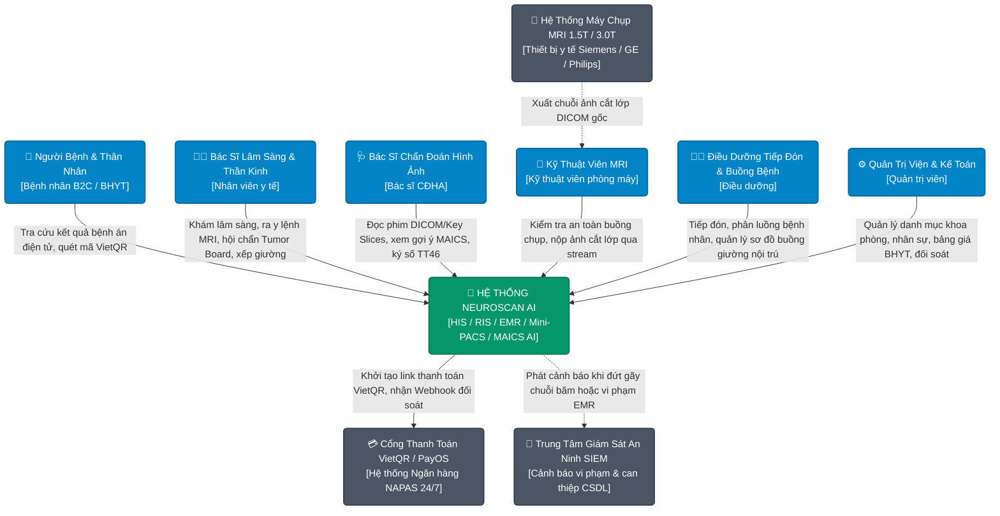
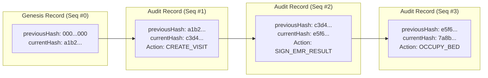
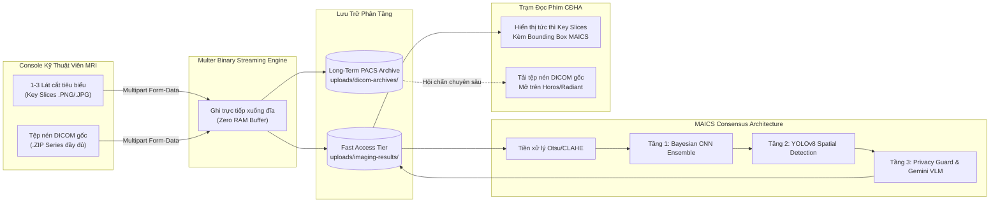

# BÁO CÁO ĐỒ ÁN TỐT NGHIỆP KỸ SƯ CÔNG NGHỆ THÔNG TIN
# CHƯƠNG 3: THIẾT KẾ KIẾN TRÚC HỆ THỐNG (SYSTEM ARCHITECTURE)

---

## 3.1. TỔNG QUAN KIẾN TRÚC VÀ MÔ HÌNH C4

Hệ thống **NeuroScan AI** được thiết kế theo kiến trúc hướng dịch vụ hiện đại kết hợp mô hình phân tầng sạch (Clean Layered Architecture), đảm bảo tính sẵn sàng cao, bảo vệ bí mật y tế cấp độ cao và khả năng mở rộng đa cơ sở khám chữa bệnh linh hoạt.

### 3.1.1. Sơ đồ C4 Cấp độ 1: Bối Cảnh Hệ Thống (System Context Diagram)



### 3.1.2. Sơ đồ C4 Cấp độ 2: Thùng Chứa (Container Diagram)

```mermaid
graph TB
    classDef client fill:#3b82f6,stroke:#1d4ed8,stroke-width:2px,color:#ffffff;
    classDef gateway fill:#6366f1,stroke:#4338ca,stroke-width:2px,color:#ffffff;
    classDef backend fill:#10b981,stroke:#047857,stroke-width:2px,color:#ffffff;
    classDef ai fill:#8b5cf6,stroke:#6d28d9,stroke-width:2px,color:#ffffff;
    classDef db fill:#f59e0b,stroke:#d97706,stroke-width:2px,color:#ffffff;

    subgraph ClientLayer ["Lớp Ứng Dụng Người Dùng (Client Layer)"]
        WEB["📱 Expo React Native Universal Web / Mobile<br/>(SPA Bác sĩ, KTV, Điều dưỡng, Bệnh nhân)<br/>Port: 80 / 8081"]:::client
    end

    subgraph GatewayLayer ["Lớp Điều Phối & An Ninh (Reverse Proxy & Security Gateway)"]
        NGINX["🌐 Nginx Reverse Proxy Gateway<br/>(SSL Offloading, Security Headers, Rate Limiting)<br/>Port: 80 / 443"]:::gateway
    end

    subgraph AppLayer ["Lớp Xử Lý Nghiệp Vụ Y Tế (Application Core Services)"]
        BE["⚙️ Node.js Express HIS/EMR Core Backend<br/>(Clean Layered: Auth, EMR, PACS, FSM, Billing, Bed Engine)<br/>Port: 5000"]:::backend
        AI["🧠 Python FastAPI MAICS Consensus Engine<br/>(Bayesian CNN Ensemble + YOLOv8 + Gemini 3.1 Flash-Lite)<br/>Port: 8000"]:::ai
    end

    subgraph DataLayer ["Lớp Lưu Trữ & Toàn Vẹn Dữ Liệu (Storage & Integrity Layer)"]
        MONGO[("🍃 MongoDB 7.0 Multi-Tenant Cluster<br/>(Collections: Tenants, Users, Visits, EMR, Beds, HashChain)"):]::db
        STORAGE[("📁 Multi-Tier Storage (Local SSD / Google Cloud / S3)<br/>(Fast Access Key-Slices & Long-term DICOM Archives)"):]::db
        SQLITE[("📜 SQLite Audit DB<br/>(Cục bộ AI Engine: audit_logs.db)"):]::db
    end

    WEB -->|HTTPS / REST API / Multer Multipart Stream| NGINX
    NGINX -->|/api/*| BE
    NGINX -->|/ai/*| AI
    NGINX -->|/*| WEB

    BE -->|Mongoose ODM / Compound Indexing / Atomic Transactions| MONGO
    BE -->|Binary Streaming Pipeline (Zero RAM Buffer)| STORAGE
    BE -->|Internal HTTP Call / Asynchronous Inference Task| AI
    AI -->|Đọc ảnh thô, phân tích đa tầng, vẽ Bounding Box| STORAGE
    AI -->|Ghi log truy vết lâm sàng CDSS| SQLITE
```

---

## 3.2. KIẾN TRÚC ĐA CƠ SỞ (MULTI-TENANCY ARCHITECTURE) VÀ CÔ LẬP DỮ LIỆU B2C

Để đáp ứng mô hình triển khai cho chuỗi bệnh viện đa cơ sở hoặc mạng lưới bệnh viện vệ tinh, hệ thống áp dụng mô hình **Shared Database, Shared Schema with Strict Logical Isolation**:

```
+-----------------------------------------------------------------------------+
|                     NEUROSCAN MULTI-TENANT DATABASE                         |
+-----------------------------------------------------------------------------+
| [Hospital Tenants Collection]                                               |
|  - Hospital A: Bệnh viện Bạch Mai - Hà Nội (hospitalId: HOSP_A)             |
|  - Hospital B: Bệnh viện Chợ Rẫy - TP.HCM (hospitalId: HOSP_B)              |
+-----------------------------------------------------------------------------+
| [Tenancy-Isolated Collections: Visits, Patients, EMRs, Beds, Invoices]      |
|  - Document 1: { hospitalId: ObjectId("HOSP_A"), patientId: P01, ... }      |
|  - Document 2: { hospitalId: ObjectId("HOSP_B"), patientId: P02, ... }      |
+-----------------------------------------------------------------------------+
| [B2C Independent Patient Boundary (Bệnh nhân tự do)]                        |
|  - Patient Document: { hospitalId: null, isB2C: true, phone: "0901234567" } |
|  - Bác sĩ bệnh viện KHÔNG được xem trích lục nếu chưa có ca khám liên kết.  |
+-----------------------------------------------------------------------------+
```

### Các Nguyên Tắc Bảo Mật Đa Cơ Sở Cốt Lõi:
1. **Tenant Context Binding (Gắn ngữ cảnh cơ sở):**
   - Khi người dùng đăng nhập thành công, thông tin `hospitalId` và vai trò `role` được ký mã hóa trong JWT token.
   - Middleware `protect` giải mã token và gắn vào `req.user`.
2. **Thẩm định Sở hữu Đa cơ sở (`checkPatientTenancy`):**
   - Mọi thao tác truy cập hồ sơ bệnh án, lịch sử khám và tài liệu y khoa đều phải thông qua hàm thẩm định trung tâm `checkPatientTenancy(patientId, req.user)`:
     ```javascript
     export async function checkPatientTenancy(patientId, user) {
       const patient = await Patient.findById(patientId);
       if (!patient) return { allowed: false, status: 404, message: "Không tìm thấy bệnh nhân" };
       
       // Bệnh nhân tự do B2C: Chỉ chính bệnh nhân hoặc bác sĩ có ca khám trực tiếp mới được xem
       if (!patient.hospitalId) {
         if (user.role === 'patient' && user.id.toString() === patient._id.toString()) {
           return { allowed: true };
         }
         const hasActiveVisit = await Visit.exists({ patientId: patient._id, hospitalId: user.hospitalId });
         if (!hasActiveVisit) {
           return { allowed: false, status: 403, message: "Từ chối truy cập: Bệnh nhân tự do không thuộc cơ sở của bạn" };
         }
       }
       
       // Bệnh nhân thuộc cơ sở: Bắt buộc hospitalId phải trùng khớp
       if (patient.hospitalId && patient.hospitalId.toString() !== user.hospitalId?.toString()) {
         return { allowed: false, status: 403, message: "Từ chối truy cập: Bệnh nhân thuộc cơ sở y tế khác" };
       }
       return { allowed: true };
     }
     ```
3. **Phòng chống Tấn công ReDoS (Regular Expression Denial of Service):**
   - Mọi chuỗi tìm kiếm từ người dùng (`req.query.search`) đều được chuẩn hóa bằng hàm escape meta-characters trước khi đưa vào toán tử `$regex`:
     ```javascript
     const safeRegex = new RegExp(search.trim().replace(/[.*+?^${}()|[\]\\]/g, '\\$&'), 'i');
     ```

---

## 3.3. MÔ HÌNH PHÂN TẦNG SẠCH (LAYERED CLEAN ARCHITECTURE)

Nhằm khắc phục tình trạng Fat Controller và tăng cường khả năng kiểm thử tự động, mã nguồn Backend được phân tách rạch ròi thành 4 tầng kiến trúc:

```
[ HTTP Client / Frontend Web / Mobile ]
                   │
                   ▼
┌────────────────────────────────────────────────────────┐
│ 1. Route Layer (Định tuyến & Middleware Guard)         │
│    - Xác thực danh tính: protect (JWT)                 │
│    - Kiểm soát phân quyền: checkRole([...])            │
│    - Rate limiter, NoSQL sanitize, Multer binary stream│
└────────────────────────────────────────────────────────┘
                   │
                   ▼
┌────────────────────────────────────────────────────────┐
│ 2. Controller Layer (Điều phối HTTP)                   │
│    - Thẩm định tính hợp lệ của tham số (Input Schema)  │
│    - Trích xuất định danh từ req.user (Không tin body) │
│    - Chuẩn hóa HTTP Status Code (200, 201, 400, 403)   │
└────────────────────────────────────────────────────────┘
                   │
                   ▼
┌────────────────────────────────────────────────────────┐
│ 3. Service Layer (Nghiệp Vụ Lâm Sàng & Pháp Lý Cốt Lõi)│
│    - Finite State Machine (ALLOWED_TRANSITIONS)        │
│    - Kiểm tra An toàn buồng chụp MRI                   │
│    - Khóa nguyên tử buồng giường nội trú (4h lock)     │
│    - Tính toán viện phí, thẩm định điều kiện BHYT      │
│    - Hoàn kho thuốc tự động khi hoàn tiền hóa đơn      │
│    - Ghi nhận chuỗi băm Tamper-Evident Hash Chain      │
└────────────────────────────────────────────────────────┘
                   │
                   ▼
┌────────────────────────────────────────────────────────┐
│ 4. Model / Data Access Layer (Truy Cập Dữ Liệu)        │
│    - Mongoose Models & Schemas (Visit, EMR, Bed, ...)  │
│    - Compound Indexes (idx_tenant_queue, ...)          │
│    - Atomic Operators ($findOneAndUpdate, $inc, $set)  │
└────────────────────────────────────────────────────────┘
```

---

## 3.4. KIẾN TRÚC TOÀN VẸN DỮ LIỆU: CHUỖI BĂM MẬT MÃ (CRYPTOGRAPHIC TAMPER-EVIDENT HASH CHAIN)

Để đáp ứng tiêu chuẩn nghiêm ngặt của **Thông tư 46/2018/TT-BYT** và **HIPAA §164.312(b)** về tính toàn vẹn và chống chối bỏ của hồ sơ bệnh án điện tử, hệ thống triển khai giải pháp chuỗi băm mật mã học (Cryptographic Hash Chain) cho toàn bộ nhật ký truy vết:

### 3.4.1. Thuật Toán Băm Khóa Liên Kết
Mỗi bản ghi kiểm toán y khoa ($L_i$) chứa mã băm liên kết chặt chẽ với bản ghi liền trước ($L_{i-1}$):
$$H_i = \text{SHA-256}\Big(H_{i-1} \,\|\, \text{CanonicalJSON}(\text{Payload}_i) \,\|\, \text{SequenceNumber}_i \,\|\, \text{Timestamp}_i\Big)$$
Trong đó:
- $H_0 = \text{"0000000000000000000000000000000000000000000000000000000000000000"}$ (Khối Genesis khởi nguyên).
- $\text{CanonicalJSON}$ đảm bảo các khóa JSON luôn được sắp xếp theo thứ tự bảng chữ cái để tạo chuỗi băm nhất quán.



### 3.4.2. Khả Năng Chịu Tải Đồng Thời (Concurrency Safety)
Khi nhiều bác sĩ trong hội đồng Tumor Board hoặc nhiều điều dưỡng cùng ghi nhật ký đồng thời, hệ thống sử dụng thuật toán khóa nguyên tử tăng tuần tự số hiệu (`sequenceNumber`) kết hợp hàng đợi xử lý tuần tự (In-Memory Serialized Queue), đảm bảo không bao giờ xảy ra hiện tượng xung đột phân nhánh (Forking) hoặc đứt gãy chuỗi băm.

### 3.4.3. Phát Hiện Can Thiệp Trái Phép & Tích Hợp SIEM Alerting
Hệ thống cung cấp API xác thực tính toàn vẹn `GET /api/v1/audit/hash-chain-verify`. Nếu kẻ tấn công xâm nhập trực tiếp vào MongoDB để sửa đổi kết quả chẩn đoán hoặc xóa bản ghi:
- Thuật toán rà soát sẽ phát hiện ra sự sai lệch giữa `previousHash` của bản ghi sau và `currentHash` được tính toán lại từ bản ghi trước.
- Hệ thống lập tức cô lập bản ghi bị can thiệp và phát tín hiệu cảnh báo khẩn cấp (Security Incident) tới hệ thống SIEM với mức độ **HIGH/CRITICAL**:
  ```json
  {
    "alertType": "INTEGRITY_TAMPER_DETECTED",
    "severity": "HIGH",
    "affectedSequenceNumber": 142,
    "complianceViolation": ["HIPAA §164.312(b)", "Thông tư 46/2018/TT-BYT Điều 18"],
    "recommendedAction": "Kích hoạt quy trình điều tra an ninh DFIR và phục hồi dữ liệu từ bản sao lưu được chứng thực."
  }
  ```

---

## 3.5. KIẾN TRÚC BẢO MẬT DỮ LIỆU Y TẾ THEO CHUẨN HIPAA

1. **Mã hóa Trường Dữ Liệu Nhạy Cảm (Field-Level Encryption - AES-256-GCM):**
   - Các trường chẩn đoán phân tử ung thư (IDH mutation, MGMT methylation status, 1p/19q codeletion) và ghi chú di truyền cá nhân được mã hóa tại tầng ứng dụng trước khi lưu vào MongoDB bằng thuật toán AES-256-GCM kèm vector khởi tạo ngẫu nhiên (IV) và khóa xác thực toàn vẹn (Auth Tag).
2. **Phòng chống Tấn công Token (Algorithm Confusion & `alg: none` Defense):**
   - Bộ giải mã JWT từ chối tuyệt đối các token chứa trường tiêu đề `alg: "none"` hoặc các token ký bằng thuật toán đối xứng giả danh bất đối xứng.
3. **Phân Tách Dữ Liệu Theo Quyền Hạn Tối Thiểu (HIPAA Minimum Necessary):**
   - Nhân viên tiếp tân và thu ngân chỉ được xem thông tin hành chính và trạng thái viện phí; các trường chẩn đoán lâm sàng chuyên sâu tự động được làm sạch (Sanitized) nhưng vẫn bảo toàn cấu trúc JSON (Non-Breaking Data Segregation) để giao diện không bị lỗi hiển thị.
4. **Quy Trình Truy Cập Cấp Cứu Khẩn Cấp (Break-Glass Protocol):**
   - Tuân thủ chuẩn HIPAA §164.312(a)(2)(ii): Khi gặp tình huống cấp cứu ngoài giờ trực, bác sĩ có thể kích hoạt cơ chế Break-Glass để xem nhanh tiền sử dị ứng và bệnh án nội sọ của bệnh nhân.
   - Để ngăn ngừa lạm dụng, hệ thống **giới hạn tối đa 3 lần cấp cứu/ngày/bác sĩ** và bắt buộc phải nhập lý do lâm sàng khẩn cấp kèm chữ ký điện tử.

---

## 3.6. KIẾN TRÚC HYBRID MINI-PACS VÀ PIPELINE XỬ LÝ ẢNH STREAMING



---

## 3.7. CƠ CHẾ KIỂM SOÁT TRANH CHẤP BUỒNG GIƯỜNG (ATOMIC CONCURRENCY CONTROL)

Trong môi trường nội trú, tình trạng nhiều điều dưỡng tại các khoa khác nhau cùng giữ chỗ hoặc xếp bệnh nhân vào một giường bệnh trống được giải quyết triệt để bằng kỹ thuật **Khóa Điều Kiện Nguyên Tử (Atomic Conditional Update)** trên MongoDB:

```javascript
// Thao tác giữ chỗ giường bệnh chống Race Condition tuyệt đối
const reservedBed = await HospitalBed.findOneAndUpdate(
  {
    _id: bedId,
    hospitalId: hospitalId,
    status: 'available' // Điều kiện tiên quyết: Giường phải thực sự trống
  },
  {
    $set: {
      status: 'reserved',
      reservedByUserId: userId,
      reservedForPatientId: patientId,
      reservedUntil: new Date(Date.now() + 4 * 60 * 60 * 1000) // Giữ chỗ 4 giờ cho cấp cứu
    }
  },
  { new: true }
);

if (!reservedBed) {
  return { success: false, status: 409, message: 'Giường bệnh này vừa được giữ chỗ bởi nhân viên khác!' };
}
```
Giải pháp này vận hành ở mức cơ sở dữ liệu (Engine-level), không phụ thuộc vào khóa phân tán (Redis/ZooKeeper), mang lại hiệu năng cao và đảm bảo tính nhất quán dữ liệu ACID trong hệ thống bệnh viện.
