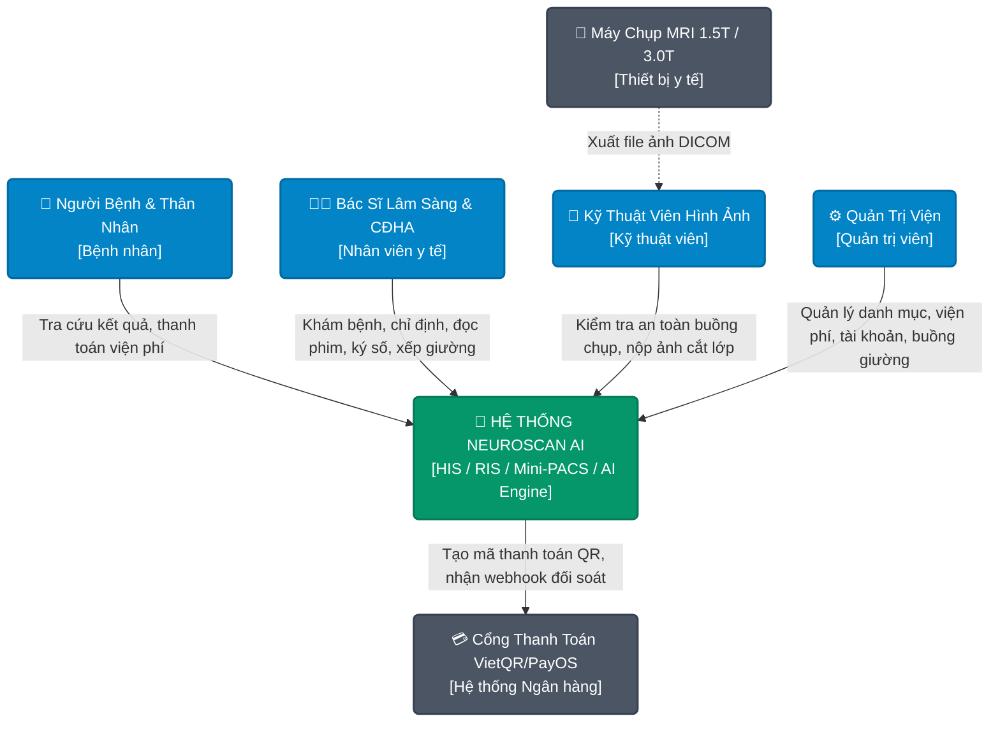
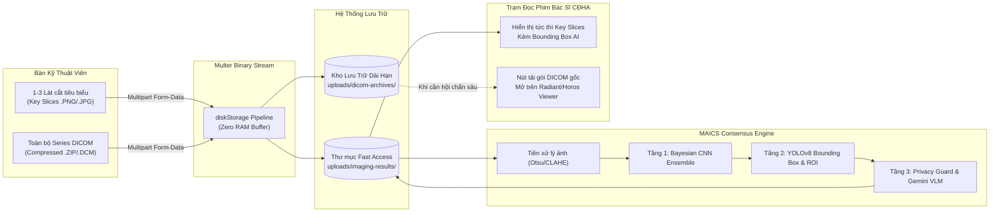

# BÁO CÁO ĐỒ ÁN TỐT NGHIỆP KỸ SƯ CÔNG NGHỆ THÔNG TIN
# CHƯƠNG 3: THIẾT KẾ KIẾN TRÚC HỆ THỐNG (SYSTEM ARCHITECTURE)

---

## 3.1. TỔNG QUAN KIẾN TRÚC VÀ MÔ HÌNH C4

Hệ thống **NeuroScan AI** được thiết kế theo kiến trúc hướng dịch vụ hiện đại kết hợp mô hình phân tầng sạch (Clean Layered Architecture), đảm bảo tính sẵn sàng cao, bảo mật dữ liệu y tế và khả năng mở rộng đa cơ sở khám chữa bệnh.

### 3.1.1. Sơ đồ C4 Cấp độ 1: Bối Cảnh Hệ Thống (System Context)



### 3.1.2. Sơ đồ C4 Cấp độ 2: Thùng Chứa (Container Diagram)

```mermaid
graph TB
    classDef client fill:#3b82f6,stroke:#1d4ed8,stroke-width:2px,color:#ffffff;
    classDef backend fill:#10b981,stroke:#047857,stroke-width:2px,color:#ffffff;
    classDef ai fill:#8b5cf6,stroke:#6d28d9,stroke-width:2px,color:#ffffff;
    classDef db fill:#f59e0b,stroke:#d97706,stroke-width:2px,color:#ffffff;

    subgraph ClientLayer ["Lớp Khách (Frontend)"]
        WEB["📱 Expo React Native Web / Mobile<br/>(SPA Desktop / Tablet / Phone)<br/>Port: 80 / 3000"]:::client
    end

    subgraph GatewayLayer ["Lớp Cổng Điều Phối (Reverse Proxy)"]
        NGINX["🌐 Nginx Web Server & Proxy<br/>Port: 80 / 443"]:::backend
    end

    subgraph AppLayer ["Lớp Xử Lý Nghiệp Vụ (Application Services)"]
        BE["⚙️ Node.js Express Core Backend<br/>(REST API, Auth, EMR, PACS Controller)<br/>Port: 5000"]:::backend
        AI["🧠 Python FastAPI MAICS AI Engine<br/>(Bayesian Ensemble CNN + YOLOv8 + Gemini VLM)<br/>Port: 8000"]:::ai
    end

    subgraph DataLayer ["Lớp Dữ Liệu & Lưu Trữ (Storage Layer)"]
        MONGO[("🍃 MongoDB Database 7.0<br/>(Tenants, Users, Visits, Invoices, Beds)"):]::db
        STORAGE[("📁 Local Disk / S3 Object Storage<br/>(DICOM Archives, Key-Slices, AI Heatmaps)"):]::db
    end

    WEB -->|HTTP / REST API / File Upload| NGINX
    NGINX -->|/api/*| BE
    NGINX -->|/ai/*| AI
    NGINX -->|/*| WEB

    BE -->|Mongoose ODM (BSON)| MONGO
    BE -->|Multer Binary Stream (Async Write)| STORAGE
    BE -->|Internal HTTP Call / Background Worker| AI
    AI -->|Read raw images / Return Bounding Boxes & Scores| STORAGE
```

---

## 3.2. KIẾN TRÚC ĐA CƠ SỞ (MULTI-TENANCY ARCHITECTURE)

Để đáp ứng mô hình triển khai cho chuỗi bệnh viện đa cơ sở hoặc các phòng khám vệ tinh, hệ thống áp dụng mô hình **Shared Database, Shared Schema with Logical Tenant Isolation**:

```
+-------------------------------------------------------------+
|               NeuroScan Multi-Tenant Database               |
+-------------------------------------------------------------+
| [Tenants Collection]                                        |
|  - Hospital A (Bệnh viện Bạch Mai - Hà Nội)                  |
|  - Hospital B (Bệnh viện Chợ Rẫy - TP.HCM)                  |
+-------------------------------------------------------------+
| [Patient / Visit / Imaging / Bed Collections]               |
|  - Document 1: { hospitalId: ObjectId("HOSP_A"), ... }     |
|  - Document 2: { hospitalId: ObjectId("HOSP_B"), ... }     |
+-------------------------------------------------------------+
```

### Các Nguyên Tắc Bảo Mật Đa Cơ Sở Bắt Buộc:
1. **Tenant Context Binding:** Khi người dùng đăng nhập, thông tin `hospitalId` được ký mã hóa trực tiếp trong JWT token và giải mã tại middleware `protect`.
2. **Ngăn chặn Rò rỉ Dữ liệu Liên Viện (Cross-Tenant Data Leak):**
   - Mọi câu lệnh truy vấn MongoDB (`find`, `findOne`, `findOneAndUpdate`, `countDocuments`) đều bắt buộc phải lồng điều kiện `{ hospitalId: req.user.hospitalId }`.
   - Đối với các thao tác tìm kiếm bệnh nhân theo từ khóa `$or`, hệ thống sử dụng mệnh đề `$and` để bảo toàn bộ lọc tenant:
     ```javascript
     const filter = {
       hospitalId: req.user.hospitalId,
       $and: [
         { $or: [{ fullName: regex }, { phone: regex }, { identityCard: regex }] }
       ]
     };
     ```
3. **Đánh Chỉ Mục Hỗn Hợp (Compound Indexing):** Toàn bộ các bảng nghiệp vụ đều được đánh chỉ mục bắt đầu bằng `hospitalId`:
   - `db.visits.createIndex({ hospitalId: 1, status: 1, createdAt: -1 })`
   - `db.patients.createIndex({ hospitalId: 1, identityCard: 1 })`

---

## 3.3. MÔ HÌNH PHÂN TẦNG SẠCH (LAYERED CLEAN ARCHITECTURE)

Nhằm khắc phục tình trạng Fat Controller và chuẩn hóa theo tiêu chuẩn công nghiệp, Backend được tái cấu trúc thành 3 tầng phân định rõ ràng:

```
[ HTTP Request ]
       |
       v
+------------------+
|   Route Layer    | -> Định nghĩa Endpoint, Middleware (Auth, Role, Upload)
+------------------+
       |
       v
+------------------+
| Controller Layer | -> Thẩm định tham số (Req Validation), Trích xuất Session, HTTP Status Code
+------------------+
       |
       v
+------------------+
|  Service Layer   | -> TOÀN BỘ LOGIC NGHIỆP VỤ Y TẾ (BHYT, Sàng lọc MRI, Khóa nguyên tử)
+------------------+
       |
       v
+------------------+
| Data Access /    | -> Mongoose Models, Compound Indexes, Atomic Transactions
| Model Layer      |
+------------------+
```

### Ưu điểm vượt trội của Layered Architecture trong Y tế:
- **Khả năng kiểm thử (Testability):** Có thể viết Unit Test trực tiếp cho Service mà không cần khởi tạo Web Server hoặc giả lập đối tượng `req`/`res`.
- **Tái sử dụng (Reusability):** Một hàm tính viện phí hoặc kiểm tra chống chỉ định có thể được gọi từ Controller REST API, từ Job chạy ngầm, hoặc từ Webhook.
- **Dễ bảo trì (Maintainability):** Khi thay đổi quy định thanh toán BHYT của Bộ Y Tế, kỹ sư chỉ cần chỉnh sửa `visit.service.js` mà không làm ảnh hưởng tới các tầng khác.

---

## 3.4. KIẾN TRÚC HYBRID MINI-PACS VÀ PIPELINE XỬ LÝ ẢNH

Các hệ thống PACS truyền thống thường yêu cầu máy chủ lưu trữ chuyên dụng cực lớn (hàng chục Terabyte) và giao thức DICOM phức tạp (C-STORE, C-FIND, C-MOVE). NeuroScan AI đề xuất mô hình **Hybrid Mini-PACS** dung hòa giữa tốc độ duyệt ảnh lâm sàng và khả năng lưu trữ hồ sơ bệnh án trọn đời:



---

## 3.5. CƠ CHẾ KIỂM SOÁT TRANH CHẤP TÀI NGUYÊN (CONCURRENCY CONTROL)

Trong môi trường bệnh viện nội trú, tình trạng nhiều điều dưỡng tại các khoa khác nhau cùng giữ chỗ hoặc xếp giường cho bệnh nhân xảy ra thường xuyên. Để chống xung đột dữ liệu (Race Condition), hệ thống áp dụng kỹ thuật **Khóa Lạc Quan kết hợp Thao tác Nguyên tử (Atomic Conditional Update)** trên MongoDB:

```javascript
// Thao tác giữ chỗ giường nội trú đảm bảo an toàn tranh chấp tuyệt đối
const updatedBed = await HospitalBed.findOneAndUpdate(
  {
    _id: bedId,
    hospitalId: hospitalId,
    status: 'available' // ĐIỀU KIỆN TIÊN QUYẾT: Giường phải đang thực sự trống
  },
  {
    $set: {
      status: 'reserved',
      reservedByUserId: userId,
      patientId: patientId,
      reservedUntil: new Date(Date.now() + 2 * 60 * 60 * 1000) // Khóa 2 giờ
    }
  },
  { new: true }
);

if (!updatedBed) {
  // Trả về mã lỗi 409 Conflict thông báo xung đột tức thì
  return { success: false, status: 409, message: 'Giường bệnh này vừa được giữ chỗ bởi nhân viên khác!' };
}
```
Cơ chế này loại bỏ hoàn toàn nguy cơ 2 bệnh nhân bị gán nằm chung 1 giường bệnh, bảo vệ tính toàn vẹn dữ liệu lâm sàng mà không cần sử dụng cơ chế khóa phân tán (Distributed Lock) phức tạp.
