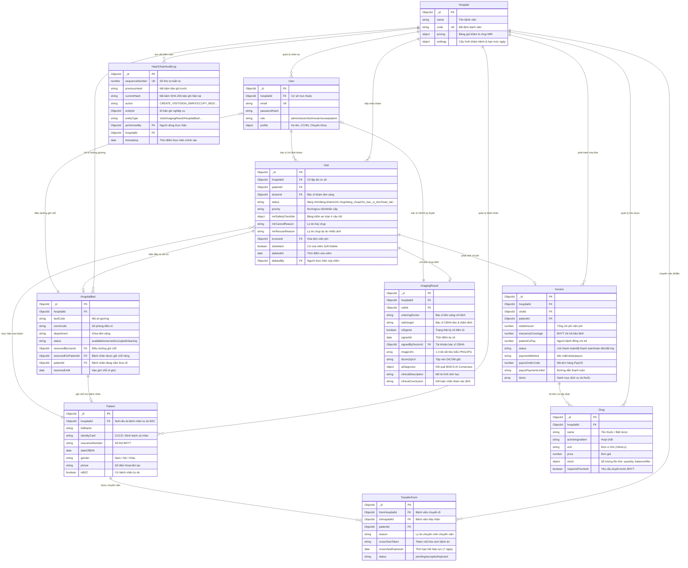

# BÁO CÁO ĐỒ ÁN TỐT NGHIỆP KỸ SƯ CÔNG NGHỆ THÔNG TIN
# CHƯƠNG 4: THIẾT KẾ CƠ SỞ DỮ LIỆU (DATABASE DESIGN)

---

## 4.1. SƠ ĐỒ MỐI QUAN HỆ THỰC THỂ (ENTITY RELATIONSHIP DIAGRAM - ERD)

Cơ sở dữ liệu của hệ thống **NeuroScan AI** được thiết kế trên nền tảng MongoDB 7.0, kết hợp linh hoạt giữa mô hình Document NoSQL hiệu năng cao và các ràng buộc toàn vẹn quan hệ (Referential Integrity) phục vụ môi trường y tế đa cơ sở, đáp ứng các tiêu chuẩn khắt khe của Thông tư 46/2018/TT-BYT và HIPAA:



---

## 4.2. TỪ ĐIỂN DỮ LIỆU CHI TIẾT (DATA DICTIONARY)

### 4.2.1. Bộ Sưu Tập `visits` (Hồ sơ Ca khám & Y lệnh Cận lâm sàng)
Thực thể trung tâm điều phối luồng quy trình khám chữa bệnh, chẩn đoán hình ảnh và FSM:

| Tên trường (Field) | Kiểu dữ liệu | Bắt buộc | Mô tả & Ràng buộc nghiệp vụ |
| :--- | :--- | :---: | :--- |
| `_id` | ObjectId | Có | Khóa chính duy nhất của ca khám. |
| `hospitalId` | ObjectId | Có | Mã định danh cơ sở y tế (Tenant Isolation). |
| `patientId` | ObjectId | Có | Tham chiếu thực thể `Patient`. |
| `doctorId` | ObjectId | Có | Tham chiếu `User` (Bác sĩ chỉ định khám ban đầu). |
| `status` | String (Enum) | Có | Quản lý bởi FSM: `'đang chờ'`, `'đang khám'`, `'chờ chụp'`, `'dang_chup'`, `'cho_ket_qua_ai'`, `'cho_bac_si_doc'`, `'hoan_tat'`, `'da_dong'`, `'cho_chup_lai'`, `'da_huy'`, `'loi_ai'`. |
| `priority` | String (Enum) | Có | `'thường'`, `'ưu tiên'`, `'khẩn cấp'` (Cấp cứu: Chụp trước, thu sau). |
| `mriSafetyChecklist` | Object | Không | Nhúng bảng kiểm an toàn buồng MRI 4 tiêu chí sinh mạng: |
| `├─ hasPacemakerOrMetal`| Boolean | - | `true` nếu có máy tạo nhịp tim hoặc kim loại từ tính (Chống chỉ định tuyệt đối). |
| `├─ hasClaustrophobia` | Boolean | - | `true` nếu có hội chứng sợ buồng kín. |
| `├─ hasKidneyDisease`  | Boolean | - | `true` nếu có suy thận (cân nhắc tiêm thuốc đối quang từ Gadolinium). |
| `├─ isPregnant`        | Boolean | - | `true` nếu phụ nữ có thai 3 tháng đầu. |
| `├─ isScreened`        | Boolean | - | Đã hoàn thành sàng lọc trước buồng máy. |
| `├─ passed`            | Boolean | - | Cho phép chụp (`true` nếu không có chống chỉ định). |
| `├─ screenedBy`        | String | - | Họ tên KTV thực hiện sàng lọc an toàn. |
| `└─ screenedAt`        | Date | - | Thời điểm xác nhận an toàn buồng chụp. |
| `mriCancelReason` | String | Không | Lý do hủy ca chụp (ví dụ: "Phát hiện mảnh đạn kim loại trong hốc mắt"). |
| `mriRescanReason` | String | Không | Lý do yêu cầu chụp lại (ví dụ: "Nhiễu ảnh cử động đầu - Motion Artifact"). |
| `invoiceId` | ObjectId | Không | Tham chiếu `Invoice` tương ứng để theo dõi viện phí. |
| `isDeleted` | Boolean | Có | Cờ xóa mềm Soft Delete theo TT 46/2018 (Mặc định: `false`). |
| `deletedAt` | Date | Không | Thời điểm thực hiện xóa mềm. |
| `deletedBy` | ObjectId | Không | Tài khoản nhân viên y tế thực hiện xóa mềm (Bảo lưu vết pháp lý). |

---

### 4.2.2. Bộ Sưu Tập `imagingresults` (Kết Quả Chẩn Đoán Hình Ảnh & Mini-PACS)
Thực thể quản trị kết quả đọc phim, gợi ý của trí tuệ nhân tạo và chữ ký số điện tử:

| Tên trường (Field) | Kiểu dữ liệu | Bắt buộc | Mô tả & Ràng buộc nghiệp vụ |
| :--- | :--- | :---: | :--- |
| `_id` | ObjectId | Có | Khóa chính của phiếu kết quả chẩn đoán hình ảnh. |
| `hospitalId` | ObjectId | Có | Mã cơ sở y tế thực hiện kỹ thuật. |
| `visitId` | ObjectId | Có | Tham chiếu ca khám tương ứng (`Visit`). |
| `orderingDoctor` | String | Có | Họ tên Bác sĩ lâm sàng chỉ định chụp. |
| `radiologist` | String | Có | Họ tên Bác sĩ CĐHA đọc và thẩm định kết quả. |
| `isSigned` | Boolean | Có | Đóng dấu ký số (`true`: Đã ký số, `false`: Chờ duyệt). |
| `signedAt` | Date | Không | Thời điểm bấm ký số hoàn tất hồ sơ. |
| `signedByDoctorId` | ObjectId | Không | Tham chiếu tài khoản Bác sĩ CĐHA ký duyệt. |
| `imageUrls` | Array[String]| Có | Danh sách 1 - 3 lát cắt tiêu biểu (.PNG/.JPG) xem nhanh trên Web EMR. |
| `dicomZipUrl` | String | Không | Đường dẫn file nén `.zip` chứa trọn vẹn chuỗi ảnh DICOM gốc. |
| `aiDiagnosis` | Object | Không | Kết quả phân tích từ Hệ thống trọng tài MAICS: |
| `├─ label` | String | - | Nhãn phân loại (`glioma`, `meningioma`, `pituitary`, `no_tumor`). |
| `├─ confidence` | Number | - | Độ tin cậy dự đoán (0.00 - 1.00). |
| `├─ boundingBoxes` | Array[Object]| - | Tọa độ hộp bao tổn thương `[x1, y1, x2, y2]`. |
| `├─ heatmapUrl` | String | - | Đường dẫn ảnh bản đồ nhiệt kích hoạt thị giác Grad-CAM. |
| `└─ vlmExplanation` | String | - | Lập luận giải phẫu từ mô hình Gemini 3.1 Flash-Lite (khi có xung đột). |
| `clinicalDescription`| String | Không | Mô tả đặc điểm hình ảnh học của Bác sĩ CĐHA. |
| `clinicalConclusion` | String | Không | Kết luận chẩn đoán xác định của Bác sĩ CĐHA. |

---

### 4.2.3. Bộ Sưu Tập `hospitalbeds` (Quản Lý Buồng Giường Bệnh Nội Trú)
Quản trị sơ đồ buồng giường với cơ chế khóa nguyên tử và chống cướp giường:

| Tên trường (Field) | Kiểu dữ liệu | Bắt buộc | Mô tả & Ràng buộc nghiệp vụ |
| :--- | :--- | :---: | :--- |
| `_id` | ObjectId | Có | Khóa chính của giường bệnh. |
| `hospitalId` | ObjectId | Có | Mã cơ sở y tế quản lý giường bệnh. |
| `bedCode` | String | Có | Mã số giường (ví dụ: "G-101", "G-102"). |
| `roomCode` | String | Có | Số phòng bệnh (ví dụ: "P-302"). |
| `department` | String | Có | Khoa điều trị nội trú (ví dụ: "Khoa Phẫu thuật Thần kinh"). |
| `status` | String (Enum) | Có | `'available'` (Trống), `'reserved'` (Đang giữ chỗ), `'occupied'` (Đang nằm điều trị), `'cleaning'` (Đang khử khuẩn). |
| `reservedByUserId`| ObjectId | Không | Tham chiếu điều dưỡng/bác sĩ thao tác giữ chỗ. |
| `reservedForPatientId`| ObjectId | Không | Tham chiếu **duy nhất** tới bệnh nhân được giữ chỗ riêng. |
| `patientId` | ObjectId | Không | Bệnh nhân đang thực tế nằm trên giường. |
| `reservedUntil` | Date | Không | Thời hạn hết hiệu lực giữ chỗ (mặc định 4 giờ cho ca cấp cứu). |

---

### 4.2.4. Bộ Sưu Tập `hashchainauditlogs` (Nhật Ký Chuỗi Băm Mật Mã Tamper-Evident)
Thực thể bảo vệ tính toàn vẹn và chống giả mạo hồ sơ y tế theo Thông tư 46/2018 và HIPAA:

| Tên trường (Field) | Kiểu dữ liệu | Bắt buộc | Mô tả & Ràng buộc nghiệp vụ |
| :--- | :--- | :---: | :--- |
| `_id` | ObjectId | Có | Khóa chính bản ghi kiểm toán. |
| `sequenceNumber` | Number | Có | Số thứ tự tuần tự không gián đoạn (0, 1, 2, ...), đánh chỉ mục `unique`. |
| `previousHash` | String | Có | Chuỗi băm SHA-256 của bản ghi $L_{i-1}$ (Genesis = 64 ký tự '0'). |
| `currentHash` | String | Có | Chuỗi băm SHA-256 của bản ghi hiện tại $L_i$. |
| `action` | String | Có | Hành động nghiệp vụ: `'CREATE_VISIT'`, `'SUBMIT_SAFETY_CHECK'`, `'SIGN_EMR'`, `'OCCUPY_BED'`, `'PAYOS_PAYMENT_SUCCESS'`. |
| `entityId` | ObjectId | Có | Khóa ngoại tới thực thể bị tác động. |
| `entityType` | String | Có | Tên thực thể (`'Visit'`, `'ImagingResult'`, `'HospitalBed'`, `'Invoice'`). |
| `performedBy` | ObjectId | Có | Tham chiếu `User` thực hiện thao tác. |
| `hospitalId` | ObjectId | Có | Cơ sở y tế phát sinh sự kiện kiểm toán. |
| `timestamp` | Date | Có | Thời điểm chính xác phát sinh sự kiện. |

---

## 4.3. CHIẾN LƯỢC ĐÁNH CHỈ MỤC HIỆU NĂNG CAO (COMPOUND INDEXING STRATEGY)

Để tối ưu hóa thời gian phản hồi truy vấn dưới $15\text{ms}$ trên tập dữ liệu hàng triệu lượt khám, đồng thời bảo đảm an toàn dữ liệu đa cơ sở:

```javascript
// 1. Chỉ mục Hàng đợi Lâm sàng & Hàng đợi KTV (Tenant Queue Index)
db.visits.createIndex(
  { hospitalId: 1, status: 1, priority: 1, createdAt: 1 },
  { name: "idx_tenant_clinical_queue" }
);

// 2. Chỉ mục định danh duy nhất Bệnh nhân theo CCCD/BHYT trong từng Cơ sở
db.patients.createIndex(
  { hospitalId: 1, identityCard: 1 },
  { unique: true, sparse: true, name: "idx_unique_patient_cccd" }
);

// 3. Chỉ mục Chuỗi băm Mật mã học (Bảo đảm tuần tự không phân nhánh)
db.hashchainauditlogs.createIndex(
  { sequenceNumber: 1 },
  { unique: true, name: "idx_unique_hash_chain_seq" }
);

// 4. Chỉ mục truy vấn Lịch sử Chẩn đoán Hình ảnh Mini-PACS
db.imagingresults.createIndex(
  { hospitalId: 1, visitId: 1, isSigned: 1, createdAt: -1 },
  { name: "idx_tenant_pacs_history" }
);

// 5. Chỉ mục Khóa nguyên tử Trạng thái Buồng giường Nội trú
db.hospitalbeds.createIndex(
  { hospitalId: 1, status: 1, department: 1, reservedUntil: 1 },
  { name: "idx_tenant_bed_concurrency" }
);

// 6. Chỉ mục Đối soát Hóa đơn Viện phí PayOS
db.invoices.createIndex(
  { hospitalId: 1, payosOrderCode: 1, status: 1 },
  { name: "idx_tenant_payos_reconcile" }
);
```
Các chỉ mục phức hợp trên giải quyết triệt để vấn đề Table Scan, giúp toàn bộ các thao tác nghiệp vụ lâm sàng đạt hiệu năng tối ưu ngay cả khi hệ thống chịu tải cao điểm.
