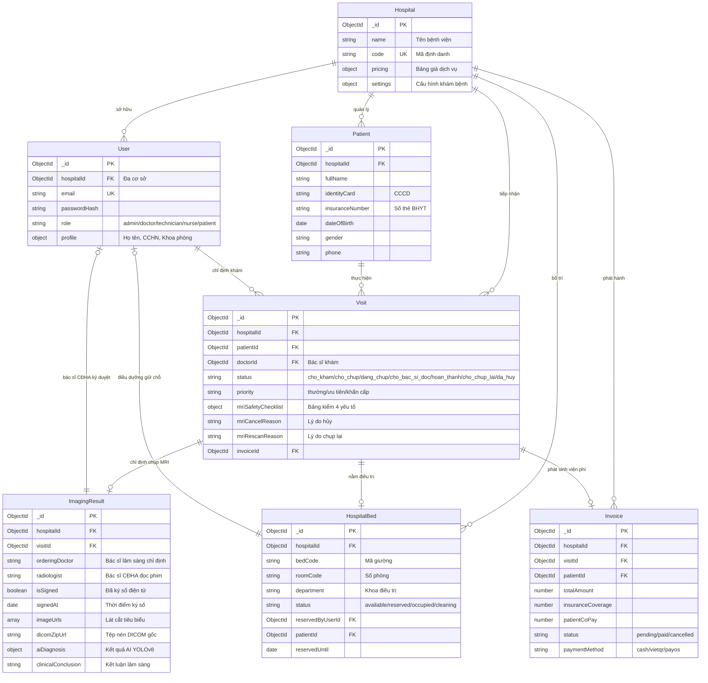

# BÁO CÁO ĐỒ ÁN TỐT NGHIỆP KỸ SƯ CÔNG NGHỆ THÔNG TIN
# CHƯƠNG 4: THIẾT KẾ CƠ SỞ DỮ LIỆU (DATABASE DESIGN)

---

## 4.1. SƠ ĐỒ MỐI QUAN HỆ THỰC THỂ (ENTITY RELATIONSHIP DIAGRAM - ERD)

Cơ sở dữ liệu của hệ thống **NeuroScan AI** được xây dựng trên nền tảng MongoDB 7.0, kết hợp giữa mô hình Document NoSQL linh hoạt và các ràng buộc toàn vẹn quan hệ (Referential Integrity) phục vụ môi trường y tế đa viện:



---

## 4.2. TỪ ĐIỂN DỮ LIỆU CHI TIẾT (DATA DICTIONARY)

### 4.2.1. Bảng `Visit` (Hồ sơ Ca khám & Y lệnh)
Đây là thực thể trung tâm điều phối toàn bộ quy trình chuyên môn tại phòng khám và khoa CĐHA:

| Tên trường (Field) | Kiểu dữ liệu | Bắt buộc | Mô tả & Ràng buộc nghiệp vụ |
| :--- | :--- | :---: | :--- |
| `_id` | ObjectId | Có | Khóa chính duy nhất của ca khám. |
| `hospitalId` | ObjectId | Có | Khóa ngoại tham chiếu `Hospital`. Phục vụ cô lập Multi-Tenant. |
| `patientId` | ObjectId | Có | Khóa ngoại tham chiếu `Patient`. |
| `doctorId` | ObjectId | Có | Khóa ngoại tham chiếu `User` (Bác sĩ chỉ định khám lâm sàng). |
| `status` | String (Enum) | Có | `'cho_kham'`, `'dang_kham'`, `'cho_chup'`, `'dang_chup'`, `'cho_bac_si_doc'`, `'hoan_thanh'`, `'cho_chup_lai'`, `'da_huy'`. |
| `priority` | String (Enum) | Có | `'thường'`, `'ưu tiên'`, `'khẩn cấp'` (Ưu tiên cấp cứu chụp trước, thu sau). |
| `mriSafetyChecklist` | Object | Không | Nhúng trực tiếp tài liệu bảng kiểm an toàn MRI: |
| `├─ hasPacemakerOrMetal`| Boolean | - | `true` nếu có máy tạo nhịp tim hoặc kim loại từ tính (Chống chỉ định tuyệt đối). |
| `├─ hasClaustrophobia` | Boolean | - | `true` nếu có hội chứng sợ buồng kín. |
| `├─ hasKidneyDisease`  | Boolean | - | `true` nếu suy thận (cân nhắc khi tiêm thuốc đối quang từ Gadolinium). |
| `├─ isPregnant`        | Boolean | - | `true` nếu phụ nữ mang thai 3 tháng đầu. |
| `├─ isScreened`        | Boolean | - | Cờ đánh dấu đã hoàn thành kiểm tra an toàn trước buồng máy. |
| `├─ passed`            | Boolean | - | Cờ cho phép vào buồng chụp (`true` nếu không có chống chỉ định). |
| `├─ screenedBy`        | String | - | Tên KTV thực hiện sàng lọc an toàn. |
| `└─ screenedAt`        | Date | - | Thời điểm xác nhận an toàn. |
| `mriCancelReason` | String | Không | Lý do hủy ca chụp (ví dụ: "Bệnh nhân mang máy tạo nhịp tim"). |
| `mriRescanReason` | String | Không | Lý do yêu cầu chụp lại (ví dụ: "Nhiễu ảnh cử động đầu"). |
| `invoiceId` | ObjectId | Không | Tham chiếu `Invoice` tương ứng để theo dõi viện phí. |

### 4.2.2. Bảng `ImagingResult` (Phiếu Kết quả Chẩn đoán Hình ảnh & Mini-PACS)
Thực thể lưu trữ hình ảnh cắt lớp, kết quả AI và chữ ký số chuyên môn:

| Tên trường (Field) | Kiểu dữ liệu | Bắt buộc | Mô tả & Ràng buộc nghiệp vụ |
| :--- | :--- | :---: | :--- |
| `_id` | ObjectId | Có | Khóa chính duy nhất của phiếu kết quả. |
| `hospitalId` | ObjectId | Có | Mã cơ sở y tế thực hiện. |
| `visitId` | ObjectId | Có | Khóa ngoại tham chiếu `Visit`. |
| `orderingDoctor` | String | Có | Họ tên Bác sĩ lâm sàng ra y lệnh chụp (Ordering Doctor). |
| `radiologist` | String | Có | Họ tên Bác sĩ CĐHA đọc và thẩm định phim (Radiologist). |
| `isSigned` | Boolean | Có | Trạng thái ký duyệt số (`false`: Chờ duyệt, `true`: Đã ký số). |
| `signedAt` | Date | Không | Thời điểm bác sĩ CĐHA bấm ký số hoàn tất. |
| `signedByDoctorId` | ObjectId | Không | ID tài khoản Bác sĩ CĐHA thực hiện ký. |
| `imageUrls` | Array[String]| Có | Danh sách 1 - 3 đường dẫn ảnh cắt lớp tiêu biểu (.PNG/.JPG) phục vụ xem nhanh Web EMR. |
| `dicomZipUrl` | String | Không | Đường dẫn file nén `.zip` chứa toàn bộ thư mục DICOM gốc của ca chụp. |
| `aiDiagnosis` | Object | Không | Kết quả phân tích từ mô hình YOLOv8: |
| `├─ label` | String | - | Nhãn u não (`glioma`, `meningioma`, `pituitary`, `no_tumor`). |
| `├─ confidence` | Number | - | Độ tin cậy dự đoán (từ 0.00 đến 1.00). |
| `├─ boundingBoxes` | Array[Object]| - | Tọa độ hộp bao tổn thương `[x1, y1, x2, y2]`. |
| `└─ processedImageUrl`| String | - | Đường dẫn ảnh đã được AI vẽ bounding box và heatmap. |
| `clinicalDescription`| String | Không | Mô tả đặc điểm hình ảnh học của bác sĩ CĐHA. |
| `clinicalConclusion` | String | Không | Kết luận chẩn đoán xác định của bác sĩ CĐHA. |

### 4.2.3. Bảng `HospitalBed` (Quản lý Buồng Giường Bệnh Nội Trú)
Thực thể quản lý phân bổ giường bệnh với cơ chế chống tranh chấp đồng thời:

| Tên trường (Field) | Kiểu dữ liệu | Bắt buộc | Mô tả & Ràng buộc nghiệp vụ |
| :--- | :--- | :---: | :--- |
| `_id` | ObjectId | Có | Khóa chính của giường bệnh. |
| `hospitalId` | ObjectId | Có | Khóa ngoại tham chiếu `Hospital`. |
| `bedCode` | String | Có | Mã số giường (ví dụ: "G-101", "G-102"). |
| `roomCode` | String | Có | Số phòng bệnh (ví dụ: "P-302"). |
| `department` | String | Có | Khoa điều trị (ví dụ: "Khoa Phẫu thuật Thần kinh"). |
| `status` | String (Enum) | Có | `'available'` (Trống), `'reserved'` (Đang giữ chỗ), `'occupied'` (Đang nằm điều trị), `'cleaning'` (Đang khử khuẩn). |
| `reservedByUserId`| ObjectId | Không | ID điều dưỡng/bác sĩ đang thực hiện giữ chỗ. |
| `patientId` | ObjectId | Không | Bệnh nhân đang được xếp nằm giường. |
| `reservedUntil` | Date | Không | Thời hạn hết hiệu lực giữ chỗ (mặc định 2 giờ). |

---

## 4.3. CHIẾN LƯỢC ĐÁNH CHỈ MỤC HIỆU NĂNG CAO (INDEXING STRATEGY)

Để tối ưu hóa tốc độ truy vấn trên tập dữ liệu hàng triệu ca khám và đảm bảo an toàn tuyệt đối chống Cross-Tenant Data Leakage, các chỉ mục phức hợp (Compound Indexes) được khởi tạo:

```javascript
// 1. Chỉ mục tối ưu hóa Hàng đợi khám & Hàng đợi KTV
db.visits.createIndex(
  { hospitalId: 1, status: 1, priority: 1, createdAt: 1 },
  { name: "idx_tenant_queue" }
);

// 2. Chỉ mục tra cứu bệnh nhân chống trùng lặp CCCD/BHYT
db.patients.createIndex(
  { hospitalId: 1, identityCard: 1 },
  { unique: true, sparse: true, name: "idx_unique_patient_cccd" }
);

// 3. Chỉ mục tra cứu nhanh lịch sử chụp phim của bệnh nhân
db.imagingresults.createIndex(
  { hospitalId: 1, visitId: 1, createdAt: -1 },
  { name: "idx_tenant_imaging_history" }
);

// 4. Chỉ mục khóa nguyên tử buồng giường bệnh
db.hospitalbeds.createIndex(
  { hospitalId: 1, status: 1, department: 1 },
  { name: "idx_tenant_bed_availability" }
);
```
Các chỉ mục trên giúp chỉ số đo lường hiệu năng truy vấn đạt thời gian phản hồi $t_{\text{query}} < 15\text{ms}$ ngay cả khi bảng chứa trên 500.000 bản ghi.
