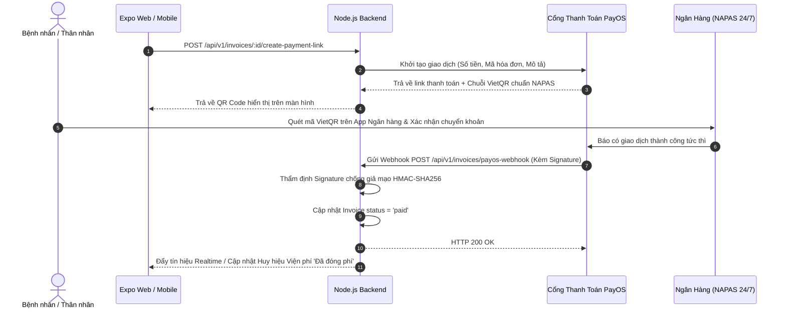

# BÁO CÁO ĐỒ ÁN TỐT NGHIỆP KỸ SƯ CÔNG NGHỆ THÔNG TIN
# CHƯƠNG 5: ĐẶC TẢ KỸ THUẬT API RESTFUL VÀ CƠ CHẾ TÍCH HỢP

---

## 5.1. QUY CHUẨN THIẾT KẾ VÀ XÁC THỰC BẢO MẬT (API STANDARDS & AUTHENTICATION)

Toàn bộ hệ thống API của **NeuroScan AI** được thiết kế tuân theo kiến trúc RESTful cấp độ 2 (Richardson Maturity Model Level 2) với các quy chuẩn kỹ thuật đồng nhất:

1. **Giao thức và Định dạng dữ liệu:** Mọi giao tiếp đều sử dụng chuẩn HTTPS, payload trao đổi dạng JSON (UTF-8), ngoại trừ luồng tải ảnh/DICOM sử dụng `multipart/form-data`.
2. **Cơ chế Xác thực và Ngữ cảnh Đa Cơ sở (Authentication & Tenant Context):**
   - Người dùng sau khi đăng nhập thành công nhận được một cặp `accessToken` (thời hạn 24 giờ) và `refreshToken`.
   - Header bắt buộc cho mọi yêu cầu xác thực: `Authorization: Bearer <JWT_TOKEN>`.
   - Cấu trúc Payload của JWT Token chứa đầy đủ ngữ cảnh phiên làm việc và mã định danh bệnh viện:
     ```json
     {
       "id": "6640abcde123456789012345",
       "email": "dr.hoang@bachmai.vn",
       "role": "doctor",
       "hospitalId": "664011112222333344445555",
       "iat": 1715424000,
       "exp": 1715510400
     }
     ```
3. **Phân quyền người dùng (Role-Based Access Control - RBAC):**
   - Middleware `checkRole(['doctor', 'technician'])` kiểm soát chặt chẽ quyền hạn của 5 vai trò: `admin`, `doctor`, `technician`, `nurse`, `patient`.

---

## 5.2. ĐẶC TẢ CHI TIẾT CÁC NHÓM API NGHIỆP VỤ Y TẾ CỐT LÕI

### 5.2.1. Nhóm API Quản lý Ca khám và Bảng kiểm An toàn MRI (`/api/v1/visits`)

#### 1. Lấy Hàng đợi Chụp cho Kỹ thuật viên (Technician Work Queue)
- **Endpoint:** `GET /api/v1/visits/queue`
- **Quyền hạn:** `technician`, `doctor`, `admin`
- **Mô tả:** Trả về danh sách bệnh nhân đang chờ chụp MRI, bao gồm cả ca yêu cầu chụp lại (`cho_chup_lai`), đã tự động populate thông tin bệnh nhân, bác sĩ chỉ định và trạng thái viện phí.
- **Phản hồi thành công (200 OK):**
  ```json
  {
    "success": true,
    "data": [
      {
        "_id": "664022223333444455556666",
        "status": "cho_chup",
        "priority": "khẩn cấp",
        "patientId": {
          "fullName": "Nguyễn Văn An",
          "insuranceNumber": "DN4010123456789",
          "gender": "Nam",
          "dateOfBirth": "1980-05-12T00:00:00.000Z"
        },
        "doctorId": {
          "profile": { "fullName": "BS. CKI Trần Hoàng" }
        },
        "invoiceId": {
          "status": "paid",
          "totalAmount": 1500000
        },
        "mriSafetyChecklist": {
          "isScreened": false,
          "passed": false
        }
      }
    ]
  }
  ```

#### 2. Nộp Bảng kiểm An toàn MRI (Submit MRI Safety Checklist)
- **Endpoint:** `POST /api/v1/visits/:id/mri-safety-check`
- **Quyền hạn:** `technician`, `doctor`
- **Mô tả:** Thẩm định 4 tiêu chí an toàn trước buồng máy. Nếu phát hiện kim loại từ tính hoặc máy tạo nhịp tim, hệ thống trả về mã từ chối cảnh báo chống chỉ định tuyệt đối.
- **Request Body mẫu:**
  ```json
  {
    "hasPacemakerOrMetal": false,
    "hasClaustrophobia": false,
    "hasKidneyDisease": false,
    "isPregnant": false,
    "metalDetails": "",
    "notes": "Bệnh nhân tiếp xúc tốt, hợp tác"
  }
  ```
- **Phản hồi thành công (200 OK):**
  ```json
  {
    "success": true,
    "message": "Bảng kiểm an toàn MRI đã được duyệt. Ca khám chuyển sang 'Đang chụp'.",
    "data": {
      "status": "dang_chup",
      "mriSafetyChecklist": {
        "isScreened": true,
        "passed": true,
        "screenedBy": "KTV. Lê Văn Bình",
        "screenedAt": "2026-09-08T08:15:00.000Z"
      }
    }
  }
  ```
- **Phản hồi khi có chống chỉ định (400 Bad Request):**
  ```json
  {
    "success": false,
    "message": "CẢNH BÁO CHỐNG CHỈ ĐỊNH TUYỆT ĐỐI: Bệnh nhân mang máy tạo nhịp tim hoặc dị vật kim loại từ tính! Không được phép cho vào buồng chụp MRI."
  }
  ```

#### 3. Yêu cầu Chụp lại do Nhiễu ảnh (Request MRI Rescan)
- **Endpoint:** `POST /api/v1/visits/:id/mri-rescan`
- **Request Body:** `{ "reason": "Bệnh nhân cử động đầu gây nhiễu ảnh Motion Artifact" }`
- **Phản hồi (200 OK):** Chuyển trạng thái sang `cho_chup_lai`, lưu vết `mriRescanReason`, `mriRescanRequestedAt` và người yêu cầu.

#### 4. Hủy Ca Chụp MRI (Cancel MRI Order)
- **Endpoint:** `POST /api/v1/visits/:id/mri-cancel`
- **Request Body:** `{ "reason": "Bệnh nhân hoảng loạn hội chứng sợ buồng kín, từ chối nằm máy" }`
- **Phản hồi (200 OK):** Chuyển trạng thái sang `da_huy`, lưu vết lý do lâm sàng và giải phóng hàng đợi.

---

### 5.2.2. Nhóm API Mini-PACS & Chẩn đoán Hình ảnh (`/api/v1/imaging`)

#### 1. Kỹ thuật viên Nộp Ảnh Cắt lớp & Tệp DICOM (Upload via Binary Stream)
- **Endpoint:** `POST /api/v1/imaging/results`
- **Content-Type:** `multipart/form-data`
- **Payload:**
  - `visitId`: ObjectId
  - `requestAiAnalysis`: `"true"` hoặc `"false"`
  - `keySlices`: 1 - 3 file `.png` / `.jpg` (Multer lưu đĩa)
  - `dicomArchive`: 1 file `.zip` nén toàn bộ series DICOM (tùy chọn)
- **Xử lý ngầm:**
  - Phân tách rõ `orderingDoctor = doctorName` và `radiologist = "Chờ bác sĩ CĐHA đọc & ký duyệt"`.
  - Đánh dấu `isSigned = false`.
  - Tự động kích hoạt Background Worker gọi Python AI Engine phân tích nếu `requestAiAnalysis === true`.

#### 2. Bác sĩ CĐHA Thẩm định & Ký số Điện tử (Sign & Finalize Result)
- **Endpoint:** `PUT /api/v1/imaging/results/:id`
- **Quyền hạn:** `doctor` (Bác sĩ chuyên khoa Chẩn đoán hình ảnh)
- **Request Body mẫu:**
  ```json
  {
    "clinicalDescription": "Hình ảnh khối choán chỗ vùng thùy trán phải, ranh giới rõ, kích thước 25x30mm, ngấm thuốc đối quang từ viền. Có phù não nhẹ xung quanh.",
    "clinicalConclusion": "Theo dõi U màng não (Meningioma) thùy trán phải giai đoạn I."
  }
  ```
- **Xử lý:**
  - Tự động gán `radiologist = req.user.profile.fullName`.
  - Đóng dấu điện tử: `isSigned = true`, `signedAt = new Date()`, `signedByDoctorId = req.user.id`.
  - Cập nhật ca khám sang `hoan_thanh` và gửi thông báo cho Bác sĩ Khám.

---

### 5.2.3. Nhóm API Quản lý Buồng Giường Bệnh Nội Trú (`/api/v1/hospital-beds`)

#### 1. Khóa Nguyên Tử Giữ Chỗ Giường Bệnh (Atomic Reserve Bed)
- **Endpoint:** `POST /api/v1/hospital-beds/:id/reserve`
- **Cơ chế chống Race Condition:** Áp dụng `HospitalBed.findOneAndUpdate({ _id, hospitalId, status: 'available' }, ...)`
- **Phản hồi xung đột (409 Conflict):**
  ```json
  {
    "success": false,
    "status": 409,
    "message": "Giường bệnh này vừa được giữ chỗ bởi nhân viên khác!"
  }
  ```

---

## 5.3. CƠ CHẾ TÍCH HỢP THANH TOÁN VIỆT QR / PAYOS VÀ WEBHOOK

Hệ thống tích hợp cổng thanh toán trực tuyến PayOS theo luồng khép kín:


