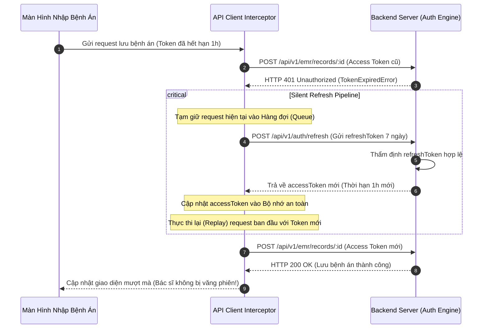

# BÁO CÁO ĐỒ ÁN TỐT NGHIỆP KỸ SƯ CÔNG NGHỆ THÔNG TIN
# CHƯƠNG 7: THIẾT KẾ TRẢI NGHIỆM NGƯỜI DÙNG VÀ GIAO DIỆN ĐA NỀN TẢNG (UI/UX DESIGN)

---

## 7.1. NGUYÊN TẮC CÔNG THÁI HỌC VÀ THIẾT KẾ GIAO DIỆN Y TẾ

Thiết kế giao diện phần mềm trong môi trường y tế (Healthcare UX/UI) có những đòi hỏi khắt khe vượt trội so với các ứng dụng thương mại thông thường, do liên quan trực tiếp đến tính mạng người bệnh và áp lực công việc của nhân viên y tế:

1. **Giảm thiểu Tải trọng Nhận thức (Cognitive Load Reduction):**
   - Bác sĩ và điều dưỡng thường xuyên làm việc trong trạng thái căng thẳng cao độ. Mọi thông tin sinh mạng trọng yếu (Tiền sử dị ứng, Cảnh báo chống chỉ định MRI, Dấu hiệu sinh tồn, Trạng thái BHYT) phải được bố trí tại các vị trí thị giác chiến lược với hệ thống màu cảnh báo y tế chuẩn quốc tế:
     - **Đỏ rực (`#ef4444` / Crimson Alert):** Báo động khẩn cấp, chống chỉ định buồng MRI, u thần kinh đệm ác tính.
     - **Vàng hổ phách (`#f59e0b` / Amber Warning):** Cảnh báo chưa đóng viện phí, ca chụp yêu cầu chụp lại do cử động nhòe ảnh, giường đang giữ chỗ tạm thời.
     - **Xanh ngọc / Xanh lá y tế (`#10b981` / Medical Green):** An toàn, đã đóng viện phí BHYT bảo lãnh, con dấu ký số điện tử hợp lệ, giường bệnh sẵn sàng tiếp nhận.
2. **Tối ưu Hóa Độ Tương Phản Phòng Đọc Phim (High Contrast Reading Mode):**
   - Phân hệ Chẩn đoán hình ảnh được thiết kế chuyên biệt trên nền tối (Deep Slate / Dark Room Theme `#0f172a` và `#1e293b`), giúp giảm mỏi mắt tối đa cho bác sĩ CĐHA khi làm việc trong phòng đọc phim thiếu sáng, đồng thời làm nổi bật độ tương phản xám - trắng của các lát cắt MRI não và bản đồ nhiệt Grad-CAM.
3. **Thiết Kế Đa Nền Tảng Thống Nhất (Universal Cross-Platform Architecture):**
   - Được xây dựng trên nền tảng **Expo React Native**, giao diện có khả năng tự động co giãn thích ứng (Responsive Layout) trên cả màn hình máy trạm Web Desktop độ phân giải cao của bệnh viện, máy tính bảng iPad của bác sĩ khi đi buồng thăm khám nội trú, lẫn điện thoại thông minh của người bệnh.

---

## 7.2. CHI TIẾT 6 PHÂN HỆ GIAO DIỆN NGƯỜI DÙNG CHUYÊN BIỆT

```
+-----------------------------------------------------------------------------------------+
|                           HỆ SINH THÁI GIAO DIỆN NEUROSCAN AI                           |
+-----------------------------------------------------------------------------------------+
| [1. Bác sĩ Khám]       | [2. Kỹ thuật viên MRI]    | [3. Bác sĩ CĐHA (PACS)]            |
| - Hàng đợi phân luồng  | - Hàng đợi phòng chụp     | - Dual Viewer (Ảnh gốc & BBox AI)  |
| - Ra Y lệnh MRI        | - Bảng kiểm 4 câu hỏi     | - Con dấu Ký số Điện tử TT46       |
| - Xếp giường nội trú   | - Upload nhị phân stream  | - Nhập mô tả & kết luận chẩn đoán  |
+------------------------+---------------------------+------------------------------------+
| [4. Điều dưỡng/Tiếp đón]                           | [5. Người Bệnh (Patient Portal)]   |
| - Sơ đồ buồng giường với đồng hồ đếm ngược 4 giờ   | - Bệnh án điện tử cá nhân (PHR)    |
| - Tiếp đón, phân luồng, tìm kiếm debounce an toàn  | - Quét mã VietQR thanh toán 24/7   |
+----------------------------------------------------+------------------------------------+
| [6. Quản Trị Viện & Kế Toán (Admin Dashboard)]                                          |
| - Quản trị nhân sự & CCHN, bảng giá dịch vụ, cấu hình trần BHYT, đối soát PayOS        |
+-----------------------------------------------------------------------------------------+
```

### 7.2.1. Phân hệ Bàn làm việc Bác sĩ Khám Lâm sàng (`DoctorWorkQueueScreen.js`)
- **Hàng đợi khám lâm sàng trực quan:** Tự động sắp xếp bệnh nhân theo thứ tự ưu tiên y khoa: `Khẩn cấp (Cấp cứu)` $\rightarrow$ `Ưu tiên` $\rightarrow$ `Thường`.
- **Huy hiệu viện phí đa năng:** Bác sĩ nhận biết tức thì bệnh nhân thuộc diện `🟢 BHYT: Đã bảo lãnh` hay `🚨 CẤP CỨU: Chụp trước, thu sau` mà không cần gọi điện thoại đối soát với phòng tài chính.
- **Ra y lệnh cận lâm sàng 1 chạm:** Chọn gói chụp MRI não, hệ thống tự động sinh hồ sơ ca khám (`cho_chup`), tạo hóa đơn tương ứng và đẩy ca sang phân hệ tiếp đón/phòng máy.
- **Tiếp nhận kết quả & Điều chuyển giường nội trú:** Khi bác sĩ CĐHA ký số xong, nút "🛏️ Xếp giường nội trú" sáng lên, cho phép bác sĩ điều trị chọn trực tiếp buồng giường trống theo khoa để giữ chỗ cho người bệnh.

### 7.2.2. Phân hệ Bàn điều khiển Kỹ thuật viên Phòng chụp MRI
- **Hàng đợi phòng chụp chuyên dụng:** Danh sách các ca chờ chụp trong ngày, đồng bộ chính xác theo múi giờ Việt Nam (+07:00).
- **Modal Bảng kiểm An toàn MRI (`MriSafetyCheckModal.js`):**
  - Khi KTV bấm "📸 Bắt đầu Chụp", modal bắt buộc hiển thị 4 câu hỏi an toàn sinh mạng.
  - Nếu KTV đánh dấu có dị vật kim loại hoặc máy tạo nhịp tim: Nút xác nhận bị khóa cứng, hiển thị cảnh báo đỏ rực: *"CẢNH BÁO CHỐNG CHỈ ĐỊNH TUYỆT ĐỐI"*.
  - Chỉ khi xác nhận an toàn hợp lệ, nút "Duyệt an toàn & Chụp phim" mới được kích hoạt để chuyển ca sang `dang_chup`.
- **Vùng Tải ảnh Chuẩn hóa:**
  - Vùng 1: Chọn 1 - 3 ảnh lát cắt tiêu biểu (.PNG/.JPG) để AI phân tích và xem nhanh trên Web EMR.
  - Vùng 2: Đính kèm tệp nén toàn bộ chuỗi ảnh DICOM gốc (.ZIP) để lưu trữ Mini-PACS dài hạn.
- **Modal Chụp lại (`MriRescanModal.js`) & Modal Hủy ca (`MriCancelModal.js`):** Cho phép KTV xử lý linh hoạt các tình huống bệnh nhân cử động đầu gây nhòe ảnh hoặc người bệnh hoảng loạn buồng kín.

### 7.2.3. Phân hệ Trạm đọc phim Bác sĩ CĐHA (`ImagingResultScreen.js`)
- **Trình xem ảnh kép đối chiếu (Dual Viewer):**
  - Khung nhìn bên trái: Lát cắt MRI sọ não gốc độ phân giải cao, hỗ trợ phóng to, thu nhỏ và kéo sáng tối.
  - Khung nhìn bên phải: Kết quả hệ thống MAICS tự động vẽ Bounding Box màu đỏ quanh vị trí khối u, gắn nhãn phân loại (`Glioma`, `Meningioma`, `Pituitary`) kèm điểm tin cậy phần trăm và bản đồ kích hoạt Grad-CAM.
- **Khu vực Con Dấu Ký Số Điện Tử (`DigitalSignatureBadge.js`):**
  - Trạng thái chưa ký: Hiển thị viền vàng hổ phách `⏳ Đang chờ Bác sĩ CĐHA đọc và ký số`.
  - Sau khi bác sĩ nhập mô tả hình ảnh, kết luận chẩn đoán và bấm "💾 Ký Số & Duyệt Kết Quả", hệ thống đóng dấu mộc điện tử màu xanh lá hợp chuẩn Thông tư 46/2018/TT-BYT:
    ```
    +---------------------------------------------------------+
    |  ✓ ĐÃ KÝ SỐ ĐIỆN TỬ BỞI BÁC SĨ CHẨN ĐOÁN HÌNH ẢNH       |
    |  Người ký: BS. CKI. Nguyễn Văn Quang                    |
    |  Chứng chỉ hành nghề: 012345/BYT-CCHN                   |
    |  Thời gian ký: 11/09/2026 14:30:15 (Giờ Việt Nam)       |
    +---------------------------------------------------------+
    ```

### 7.2.4. Phân hệ Điều dưỡng Tiếp đón & Sơ đồ Buồng giường (`NurseReceptionScreen.js`)
- **Sơ đồ Buồng giường Nội trú Trực quan:**
  - Hiển thị toàn bộ giường bệnh theo từng khoa phòng với mã màu phân định rõ ràng:
    - *Xanh lá:* Giường trống sẵn sàng tiếp nhận.
    - *Cam hổ phách:* Giường đang giữ chỗ, **hiển thị đồng hồ đếm ngược thời gian giữ chỗ 4 giờ** và họ tên bệnh nhân được giữ chỗ riêng.
    - *Đỏ:* Giường đang có bệnh nhân nằm điều trị.
    - *Xám:* Giường đang trong chu trình khử khuẩn.
- **Tìm kiếm an toàn có Debounce:** Ô tìm kiếm bệnh nhân được tích hợp cơ chế trễ 400ms (Debounce) và escape ký tự đặc biệt, chống nghẽn sự kiện gọi API và phòng ngừa tấn công ReDoS.
- **Phân trang dữ liệu thông minh:** Hiển thị danh sách bệnh nhân theo từng trang 20 bản ghi kèm nút chuyển trang mượt mà, giải quyết dứt điểm lỗi lễ tân không tìm thấy bệnh nhân mới đăng ký.

### 7.2.5. Phân hệ Cổng thông tin Người bệnh (Patient Portal)
- **Hồ sơ sức khỏe cá nhân điện tử (PHR):** Bệnh nhân đăng nhập bằng số điện thoại/CCCD để xem toàn bộ lịch sử các lần khám bệnh, toa thuốc và phác đồ điều trị.
- **Thanh toán Viện phí VietQR:** Quét mã QR động hiển thị trực tiếp trên màn hình điện thoại hoặc máy tính, tự động điền số tiền và nội dung chuyển khoản, gạch nợ tự động trong 3 giây qua PayOS Webhook.
- **Xem phim và kết quả trực tuyến:** Xem trực tiếp ảnh MRI đã được AI hỗ trợ định vị và phiếu kết quả có dấu ký số điện tử của bác sĩ CĐHA, hỗ trợ xuất file PDF để lưu trữ hoặc chuyển tuyến.

### 7.2.6. Phân hệ Bảng điều khiển Quản trị Bệnh viện (Hospital Admin Dashboard)
- Quản trị danh mục khoa phòng, nhân sự y tế, phân quyền tài khoản và quản lý Chứng chỉ hành nghề (CCHN).
- Cấu hình bảng giá dịch vụ khám chữa bệnh, giá chụp MRI và tỷ lệ đồng chi trả BHYT.
- Báo cáo thống kê lưu lượng bệnh nhân theo ngày, tỷ lệ sử dụng buồng giường và đối soát tài chính viện phí trực tuyến.

---

## 7.3. CƠ CHẾ LÀM MỚI PHIÊN LÀM VIỆC NGẦM (SILENT REFRESH INTERCEPTOR)

Trong môi trường bệnh viện, các ca phẫu thuật hoặc phiên thăm khám nội trú có thể kéo dài nhiều giờ. Để khắc phục hiện tượng phiên làm việc bị ngắt đột ngột làm mất dữ liệu chưa lưu của bác sĩ, tầng mạng client ([FE/src/api/client.js](file:///c:/Users/Administrator/OneDrive/Desktop/team5/FE/src/api/client.js)) được trang bị cơ chế **Silent Token Refresh với Hàng đợi Tạm giữ (Request Queue Replay)**:


Cơ chế trên bảo đảm tính liên tục tuyệt đối cho phiên làm việc lâm sàng, ngăn chặn triệt để nguy cơ mất dữ liệu hồ sơ bệnh án đang nhập dở.
