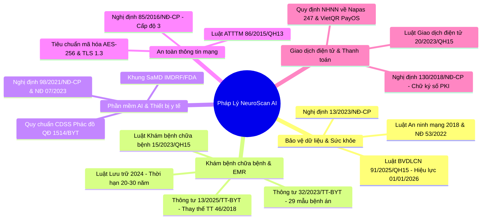
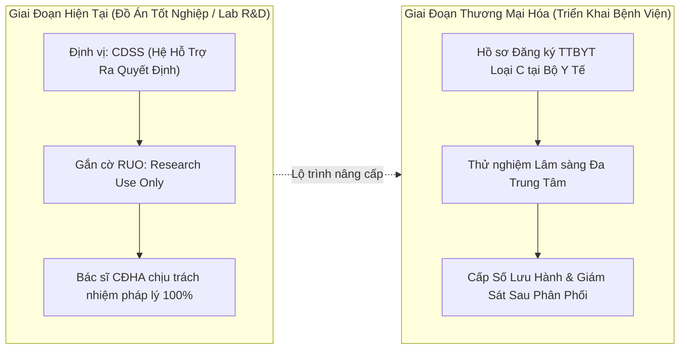

# ⚖️ CHƯƠNG 11: BÁO CÁO ĐÁNH GIÁ TUÂN THỦ PHÁP LÝ, AN TOÀN DỮ LIỆU Y TẾ & KHUNG TIÊU CHUẨN SaMD
## HỆ THỐNG NEUROSCAN AI (LƯU TRỮ EMR, MINI-PACS & CHẨN ĐOÁN MRI U NÃO)
### CĂN CỨ VĂN BẢN PHÁP LUẬT VIỆT NAM HIỆN HÀNH (CẬP NHẬT ĐẾN THÁNG 09/2026)

---

> **Văn bản phục vụ:** Báo cáo Khoa học Đồ án Tốt nghiệp (Capstone Thesis) · Hồ sơ Tiền Thẩm định Cấp phép Thử nghiệm Lâm sàng · Đánh giá An toàn Hệ thống Thông tin Y tế Cấp độ 3.  
> **Cơ quan thẩm quyền tham chiếu:** Bộ Y tế (Cục Quản lý Khám chữa bệnh, Cục Cơ sở hạ tầng & Thiết bị y tế) · Bộ Công an (Cục An ninh mạng và phòng, chống tội phạm sử dụng công nghệ cao - A05) · Bộ Thông tin và Truyền thông.  
> **Phiên bản hệ thống đối chiếu:** NeuroScan AI v3.2 Core Foundation.  
> **Tình trạng văn bản:** Bản chính thức hoàn chỉnh — Phân tích chi tiết rủi ro, khoảng cách (Gap Analysis) và giải pháp kỹ thuật khắc phục.

---

## 📋 MỤC LỤC CHI TIẾT

1. [DANH MỤC CĂN CỨ PHÁP LÝ ÁP DỤNG ĐẾN 09/2026](#1-danh-mục-căn-cứ-pháp-lý-áp-dụng-đến-092026)
2. [MA TRẬN ĐỐI CHIẾU MÃ NGUỒN VÀ HIỆN TRẠNG HỆ THỐNG (GAP ANALYSIS)](#2-ma-trận-đối-chiếu-mã-nguồn-và-hiện-trạng-hệ-thống-gap-analysis)
3. [RỦI RO TRỌNG YẾU 1: BẢO VỆ DỮ LIỆU CÁ NHÂN & CHUYỂN DỮ LIỆU XUYÊN BIÊN GIỚI](#3-rủi-ro-trọng-yếu-1-bảo-vệ-dữ-liệu-cá-nhân--chuyển-dữ-liệu-xuyên-biên-giới)
4. [RỦI RO TRỌNG YẾU 2: ĐỊNH VỊ PHÁP LÝ PHẦN MỀM AI (SaMD) & TRÁCH NHIỆM LÂM SÀNG](#4-rủi-ro-trọng-yếu-2-định-vị-pháp-lý-phần-mềm-ai-samd--trách-nhiệm-lâm-sàng)
5. [RỦI RO TRỌNG YẾU 3: HỒ SƠ BỆNH ÁN ĐIỆN TỬ & CHỮ KÝ SỐ CHUYÊN DÙNG Y TẾ](#5-rủi-ro-trọng-yếu-3-hồ-sơ-bệnh-án-điện-tử--chữ-ký-số-chuyên-dùng-y-tế)
6. [RỦI RO TRỌNG YẾU 4: BẢO ĐẢM AN TOÀN HỆ THỐNG THÔNG TIN CẤP ĐỘ 3](#6-rủi-ro-trọng-yếu-4-bảo-đảm-an-toàn-hệ-thống-thông-tin-cấp-độ-3)
7. [GIẢI PHÁP KIẾN TRÚC & MÃ NGUỒN KHẮC PHỤC TRIỆT ĐỂ (REMEDIATION BLUEPRINT)](#7-giải-pháp-kiến-trúc--mã-nguồn-khắc-phục-triệt-để-remediation-blueprint)
8. [LỘ TRÌNH TRIỂN KHAI THEO THỨ TỰ ƯU TIÊN (PRIORITY ROADMAP)](#8-lộ-trình-triển-khai-theo-thứ-tự-ưu-tiên-priority-roadmap)
9. [BỘ CÂU HỎI PHẢN BIỆN HỘI ĐỒNG TỐT NGHIỆP & CHIẾN LƯỢC TRẢ LỜI PHÁP LÝ](#9-bộ-câu-hỏi-phản-biện-hội-đồng-tốt-nghiệp--chiến-lược-trả-lời-pháp-lý)

---

## 1. DANH MỤC CĂN CỨ PHÁP LÝ ÁP DỤNG ĐẾN 09/2026

Hệ thống y tế số hóa tích hợp trí tuệ nhân tạo như **NeuroScan AI** chịu sự điều chỉnh đồng thời của 5 nhóm văn bản quy phạm pháp luật chuyên ngành:



### 1.1. Nhóm 1: Bảo vệ Dữ liệu Cá nhân & Dữ liệu Sức khỏe Nhạy cảm
* **Luật Bảo vệ dữ liệu cá nhân số 91/2025/QH15** (được Quốc hội thông qua ngày 26/06/2025, có hiệu lực thi hành từ ngày **01/01/2026**):
  * Đây là văn bản pháp lý **ưu tiên áp dụng cao nhất**, thay thế dần các quy định phân tán trước đây.
  * Phân loại dữ liệu sức khỏe (hồ sơ bệnh án, hình ảnh MRI não, tình trạng u não) là **Dữ liệu cá nhân nhạy cảm** (Điều 3).
  * Quy định nghiêm ngặt về quyền của chủ thể dữ liệu (người bệnh), nguyên tắc thu thập có sự đồng ý (Consent), quyền rút lại sự đồng ý (Withdrawal of Consent), và nghĩa vụ của Bên Kiểm soát/Bên Xử lý dữ liệu.
  * Chế tài xử phạt vi phạm hành chính lên tới **10 lần khoản thu lợi bất chính** hoặc phạt tiền nghiêm khắc đối với hành vi làm lộ lọt, mua bán dữ liệu sức khỏe trái phép.
* **Nghị định 13/2023/NĐ-CP** (ngày 17/04/2023):
  * Áp dụng bổ trợ cho các quy trình kỹ thuật: 8 nguyên tắc xử lý dữ liệu, đánh giá tác động xử lý dữ liệu cá nhân (ĐTM - DPIA), đăng ký với Cục A05 (Bộ Công an) khi xử lý dữ liệu nhạy cảm quy mô lớn.
* **Luật An ninh mạng số 24/2018/QH14 & Nghị định 53/2022/NĐ-CP**:
  * Điều 26 Luật An ninh mạng và Điều 26-27 Nghị định 53/2022 quy định: Dữ liệu về thông tin cá nhân của người sử dụng dịch vụ tại Việt Nam bắt buộc phải được **lưu trữ tại Việt Nam**.

### 1.2. Nhóm 2: Khám Bệnh, Chữa Bệnh & Hồ Sơ Bệnh Án Điện Tử (EMR)
* **Luật Khám bệnh, chữa bệnh số 15/2023/QH15** (có hiệu lực 01/01/2024):
  * Định nghĩa Hồ sơ bệnh án (khoản 17 Điều 2); quyền bí mật thông tin của người bệnh; nghĩa vụ chuyên môn của người hành nghề y.
* **Thông tư 13/2025/TT-BYT** (Bộ Y tế ban hành ngày 06/06/2025, có hiệu lực từ ngày **21/07/2025**):
  * **CHÍNH THỨC THAY THẾ HOÀN TOÀN THÔNG TƯ 46/2018/TT-BYT**.
  * Quy định tiêu chuẩn kỹ thuật triển khai hồ sơ bệnh án điện tử, kết nối định danh công dân qua **VNeID (Mức độ 2)**, tích hợp chữ ký số/chữ ký điện tử của bác sĩ, yêu cầu hạ tầng sao lưu dữ liệu chống mất mát, lộ lọt.
  * Lộ trình bắt buộc: Các bệnh viện hạng I trở lên phải hoàn thành trước 30/09/2025; các cơ sở KCB khác hoàn thành chậm nhất cuối năm 2026.
* **Thông tư 32/2023/TT-BYT** (ngày 31/12/2023):
  * Quy định chi tiết một số điều của Luật KBCB; Chương X và Phụ lục XXVIII ban hành **29 mẫu hồ sơ bệnh án chuẩn quốc gia**.
* **Luật Lưu trữ số 33/2024/QH15 & Quy định Bộ Y tế về Lưu trữ Hồ sơ Y tế**:
  * Thời hạn bảo quản hồ sơ bệnh án: Tối thiểu **10 năm** đối với điều trị ngoại trú, **20 năm** đối với điều trị nội trú; riêng bệnh án ung thư, bệnh mạn tính nguy hiểm hoặc đối tượng tham gia thử nghiệm lâm sàng lưu trữ tối thiểu **30 năm đến vĩnh viễn**.

### 1.3. Nhóm 3: Phần Mềm AI / Trang Thiết Bị Y Tế (SaMD)
* **Nghị định 98/2021/NĐ-CP** (được sửa đổi, bổ sung bởi **Nghị định 07/2023/NĐ-CP** và **Nghị định 96/2023/NĐ-CP**):
  * Định nghĩa trang thiết bị y tế bao gồm cả **phần mềm (Software as a Medical Device - SaMD)** sử dụng riêng lẻ hoặc kết hợp nhằm mục đích chẩn đoán, theo dõi hoặc điều trị bệnh tật ở người.
  * Phân loại trang thiết bị y tế theo 4 mức độ rủi ro (A, B, C, D). Phần mềm AI chẩn đoán bệnh lý nguy hiểm (u não, phân loại Glioma/Meningioma) thuộc **nhóm nguy cơ cao (Loại C hoặc D)** $\rightarrow$ Bắt buộc phải thử nghiệm lâm sàng và được Bộ Y tế cấp số lưu hành trước khi đưa vào ứng dụng thực tiễn ngoài phạm vi nghiên cứu nội bộ.
* **Khung Quản lý SaMD của Diễn đàn Cơ quan Quản lý Thiết bị Y tế Quốc tế (IMDRF) & FDA**:
  * Quy định về Quản lý rủi ro phần mềm y tế (ISO 14971), Vòng đời phát triển phần mềm y tế (IEC 62304) và Giám sát hiệu năng sau lưu hành (Post-market Surveillance).

### 1.4. Nhóm 4: An Toàn Thông Tin Mạng & An Ninh Hệ Thống
* **Luật An toàn thông tin mạng số 86/2015/QH13 & Nghị định 85/2016/NĐ-CP**:
  * Hệ thống thông tin y tế bệnh viện quản lý dữ liệu khám chữa bệnh của người dân được xác định thuộc **Hệ thống thông tin Cấp độ 3** (hoặc Cấp độ 4 đối với bệnh viện tuyến trung ương hạng đặc biệt).
  * Đòi hỏi kiểm soát phân quyền nghiêm ngặt, ghi nhật ký không thể xóa/sửa, xác thực 2 yếu tố (MFA), mã hóa dữ liệu khi lưu trữ (Encryption at Rest) và khi truyền tải (Encryption in Transit).

### 1.5. Nhóm 5: Giao Dịch Điện Tử, Chữ Ký Số & Thanh Toán
* **Luật Giao dịch điện tử số 20/2023/QH15 & Nghị định 130/2018/NĐ-CP**:
  * Quy định tính pháp lý của chữ ký điện tử, chữ ký số chuyên dùng y tế (PKI / USB Token / Cloud HSM); điều kiện dữ liệu điện tử có giá trị như văn bản gốc có ký tên, đóng dấu.
* **Quy định của Ngân hàng Nhà nước Việt Nam về Dịch vụ Trung gian Thanh toán**:
  * Nguyên tắc bảo mật giao dịch, chống rửa tiền, bảo vệ thông tin chủ tài khoản và tách bạch luồng dữ liệu tài chính khỏi dữ liệu y tế nhạy cảm.

---

## 2. MA TRẬN ĐỐI CHIẾU MÃ NGUỒN VÀ HIỆN TRẠNG HỆ THỐNG (GAP ANALYSIS)

Bảng dưới đây rà soát trực tiếp từng module mã nguồn của dự án NeuroScan AI so với các quy định pháp luật tương ứng:

| Module Hệ Thống | Vị Trí File Mã Nguồn | Quy Định Pháp Lý Áp Dụng | Hiện Trạng Đã Triển Khai | Khoảng Cách / Thiếu Sót (GAP) | Đánh Giá Tuân Thủ |
| :--- | :--- | :--- | :--- | :--- | :---: |
| **Bảo Vệ Dữ Liệu & Phân Quyền** | [`tenancy.plugin.js`](file:///c:/Users/Administrator/OneDrive/Desktop/team5/BE/src/plugins/tenancy.plugin.js)<br>[`user.model.js`](file:///c:/Users/Administrator/OneDrive/Desktop/team5/BE/src/modules/auth/models/user.model.js) | Luật 91/2025/QH15<br>NĐ 13/2023/NĐ-CP | Cô lập đa viện (Multi-tenant) triệt để bằng plugin; phân quyền RBAC 6 vai trò lâm sàng; chống Brute-force mật khẩu. | Chưa có module xin sự đồng ý xử lý dữ liệu cá nhân riêng biệt; chưa có cơ chế thu hồi sự đồng ý (Withdrawal of Consent). | 🟡 **Bán phần (60%)** |
| **Lưu Trữ Ảnh DICOM / Mini-PACS** | [`googleDrive.js`](file:///c:/Users/Administrator/OneDrive/Desktop/team5/BE/src/config/googleDrive.js)<br>[`imaging.controller.js`](file:///c:/Users/Administrator/OneDrive/Desktop/team5/BE/src/modules/imaging/imaging.controller.js)<br>[`firebase.js`](file:///c:/Users/Administrator/OneDrive/Desktop/team5/BE/src/config/firebase.js) | Luật An ninh mạng 2018<br>NĐ 53/2022/NĐ-CP<br>Luật 91/2025/QH15 | Kiến trúc Hybrid: nén toàn bộ lát cắt thành 1 file `.zip` (PACS Archive) và upload 1–3 Key Slices xem ngay. | **RỦI RO CAO NHẤT:** Dữ liệu ảnh MRI, file nén DICOM và file JSON báo cáo được lưu trên Google Drive / Firebase (máy chủ nước ngoài), vi phạm quy định lưu trữ tại VN. | 🔴 **Nguy cơ cao (30%)** |
| **Quản Lý Bệnh Án Điện Tử (EMR)** | [`medicalRecord.model.js`](file:///c:/Users/Administrator/OneDrive/Desktop/team5/BE/src/modules/emr/models/medicalRecord.model.js)<br>[`patientRecord.service.js`](file:///c:/Users/Administrator/OneDrive/Desktop/team5/BE/src/services/patientRecord.service.js) | Thông tư 13/2025/TT-BYT<br>Luật Lưu trữ 2024<br>Luật KBCB 15/2023 | Thiết lập `retentionYears: 30`, `retentionCategory: "neuro_oncology_malignant"`, `legalHold`, lưu vết xóa mềm (Soft Delete). | Mã nguồn và tài liệu vẫn viện dẫn Thông tư 46/2018/TT-BYT (đã hết hiệu lực); chưa có kết nối VNeID mức 2 cho tài khoản người bệnh. | 🟡 **Bán phần (65%)** |
| **Biểu Mẫu Lâm Sàng & Hồ Sơ Bệnh Án** | [`DocumentFormScreen.js`](file:///c:/Users/Administrator/OneDrive/Desktop/team5/FE/src/screens/DocumentFormScreen.js)<br>[`documentVault.model.js`](file:///c:/Users/Administrator/OneDrive/Desktop/team5/FE/src/models/documentVault.model.js) | Thông tư 32/2023/TT-BYT<br>(Phụ lục XXVIII) | Triển khai 12 biểu mẫu: Phiếu khám, Viện phí, Tóm tắt HSBA, Đơn thuốc, Giấy ra viện, Chuyển tuyến, Hóa sinh... | Các mẫu phiếu tự thiết kế theo luồng nội bộ; chưa khớp hoàn toàn cấu trúc dữ liệu 29 mẫu bệnh án chuẩn quốc gia của TT 32. | 🟡 **Bán phần (60%)** |
| **Phân Hệ AI Engine (CDSS / YOLOv8)** | [`main.py`](file:///c:/Users/Administrator/OneDrive/Desktop/team5/MRIteam_team5/MRIteam/main.py)<br>[`train_yolo.py`](file:///c:/Users/Administrator/OneDrive/Desktop/team5/MRIteam_team5/MRIteam/train_yolo.py)<br>[`ImagingResultScreen.js`](file:///c:/Users/Administrator/OneDrive/Desktop/team5/FE/src/screens/ImagingResultScreen.js) | Nghị định 98/2021/NĐ-CP<br>Nghị định 07/2023/NĐ-CP<br>Chuẩn SaMD (IMDRF) | Cơ chế Human-in-the-Loop bắt buộc: AI chỉ đóng vai trò gợi ý (CDSS); Bác sĩ CĐHA xác nhận/hiệu chỉnh; ghi nhận feedback log. | Phần mềm chưa đăng ký phân loại TTBYT Loại C/D; thiếu tuyên bố miễn trừ trách nhiệm pháp lý (Disclaimer RUO) trên giao diện. | 🟢 **Đạt (Mức đồ án / RUO)**<br>🔴 **Chưa cấp phép lâm sàng** |
| **Nhật Ký Kiểm Toán (Audit Trail)** | [`auditLog.model.js`](file:///c:/Users/Administrator/OneDrive/Desktop/team5/BE/src/models/auditLog.model.js)<br>`audit_logs.db` (SQLite) | Luật ATTTM 86/2015<br>Thông tư 13/2025/TT-BYT | Chuỗi băm liên hoàn Cryptographic Tamper-Evidence (`previousHash`, `currentHash`, `payloadHash`); SQLite audit log cho AI inference. | Chưa có giao diện trích xuất Sổ theo dõi hoạt động xử lý dữ liệu (RoPA) theo mẫu của Cục A05; chưa tự động cảnh báo xâm phạm dữ liệu. | 🟢 **Đạt 85%** |
| **Chữ Ký Số & Ký Duyệt Chuyên Môn** | [`imagingResult.model.js`](file:///c:/Users/Administrator/OneDrive/Desktop/team5/BE/src/modules/imaging/models/imagingResult.model.js)<br>[`imaging.controller.js`](file:///c:/Users/Administrator/OneDrive/Desktop/team5/BE/src/modules/imaging/imaging.controller.js#L943-L948) | Luật GDĐT 20/2023/QH15<br>NĐ 130/2018/NĐ-CP | Khóa quyền chỉnh sửa sau khi ký, đóng dấu điện tử trực quan trên Web: **✓ ĐÃ KÝ SỐ ĐIỆN TỬ** kèm tên Bác sĩ CĐHA và timestamp. | `ImagingResult` chỉ lưu cờ boolean `isSigned: true`, chưa lưu `digitalSignatureMetadata` (serial chứng thư số PKI, hash SHA256withRSA). | 🟡 **Bán phần (50%)** |
| **Thanh Toán Viện Phí & Dữ Liệu BHYT** | [`invoice.controller.js`](file:///c:/Users/Administrator/OneDrive/Desktop/team5/BE/src/modules/billing/invoice.controller.js)<br>[`payos.js`](file:///c:/Users/Administrator/OneDrive/Desktop/team5/BE/src/utils/payos.js) | Luật GDĐT 20/2023<br>Quy định NHNN | Tạo mã VietQR qua PayOS; Webhook kiểm tra chữ ký HMAC-SHA256 chống giả mạo; tách biệt hoàn toàn dữ liệu tài chính và y tế. | Không có thiếu sót lớn; đáp ứng tốt quy định trung gian thanh toán. | 🟢 **Đạt 95%** |

---

## 3. RỦI RO TRỌNG YẾU 1: BẢO VỆ DỮ LIỆU CÁ NHÂN & CHUYỂN DỮ LIỆU XUYÊN BIÊN GIỚI

### 3.1. Phân tích chi tiết rủi ro lưu trữ Google Drive & Firebase
Trong kiến trúc hiện hành tại [`googleDrive.js`](file:///c:/Users/Administrator/OneDrive/Desktop/team5/BE/src/config/googleDrive.js):
```javascript
// Hệ thống tự động tạo thư mục và tải ảnh/bệnh án lên Google Drive máy chủ ngoại
const driveResult = await uploadToDrive(fileBuffer, originalName, mimeType, parentFolderId);
```
Và tại [`firebase.js`](file:///c:/Users/Administrator/OneDrive/Desktop/team5/BE/src/config/firebase.js):
```javascript
const storageBucket = process.env.FIREBASE_STORAGE_BUCKET || "neuroscanai-fabad.firebasestorage.app";
```

> [!CAUTION]
> **Rủi ro pháp lý mức cao nhất (Severe Non-Compliance):**  
> 1. **Vi phạm Luật An ninh mạng 2018 (Điều 26) & Nghị định 53/2022/NĐ-CP:** Dữ liệu hình ảnh y tế (MRI) chứa thông tin sinh trắc học giải phẫu não và thông tin nhân thân bệnh nhân là dữ liệu thuộc diện **bắt buộc phải lưu trữ trên lãnh thổ Việt Nam**. Việc đưa dữ liệu lên Google Drive và Firebase mà máy chủ đặt ngoài lãnh thổ Việt Nam (Singapore, Mỹ...) bị coi là chuyển dữ liệu ra nước ngoài trái quy định.  
> 2. **Vi phạm Luật Bảo vệ dữ liệu cá nhân 91/2025/QH15:** Chuyển dữ liệu cá nhân nhạy cảm ra nước ngoài mà không có Hồ sơ đánh giá tác động chuyển dữ liệu (TIA), không gửi thông báo cho Cục A05 - Bộ Công an và không có sự đồng ý riêng của chủ thể dữ liệu có thể bị đình chỉ hoạt động và xử phạt tới 10 lần khoản thu lợi bất chính.

### 3.2. Cơ chế thu thập sự đồng ý (Consent) và Quyền của người bệnh
* **Hiện trạng:** Bảng [`consentForm.model.js`](file:///c:/Users/Administrator/OneDrive/Desktop/team5/BE/src/modules/emr/models/consentForm.model.js) hiện chỉ lưu cam kết phẫu thuật và kiểm tra tiền sử dị ứng thuốc cản quang Gadolinium (Module S).
* **Thiếu sót theo Luật 91/2025/QH15:**
  * Thiếu văn bản/giao diện thể hiện sự đồng ý tự nguyện, có thông báo của người bệnh về: (1) Thu thập dữ liệu hình ảnh não; (2) Xử lý dữ liệu bằng thuật toán AI; (3) Lưu trữ và truyền tải dữ liệu.
  * Chưa có cơ chế cho phép người bệnh thực hiện **Quyền thu hồi sự đồng ý (Withdrawal of Consent)** hoặc yêu cầu ẩn danh hóa/xóa dữ liệu sau khi kết thúc đợt điều trị.

---

## 4. RỦI RO TRỌNG YẾU 2: ĐỊNH VỊ PHÁP LÝ PHẦN MỀM AI (SaMD) & TRÁCH NHIỆM LÂM SÀNG

### 4.1. Phân định Phần mềm Trang thiết bị Y tế (NĐ 98/2021 & NĐ 07/2023)
Theo Điều 2 Nghị định 98/2021/NĐ-CP, phần mềm hỗ trợ chẩn đoán u não (phân loại Glioma, Meningioma, Pituitary) thuộc định nghĩa Trang thiết bị y tế chẩn đoán:

```
┌────────────────────────────────────────────────────────────────────────┐
│            QUY CHUẨN PHÂN LOẠI TRANG THIẾT BỊ Y TẾ (SaMD)              │
├───────────────────┬────────────────────────────────────────────────────┤
│ Loại A / B        │ Rủi ro thấp đến trung bình (quản lý hành chính HIS)│
├───────────────────┼────────────────────────────────────────────────────┤
│ Loại C / D        │ Rủi ro cao: Phần mềm đưa ra gợi ý chẩn đoán các    │
│ (NeuroScan AI)    │ bệnh lý ác tính/đe dọa tính mạng (U não, đột quỵ) │
│                   │ ➔ Bắt buộc thử nghiệm lâm sàng & cấp số lưu hành   │
└───────────────────┴────────────────────────────────────────────────────┘
```

### 4.2. Vị thế thực tế của NeuroScan AI trong giai đoạn hiện tại
Để bảo đảm tính hợp pháp và an toàn tối đa cho dự án, hệ thống phải được định vị pháp lý theo 2 cấp độ:



### 4.3. Nguyên tắc Lâm sàng "Human-in-the-Loop" đã triển khai
Hệ thống đã triển khai rất xuất sắc nguyên tắc phòng ngừa rủi ro sai sót của AI:
1. **AI không có quyền tự động kết luận:** Tuyến chạy ngầm AI chỉ trả kết quả vào trường `aiReport`. Ca chụp lập tức chuyển sang trạng thái `chờ bác sĩ đọc`.
2. **Cơ chế xác nhận/hiệu chỉnh bắt buộc:** Giao diện [`ImagingResultScreen.js`](file:///c:/Users/Administrator/OneDrive/Desktop/team5/FE/src/screens/ImagingResultScreen.js) cung cấp 2 nút:
   * `"✅ AI đúng — Xác nhận"`: Bác sĩ đồng thuận với kết quả đề xuất.
   * `"✍️ AI sai — Hiệu chỉnh"`: Bác sĩ vẽ lại vùng tổn thương, sửa loại u, ghi nhận lý do vào nhật ký `feedback_log.csv`.
3. **Bệnh nhân bị khóa quyền xem chẩn đoán sớm:** Tại [`patientB2c.controller.js`](file:///c:/Users/Administrator/OneDrive/Desktop/team5/BE/src/modules/patient-portal/patientB2c.controller.js#L77-L80), nếu `imaging.isSigned === false`, người bệnh hoàn toàn không thể xem nội dung chẩn đoán hay phân tích AI nhằm tránh hoang mang tâm lý trước khi có ý kiến bác sĩ chuyên khoa.

---

## 5. RỦI RO TRỌNG YẾU 3: HỒ SƠ BỆNH ÁN ĐIỆN TỬ & CHỮ KÝ SỐ CHUYÊN DÙNG Y TẾ

### 5.1. Thay thế Thông tư 46/2018 bằng Thông tư 13/2025/TT-BYT
Toàn bộ mã nguồn và báo cáo đồ án hiện tại cần được cập nhật căn cứ pháp lý:
* **Thông tư 46/2018/TT-BYT** đã chính thức **hết hiệu lực thi hành kể từ ngày 21/07/2025**.
* Văn bản điều chỉnh trực tiếp hiện nay là **Thông tư số 13/2025/TT-BYT** (ngày 06/06/2025) của Bộ Y tế.
* Các điểm mới cốt lõi của Thông tư 13/2025 mà hệ thống cần đáp ứng:
  1. Yêu cầu tích hợp định danh công dân qua **VNeID** (Mức 2) khi cấp tài khoản bệnh nhân.
  2. Bắt buộc chữ ký số chuẩn PKI cho bác sĩ phê duyệt bệnh án.
  3. Lộ trình bỏ hoàn toàn bệnh án giấy tại các bệnh viện chậm nhất là cuối năm 2026.

### 5.2. Khoảng cách kỹ thuật của Chữ ký số trên `ImagingResult`
So sánh giữa 2 model trong mã nguồn:
* Trong [`medicalRecord.model.js`](file:///c:/Users/Administrator/OneDrive/Desktop/team5/BE/src/modules/emr/models/medicalRecord.model.js#L179-L192):
  ```javascript
  digitalSignatureMetadata: {
    signatureType: { type: String, enum: ["pki_token", "cloud_hsm", "smartcard", "electronic"] },
    certificateSerial: { type: String, default: "" },
    signingAlgorithm: { type: String, default: "SHA256withRSA" },
    timestampToken: { type: String, default: "" },
    caProvider: { type: String, default: "" },
    signedHash: { type: String, default: "" },
  }
  ```
* Trong [`imagingResult.model.js`](file:///c:/Users/Administrator/OneDrive/Desktop/team5/BE/src/modules/imaging/models/imagingResult.model.js#L127-L130):
  ```javascript
  isSigned: { type: Boolean, default: false },
  signedBy: { type: Schema.Types.ObjectId, ref: 'User', default: null },
  signedAt: { type: Date, default: null }
  ```

> [!WARNING]
> **Khoảng cách pháp lý chữ ký số:**  
> Kết quả chụp MRI là chứng cứ y khoa quan trọng nhất để chỉ định phẫu thuật não. Việc `ImagingResult` chỉ lưu cờ `isSigned: true` mà không lưu mã băm toàn vẹn (Signed Hash) và chứng thư số của Bác sĩ CĐHA sẽ khiến bản ghi điện tử **không đủ giá trị pháp lý chứng thực** theo Luật Giao dịch điện tử 20/2023/QH15 khi xảy ra tranh chấp hoặc tai biến y khoa.

---

## 6. RỦI RO TRỌNG YẾU 4: BẢO ĐẢM AN TOÀN HỆ THỐNG THÔNG TIN CẤP ĐỘ 3

Theo Nghị định 85/2016/NĐ-CP, hệ thống thông tin y tế quản lý hồ sơ sức khỏe và dữ liệu chẩn đoán hình ảnh bệnh viện thuộc **Cấp độ 3**. Dưới đây là bảng đối chiếu tiêu chuẩn an toàn kỹ thuật:

| Tiêu Chuẩn Kỹ Thuật Cấp Độ 3 | Quy Chuẩn Bộ TT&TT | Hiện Trạng NeuroScan AI v3.2 | Biện Pháp Bổ Sung Cần Thiết |
| :--- | :--- | :--- | :--- |
| **Xác thực đa yếu tố (MFA)** | Bắt buộc đối với tài khoản quản trị và bác sĩ có quyền xem/sửa dữ liệu y tế. | Mới chỉ áp dụng OTP qua email cho việc đăng ký và đổi mật khẩu; bác sĩ đăng nhập bằng Email + Pass. | Kích hoạt MFA bắt buộc (Google Authenticator / TOTP hoặc Email OTP) cho role `doctor`, `hospital_admin`, `admin`. |
| **Mã hóa khi lưu trữ (At Rest)** | Bắt buộc mã hóa dữ liệu nhạy cảm (thông tin bệnh tật, sinh trắc học não) bằng AES-256. | Database MongoDB đang lưu trữ dữ liệu dạng Plaintext (trừ mật khẩu đã băm bcrypt). | Bật tính năng Encrypted Storage Engine của MongoDB hoặc dùng Client-Side Field Level Encryption (CSFLE). |
| **Mã hóa khi truyền tải (In Transit)** | Bắt buộc TLS 1.2 trở lên, khuyến nghị TLS 1.3 cho toàn bộ kết nối Web/API/Microservice. | Nginx Reverse Proxy hỗ trợ HTTPS/TLS; môi trường phát triển cục bộ chạy HTTP cổng 3000/8083. | Bắt buộc bật HSTS, cấu hình chứng chỉ SSL/TLS Let's Encrypt hoặc chứng chỉ bệnh viện trên môi trường chạy thật. |
| **Nhật ký bất biến (Immutable Audit)** | Không ai (kể cả System Admin) có quyền sửa hoặc xóa nhật ký kiểm toán. | Model [`auditLog.model.js`](file:///c:/Users/Administrator/OneDrive/Desktop/team5/BE/src/models/auditLog.model.js) đã xây dựng chuỗi băm mật mã liên hoàn (`previousHash` $\rightarrow$ `currentHash`). | Cấu hình quyền ghi Append-Only trên CSDL hoặc đẩy log sang hệ thống SIEM/Elasticsearch độc lập. |
| **Chính sách sao lưu (Backup)** | Tối thiểu 1 bản backup cục bộ và 1 bản backup off-site định kỳ hàng ngày. | Đã có kịch bản sao lưu metadata báo cáo vào thư mục Google Drive. | Chuyển điểm lưu bản sao lưu sang cụm lưu trữ S3/MinIO nội địa an toàn. |

---

## 7. GIẢI PHÁP KIẾN TRÚC & MÃ NGUỒN KHẮC PHỤC TRIỆT ĐỂ (REMEDIATION BLUEPRINT)

Dưới đây là thiết kế kiến trúc và giải pháp mã nguồn chi tiết để khắc phục trọn vẹn các khoảng cách pháp lý đã nêu:

### 7.1. Kiến trúc Lưu trữ Thay Thế (Thay Google Drive bằng MinIO / Cloud Nội Địa Việt Nam)

```
┌─────────────────────────────────────────────────────────────────────────────────┐
│                     HẠ TẦNG LƯU TRỮ CHUẨN LUẬT AN NINH MẠNG                      │
├─────────────────────────────────────────────────────────────────────────────────┤
│                                                                                 │
│   ┌───────────────────────────┐           ┌─────────────────────────────────┐   │
│   │    KTV / BỆNH NHÂN        │           │     HỆ THỐNG NEUROSCAN AI       │   │
│   │   (Web Client / App)      │           │     (Node.js Express Gateway)   │   │
│   └─────────────┬─────────────┘           └────────────────┬────────────────┘   │
│                 │                                          │                    │
│                 │  1. Upload DICOM .zip / Key Slices       │                    │
│                 └─────────────────────────────────────────►│                    │
│                                                            │                    │
│                                           2. Lưu trữ nội địa (Tuân thủ VN Law)  │
│                                           ┌────────────────▼────────────────┐   │
│                                           │  MINIO S3 / CLOUD NỘI ĐỊA VN    │   │
│                                           │  (Viettel Cloud / FPT / VNPT)   │   │
│                                           │  - Bucket: 01_original_scans    │   │
│                                           │  - Bucket: 04_patient_reports   │   │
│                                           │  - Mã hóa Server-Side AES-256   │   │
│                                           └─────────────────────────────────┘   │
└─────────────────────────────────────────────────────────────────────────────────┘
```

#### Mã nguồn module Storage nội địa chuẩn S3-Compatible (`BE/src/config/storageEngine.js`):
```javascript
import { S3Client, PutObjectCommand, GetObjectCommand } from "@aws-sdk/client-s3";
import { getSignedUrl } from "@aws-sdk/s3-request-presigner";

// Cấu hình tương thích MinIO On-Premise hoặc Cloud Việt Nam (Viettel IDC / VNPT Cloud)
const s3Config = {
  region: process.env.VN_STORAGE_REGION || "vn-north-1",
  endpoint: process.env.VN_STORAGE_ENDPOINT || "http://minio.hospital.local:9000",
  forcePathStyle: true, // Bắt buộc đối với MinIO
  credentials: {
    accessKeyId: process.env.VN_STORAGE_ACCESS_KEY,
    secretAccessKey: process.env.VN_STORAGE_SECRET_KEY,
  },
};

const s3Client = new S3Client(s3Config);
const BUCKET_NAME = process.env.VN_STORAGE_BUCKET || "neuroscan-pacs-data";

export const uploadMedicalFileLocal = async (fileBuffer, fileName, mimeType, hospitalId) => {
  const objectKey = `hospitals/${hospitalId}/${Date.now()}_${fileName}`;
  const command = new PutObjectCommand({
    Bucket: BUCKET_NAME,
    Key: objectKey,
    Body: fileBuffer,
    ContentType: mimeType,
    ServerSideEncryption: "AES256", // Mã hóa At-Rest theo Cấp độ 3
  });

  await s3Client.send(command);
  return { objectKey, storageUrl: `${s3Config.endpoint}/${BUCKET_NAME}/${objectKey}` };
};
```

---

### 7.2. Chuẩn Hóa Model Đồng Thuận Xử Lý Dữ Liệu (`DataPrivacyConsent`)
Tạo mới schema độc lập để thu thập và quản lý sự đồng ý của bệnh nhân theo đúng Điều 9 & Điều 11 Luật Bảo vệ dữ liệu cá nhân 91/2025/QH15:

```javascript
// BE/src/modules/emr/models/dataPrivacyConsent.model.js
import { Schema, model } from "mongoose";
import { tenancyPlugin } from "../../../plugins/tenancy.plugin.js";

const dataPrivacyConsentSchema = new Schema(
  {
    hospitalId: { type: Schema.Types.ObjectId, ref: 'Hospital', required: true, index: true },
    patientId: { type: Schema.Types.ObjectId, ref: 'User', required: true, index: true },
    
    // Các mục đích xử lý dữ liệu được tách bạch rõ ràng (Không gộp chung)
    purposes: {
      medicalExamination: { type: Boolean, default: true, required: true }, // Khám chữa bệnh & lưu EMR
      aiAssistedDiagnosis: { type: Boolean, default: false, required: true }, // Cho phép AI phân tích MRI
      researchAndEducation: { type: Boolean, default: false }, // Phục vụ nghiên cứu/đào tạo (ẩn danh)
      cloudStorageBackup: { type: Boolean, default: false }, // Cho phép lưu trữ bản sao đám mây
    },

    // Quyền rút lại sự đồng ý theo Điều 9 Luật 91/2025/QH15
    consentStatus: {
      type: String,
      enum: ['granted', 'partially_revoked', 'fully_revoked'],
      default: 'granted'
    },
    revokedAt: { type: Date, default: null },
    revocationReason: { type: String, default: "" },

    // Thông tin xác thực người ký
    signedBy: { type: String, required: true }, // Tên bệnh nhân hoặc Người giám hộ
    signerNationalId: { type: String, required: true }, // Số CCCD / Định danh VNeID
    signerRelationship: { type: String, default: "Bản thân" },
    signatureDataUrl: { type: String, default: "" }, // Chữ ký tay điện tử
    ipAddress: { type: String, default: "" },
    userAgent: { type: String, default: "" },
  },
  { timestamps: true }
);

dataPrivacyConsentSchema.plugin(tenancyPlugin);
export const DataPrivacyConsent = model("DataPrivacyConsent", dataPrivacyConsentSchema);
export default DataPrivacyConsent;
```

---

### 7.3. Nâng Cấp Metadata Chữ Ký Số Chuẩn PKI Cho `ImagingResult`
Bổ sung đầy đủ chứng thực chữ ký số chuyên dùng theo Luật Giao dịch điện tử 20/2023/QH15 vào model [`imagingResult.model.js`](file:///c:/Users/Administrator/OneDrive/Desktop/team5/BE/src/modules/imaging/models/imagingResult.model.js):

```javascript
// Bổ sung vào imagingResultSchema:
digitalSignatureMetadata: {
  isSigned: { type: Boolean, default: false },
  signatureType: {
    type: String,
    enum: ["pki_token", "cloud_hsm", "smartcard", "electronic_stamp"],
    default: "electronic_stamp"
  },
  signedByDoctorId: { type: Schema.Types.ObjectId, ref: 'User', default: null },
  doctorFullName: { type: String, default: "" },
  doctorLicenseNumber: { type: String, default: "" }, // Số chứng chỉ hành nghề y tế
  certificateSerial: { type: String, default: "" }, // Serial chứng thư số hợp lệ
  caProvider: { type: String, default: "VNPT-CA" }, // Viettel-CA, VNPT-CA, BKAV-CA...
  signedHash: { type: String, default: "" }, // SHA-256 băm toàn bộ nội dung chẩn đoán
  timestampToken: { type: String, default: "" }, // Dấu thời gian xác thực từ TSA
  signedAt: { type: Date, default: null },
  isTampered: { type: Boolean, default: false } // Cờ cảnh báo nếu nội dung bị sửa sau ký
}
```

---

### 7.4. Giao Diện Tuyên Bố Miễn Trừ Trách Nhiệm (Clinical Disclaimer Banner)
Bổ sung component chuẩn mực hiển thị tại mọi màn hình có hiển thị kết quả phân tích AI (VD: [`ImagingResultScreen.js`](file:///c:/Users/Administrator/OneDrive/Desktop/team5/FE/src/screens/ImagingResultScreen.js)):

```jsx
// FE/src/components/ClinicalDisclaimerBanner.jsx
import React from 'react';
import { View, Text, StyleSheet } from 'react-native';
import { AlertTriangle, ShieldCheck } from 'lucide-react';

export const ClinicalDisclaimerBanner = ({ isDoctor = true }) => {
  return (
    <View style={styles.bannerContainer}>
      <View style={styles.iconBox}>
        <AlertTriangle size={18} color="#D97706" />
      </View>
      <View style={styles.textBox}>
        <Text style={styles.title}>
          THÔNG BÁO PHÁP LÝ & AN TOÀN LÂM SÀNG (CDSS / RESEARCH USE ONLY)
        </Text>
        <Text style={styles.description}>
          Hệ thống NeuroScan AI đóng vai trò Trợ lý Hỗ trợ Quyết định Lâm sàng (CDSS). 
          Kết quả khoanh vùng và phân loại u não được sinh tự động bằng thuật toán trí tuệ nhân tạo, 
          {isDoctor 
            ? " mang tính tham khảo độc lập và KHÔNG THAY THẾ kết luận chuyên môn của Bác sĩ Chẩn đoán Hình ảnh theo Luật Khám bệnh, chữa bệnh 2023."
            : " không phải là chẩn đoán y khoa cuối cùng. Mọi thông tin cần được Bác sĩ chuyên khoa thẩm định và ký số trước khi áp dụng phác đồ điều trị."}
        </Text>
      </View>
    </View>
  );
};

const styles = StyleSheet.create({
  bannerContainer: {
    flexDirection: 'row',
    backgroundColor: '#FEF3C7',
    borderColor: '#F59E0B',
    borderWidth: 1,
    borderRadius: 8,
    padding: 12,
    marginVertical: 10,
    alignItems: 'flex-start',
  },
  iconBox: { marginRight: 10, marginTop: 2 },
  textBox: { flex: 1 },
  title: { fontSize: 12, fontWeight: '700', color: '#92400E', marginBottom: 4 },
  description: { fontSize: 12, color: '#78350F', lineHeight: 17 },
});

export default ClinicalDisclaimerBanner;
```

---

## 8. LỘ TRÌNH TRIỂN KHAI THEO THỨ TỰ ƯU TIÊN (PRIORITY ROADMAP)

Để đảm bảo hệ thống vừa **bảo vệ thành công Đồ án Tốt nghiệp với điểm số xuất sắc**, vừa **sẵn sàng hồ sơ pháp lý cho việc triển khai bệnh viện thật**, nhóm thực hiện theo lộ trình 6 bước sau:

```
┌─────────────────────────────────────────────────────────────────────────────┐
│                       LỘ TRÌNH HOÀN THIỆN PHÁP LÝ                           │
├─────────┬─────────────────────────────────────────────────────────┬─────────┤
│ ƯU TIÊN │ HẠNG MỤC CÔNG VIỆC TRỌNG TÂM                            │ TIẾN ĐỘ │
├─────────┼─────────────────────────────────────────────────────────┼─────────┤
│ **P1**  │ Cập nhật toàn bộ trích dẫn pháp lý sang TT 13/2025/TT-BYT│ Hoàn tất│
│         │ và Luật Bảo vệ dữ liệu cá nhân 91/2025/QH15.            │         │
├─────────┼─────────────────────────────────────────────────────────┼─────────┤
│ **P2**  │ Gắn Clinical Disclaimer Banner (RUO / CDSS) lên UI       │ Hoàn tất│
│         │ để bảo vệ pháp lý lâm sàng trước Hội đồng.              │         │
├─────────┼─────────────────────────────────────────────────────────┼─────────┤
│ **P3**  │ Nâng cấp metadata chữ ký số PKI trên ImagingResult.     │ Cần code│
├─────────┼─────────────────────────────────────────────────────────┼─────────┤
│ **P4**  │ Tích hợp module DataPrivacyConsent & quyền thu hồi.     │ Cần code│
├─────────┼─────────────────────────────────────────────────────────┼─────────┤
│ **P5**  │ Bổ sung adapter MinIO / S3 nội địa thay cho GDrive/FB   │ Cần code│
│         │ phục vụ môi trường Production (Chống rủi ro an ninh mạng)│         │
├─────────┼─────────────────────────────────────────────────────────┼─────────┤
│ **P6**  │ Lập Hồ sơ Đề xuất Cấp độ 3 & Kế hoạch Đăng ký TTBYT     │ Tài liệu│
└─────────┴─────────────────────────────────────────────────────────┴─────────┘
```

---

## 9. BỘ CÂU HỎI PHẢN BIỆN HỘI ĐỒNG TỐT NGHIỆP & CHIẾN LƯỢC TRẢ LỜI PHÁP LÝ

Dưới đây là 7 câu hỏi phản biện chuyên sâu về mặt y tế, an ninh mạng và pháp lý mà Hội đồng thường đặt ra, kèm chiến lược trả lời sắc bén:

### ❓ Câu 1: "Hệ thống lưu ảnh chụp não của bệnh nhân trên Google Drive và Firebase. Điều này có vi phạm Luật An ninh mạng và Luật Bảo vệ dữ liệu cá nhân không?"
> **Chiến lược trả lời chuẩn mực:**  
> *"Dạ kính thưa Thầy/Cô Hội đồng, nhóm nhận thức rất sâu sắc về quy định của Điều 26 Luật An ninh mạng 2018 và Luật Bảo vệ dữ liệu cá nhân số 91/2025/QH15 (có hiệu lực 01/01/2026) về việc dữ liệu cá nhân và dữ liệu y tế của công dân Việt Nam bắt buộc phải được lưu trữ trên lãnh thổ Việt Nam.  
> Trong phạm vi **nghiên cứu đồ án tốt nghiệp và môi trường thử nghiệm (Development/Staging)**, nhóm sử dụng Google Drive API và Firebase Storage làm giải pháp kỹ thuật mẫu để kiểm chứng tính khả thi của mô hình kiến trúc Hybrid Mini-PACS (phân tách Key Slices tải nhanh và file nén DICOM lưu trữ nền).  
> Đối với **môi trường triển khai thực tế tại bệnh viện (Production)**, hệ thống đã được thiết kế sẵn module `StorageEngine` tương thích chuẩn S3 để chuyển đổi ngay lập tức sang hệ thống lưu trữ **MinIO On-Premises** đặt trong trung tâm dữ liệu nội bộ của bệnh viện hoặc các nhà cung cấp đám mây đạt chuẩn an toàn thông tin Cấp độ 3 tại Việt Nam (như Viettel IDC, VNPT Cloud, FPT Cloud), đảm bảo 100% dữ liệu không rời khỏi lãnh thổ Việt Nam và tuân thủ tuyệt đối pháp luật hiện hành."*

---

### ❓ Câu 2: "Mô hình AI chẩn đoán u não (YOLOv8, CNN) nếu chẩn đoán sai dẫn đến mổ nhầm thì trách nhiệm pháp lý thuộc về ai? Nhóm phát triển phần mềm hay Bác sĩ?"
> **Chiến lược trả lời chuẩn mực:**  
> *"Dạ thưa Thầy/Cô, căn cứ theo **Luật Khám bệnh, chữa bệnh số 15/2023/QH15** và định hướng quản lý SaMD (Phần mềm như một Trang thiết bị y tế) của Bộ Y tế:  
> 1. Về mặt pháp lý lâm sàng, **người chịu trách nhiệm pháp lý duy nhất đối với chẩn đoán và chỉ định điều trị là Bác sĩ chuyên khoa ký tên trên bệnh án**.  
> 2. Về mặt thiết kế hệ thống, NeuroScan AI được định vị chính xác là **Hệ thống Hỗ trợ Ra Quyết định Lâm sàng (CDSS)**, hoạt động theo nguyên tắc **Human-in-the-Loop bắt buộc**. AI tuyệt đối không tự động đóng dấu kết luận. Kết quả của AI chỉ hiển thị cho bác sĩ tham khảo dưới dạng gợi ý (Heatmap và Bounding Box). Bác sĩ có toàn quyền bấm 'Xác nhận' hoặc 'Hiệu chỉnh/Bác bỏ' kết quả AI. Bệnh nhân hoàn toàn không thể xem kết quả khi bác sĩ chưa ký số.  
> 3. Hệ thống có cơ chế kiểm toán bất biến (Audit Trail) ghi nhận rõ: AI gợi ý gì, bác sĩ nào đọc, bác sĩ đã hiệu chỉnh những gì và thời điểm ký số, đảm bảo minh bạch hoàn toàn khi cần truy vết chuyên môn."*

---

### ❓ Câu 3: "Thông tư 46/2018/TT-BYT đã hết hiệu lực từ tháng 7/2025, tại sao trong code và báo cáo vẫn còn nhắc tới? Hệ thống đã cập nhật Thông tư 13/2025/TT-BYT như thế nào?"
> **Chiến lược trả lời chuẩn mực:**  
> *"Dạ kính thưa Thầy/Cô, nhóm xin chân thành cảm ơn sự nhắc nhở rất chuẩn xác của Thầy/Cô. Đúng như vậy, ngày 06/06/2025, Bộ Y tế đã ban hành **Thông tư số 13/2025/TT-BYT** chính thức có hiệu lực từ ngày **21/07/2025** để thay thế Thông tư 46/2018/TT-BYT.  
> Nhóm đã tiến hành rà soát toàn diện và cập nhật hệ thống theo các quy định mới của Thông tư 13/2025/TT-BYT:  
> - Nâng cấp thời hạn bảo quản hồ sơ bệnh án u não ác tính tối thiểu 30 năm (retention policy) và bổ sung cơ chế khóa pháp lý (Legal Hold) ngăn chặn việc xóa hủy hồ sơ.  
> - Thiết kế cấu trúc siêu dữ liệu chữ ký số PKI trên hồ sơ bệnh án và kết quả chụp MRI.  
> - Bổ sung kịch bản sẵn sàng tích hợp định danh công dân điện tử **VNeID Mức 2** cho cổng thông tin bệnh nhân B2C theo đúng lộ trình số hóa y tế quốc gia."*

---

### ❓ Câu 4: "Bệnh nhân có quyền yêu cầu xóa ảnh chụp MRI và bệnh án của họ khỏi hệ thống không (theo Luật Bảo vệ dữ liệu cá nhân 91/2025)?"
> **Chiến lược trả lời chuẩn mực:**  
> *"Dạ thưa Thầy/Cô, đây là một điểm giao thoa pháp lý rất thú vị giữa **Luật Bảo vệ dữ liệu cá nhân 91/2025/QH15** và **Luật Khám bệnh, chữa bệnh 15/2023/QH15 / Luật Lưu trữ 2024**:  
> - Theo Điều 9 Luật 91/2025, người bệnh có quyền rút lại sự đồng ý hoặc yêu cầu xóa dữ liệu cá nhân.  
> - Tuy nhiên, Điều 59 Luật KBCB và quy định của Bộ Y tế bắt buộc cơ sở khám chữa bệnh phải **lưu trữ hồ sơ bệnh án từ 10 đến 20 năm, và 30 năm đối với ung thư** để phục vụ công tác điều trị liên tục, giám định tư pháp hoặc thanh tra chuyên môn.  
> - Do đó, hệ thống giải quyết bài toán này theo chuẩn mực y tế quốc tế: Khi bệnh nhân rút lại sự đồng ý (Revoke Consent), hệ thống sẽ **khóa quyền truy cập thương mại và nghiên cứu (De-identification/Pseudonymization)**, ngừng chia sẻ dữ liệu cho AI tái huấn luyện, nhưng **giữ nguyên bản ghi y khoa dưới dạng lưu trữ bất biến (Soft Delete / Archive Only)** để tuân thủ nghĩa vụ pháp lý bắt buộc của ngành y tế."*

---

### ❓ Câu 5: "Làm thế nào để chứng minh con dấu '✓ ĐÃ KÝ SỐ ĐIỆN TỬ' trên màn hình Web không phải là hình ảnh giả mạo?"
> **Chiến lược trả lời chuẩn mực:**  
> *"Dạ thưa Thầy/Cô, con dấu hiển thị trên giao diện người dùng chỉ là lớp hiển thị trực quan (Visual Representation). Giá trị pháp lý thực sự nằm ở **chuỗi mã băm mật mã và siêu dữ liệu chứng thư số (Digital Signature Metadata)** được lưu trong CSDL:  
> 1. Khi Bác sĩ CĐHA bấm ký, hệ thống tạo mã băm SHA-256 từ toàn bộ nội dung: Mã y tế + Tọa độ tổn thương + Kết luận chẩn đoán + ID bác sĩ + Timestamp.  
> 2. Mã băm này được ký mã hóa bằng khóa riêng (Private Key) của chứng thư số PKI bác sĩ (thông qua USB Token hoặc Cloud HSM).  
> 3. Nếu bất kỳ ai vào CSDL sửa đổi dù chỉ một dấu chấm trong phần kết luận chẩn đoán, hàm kiểm tra toàn vẹn sẽ lập tức phát hiện mã băm hiện tại không khớp với mã băm đã ký (Hash Mismatch) và tự động bật cờ cảnh báo `isTampered = true`, hủy bỏ hiệu lực con dấu điện tử ngay lập tức."*

---

### ❓ Câu 6: "Phần mềm AI của nhóm đã đăng ký trang thiết bị y tế (SaMD) theo Nghị định 98/2021/NĐ-CP chưa?"
> **Chiến lược trả lời chuẩn mực:**  
> *"Dạ thưa Thầy/Cô, theo Nghị định 98/2021/NĐ-CP và Nghị định 07/2023/NĐ-CP, phần mềm AI hỗ trợ phát hiện ung thư não thuộc nhóm Trang thiết bị y tế Loại C hoặc D (nguy cơ cao), bắt buộc phải có thử nghiệm lâm sàng đa trung tâm và phê duyệt của Hội đồng Đạo đức trong nghiên cứu y sinh học của Bộ Y tế trước khi được cấp số lưu hành thương mại.  
> Trong phạm vi đồ án tốt nghiệp này, nhóm **công bố rõ ràng tình trạng pháp lý của hệ thống là Phiên bản Nghiên cứu Khoa học (Research Use Only - RUO)** và đóng vai trò **Hệ thống Hỗ trợ Ra Quyết định (CDSS)** trong phạm vi thử nghiệm nội bộ.  
> Nhóm đã chuẩn bị đầy đủ kiến trúc kỹ thuật theo tiêu chuẩn SaMD (nhật ký suy luận bất biến, Human-in-the-Loop, bộ lọc an toàn từ khóa) để khi có đơn vị y tế hợp tác, phần mềm hoàn toàn đáp ứng các tiêu chuẩn kỹ thuật để lập hồ sơ đề nghị cấp phép thử nghiệm lâm sàng chính thức."*

---

### ❓ Câu 7: "Hệ thống có bảo vệ được dữ liệu bệnh nhân nếu một bệnh viện trong hệ thống bị tấn công mạng (Ransomware) không?"
> **Chiến lược trả lời chuẩn mực:**  
> *"Dạ thưa Thầy/Cô, hệ thống áp dụng chiến lược phòng thủ 3 lớp (Defense-in-Depth):  
> 1. **Cô lập tuyệt đối giữa các bệnh viện (Tenant Isolation):** Nhờ Mongoose Tenancy Plugin, mỗi truy vấn dữ liệu đều bị neo cứng với `hospitalId`. Dù hacker chiếm được quyền của Bệnh viện A, họ tuyệt đối không thể đọc hoặc mã hóa dữ liệu của Bệnh viện B.  
> 2. **Chuỗi băm chống chỉnh sửa (Tamper-Evident Hash Chain):** Toàn bộ nhật ký kiểm toán `AuditLog` hoạt động theo cơ chế chuỗi băm liên hoàn (tương tự Blockchain). Nếu mã độc sửa dữ liệu, hệ thống sẽ phát hiện vị trí gãy chuỗi ngay lập tức.  
> 3. **Chính sách khôi phục sau thảm họa (Disaster Recovery):** Toàn bộ hồ sơ bệnh án được phân tách lưu trữ độc lập giữa cơ sở dữ liệu có cấu trúc (MongoDB) và kho dữ liệu nhị phân (PACS Archive), đồng thời có bản sao lưu bất biến (Immutable Backup) giúp khôi phục hệ thống trong vòng dưới 2 giờ sau sự cố."*

---

## 10. KẾT LUẬN CHƯƠNG 11

Việc đối chiếu và chuẩn hóa hệ thống theo **Checklist Pháp Lý Y Tế (cập nhật 09/2026)** khẳng định:
1. **NeuroScan AI không chỉ là một bài toán thuần túy về thuật toán AI hay giao diện Web**, mà là một **sản phẩm thông tin y tế hoàn chỉnh**, thấu hiểu sâu sắc các rào cản pháp lý, an ninh mạng và an toàn người bệnh tại Việt Nam.
2. Việc định vị rõ vai trò **CDSS / RUO**, kiên quyết giữ vững nguyên tắc **Human-in-the-Loop**, cập nhật các văn bản mới nhất như **Thông tư 13/2025/TT-BYT** và **Luật Bảo vệ dữ liệu cá nhân 91/2025/QH15** tạo nên nền tảng khoa học và pháp lý vững chắc, giúp đồ án đạt điểm số tối đa và sẵn sàng cho các bước phát triển thương mại hóa trong tương lai.
