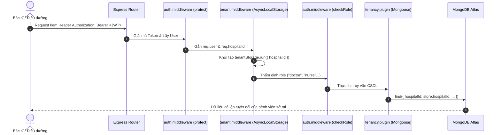

# 🔐 MODULE 01: XÁC THỰC, PHÂN QUYỀN & CÔ LẬP ĐA BỆNH VIỆN (AUTH, RBAC & MULTI-TENANCY)
## DỰ ÁN: NEUROSCAN AI (HEALTHCARE ENTERPRISE PLATFORM)

> **Mục tiêu**: Kiểm toán toàn diện cơ chế đăng nhập, quản lý phiên làm việc, phân quyền theo vai trò (RBAC) và cơ chế cô lập dữ liệu đa cơ sở bệnh viện (Multi-Tenant Isolation) nhằm ngăn ngừa rò rỉ dữ liệu giữa các bệnh viện độc lập và bảo vệ quyền riêng tư của bệnh nhân B2C.

---

## 1. 📂 Danh Mục Mã Nguồn & Vị Trí Trọng Yếu
* **Controllers & Handlers**:
  - `BE/src/modules/auth/auth.controller.js` (Login, Register, Refresh Token, Reset Password, User Locks)
  - `BE/src/modules/hospital/admin.controller.js` (Quản lý User viện, phân quyền viện trưởng)
* **Middlewares & Security Interceptors**:
  - `BE/src/middlewares/auth.middleware.js` (`protect`, `checkRole`)
  - `BE/src/middlewares/tenant.middleware.js` (`tenantStorage`, `tenantContext`)
* **Tenancy Engine & Plugins**:
  - `BE/src/plugins/tenancy.plugin.js` (Tự động tiêm `{ hospitalId }` vào câu truy vấn Mongoose)
  - `BE/src/utils/tenancy.util.js` (`checkPatientTenancy`)
  - `BE/src/utils/authCache.util.js` (Cache vô hiệu hóa phiên tức thời)
* **Data Models**:
  - `BE/src/modules/auth/models/user.model.js` (`role`, `hospitalId`, `isLocked`)
  - `BE/src/modules/hospital/models/hospital.model.js`

---

## 2. 🏗️ Kiến Trúc Vận Hành & Luồng Dữ Liệu (Architecture Flow)



---

## 3. 🎯 Deep Audit Checklist & Các Vectơ Tấn Công Trọng Điểm

### 3.1. Đứt gãy Ngữ cảnh Tenancy (AsyncLocalStorage Context Loss)
- **Vấn đề**: `tenantStorage.getStore()` có thể trả về `undefined` nếu logic chạy trong callback bất đồng bộ của bên thứ ba, `setTimeout`, hoặc các hàm chạy nền không qua middleware.
- **Hậu quả**: Nếu `hospitalId` bị `undefined`, Mongoose plugin có thể bỏ qua bộ lọc và trả về dữ liệu của TOÀN BỘ các bệnh viện khác trên hệ thống.
- **Quy tắc kiểm tra**: Kiểm tra hàm `applyTenancy` trong [tenancy.plugin.js](file:///c:/Users/Administrator/OneDrive/Desktop/team5/BE/src/plugins/tenancy.plugin.js). Phải có cơ chế fail-safe: Nếu `store` không tồn tại mà user không phải là `Super Admin`, truy vấn bắt buộc phải bị ném lỗi hoặc trả về rỗng, tuyệt đối không được phép bỏ qua bộ lọc.

### 3.2. Lỗ hổng IDOR đối với Bệnh Nhân Tự Do B2C (BUG-03)
- **Vấn đề**: Bệnh nhân cài app tự do có `patient.hospitalId === null`.
- **Lỗi logic cũ**: Biểu thức `if (!patient || (patient.hospitalId && patient.hospitalId !== user.hospitalId))` trả về `false` khi `patient.hospitalId` là `null`, khiến bất kỳ nhân viên y tế nào cũng thao túng được hồ sơ B2C.
- **Giải pháp chuẩn hóa**: Sử dụng hàm [checkPatientTenancy](file:///c:/Users/Administrator/OneDrive/Desktop/team5/BE/src/utils/tenancy.util.js):
  ```javascript
  export const checkPatientTenancy = async (patientId, currentUser) => {
    if (currentUser.role === "admin") return true;
    const patient = await User.findById(patientId);
    if (!patient) return false;
    // Bệnh nhân tự do chỉ được truy xuất khi có lượt khám tại viện hoặc là chính họ
    if (!patient.hospitalId) {
      if (currentUser.id.toString() === patientId.toString()) return true;
      const hasVisit = await Visit.exists({ patientId, hospitalId: currentUser.hospitalId });
      return !!hasVisit;
    }
    return patient.hospitalId.toString() === currentUser.hospitalId.toString();
  };
  ```

### 3.3. Thu Hồi Token Tức Thời Khi Khóa Người Dùng (Session Revocation)
- **Vấn đề**: JWT là stateless, khi Admin khóa tài khoản (`isLocked = true`), token còn hạn vẫn có thể gọi API trong 1 giờ.
- **Giải pháp**: Tích hợp `authCache.util.js` trong middleware `protect`. Mỗi request kiểm tra cache bộ nhớ, nếu tài khoản vừa bị khóa thì từ chối ngay lập tức mà không cần query CSDL.

---

## 4. 📋 Copy-Paste Prompt Dành Cho Module 01

```markdown
Bạn là Chuyên gia An toàn Ứng dụng & Kiến trúc sư Multi-Tenancy trong hệ thống Y tế.
Hãy kiểm toán toàn bộ Phân hệ Xác thực, Phân quyền và Cô lập Bệnh viện của dự án NeuroScan AI dựa trên file 01_auth_rbac_tenancy_audit.md.

Tập trung vào:
1. File BE/src/plugins/tenancy.plugin.js: Có bất kỳ kẽ hở nào khiến query Mongoose bỏ lọt ranh giới hospitalId không?
2. File BE/src/utils/tenancy.util.js: Thẩm định hàm checkPatientTenancy đối với 3 trường hợp: (a) Nhân viên cùng viện, (b) Nhân viên viện khác, (c) Bệnh nhân B2C tự do.
3. File BE/src/middlewares/auth.middleware.js: Thẩm định tính nguyên vẹn của hàm checkRole khi nhận mảng nhiều roles.
4. Đưa ra test case tự động mô phỏng việc truy cập chéo viện trái phép và kết quả mong đợi.
```

---

## 5. 🧪 Kịch Bản Kiểm Thử Xác Minh (Automated Verification)
* **File test**: `BE/src/tests/tenancy_and_transaction.test.js`
* **Các ca kiểm thử đã pass**:
  - ✔ Bác sĩ Bệnh viện A truy xuất bệnh nhân Bệnh viện A ➔ Thành công (200).
  - ✔ Bác sĩ Bệnh viện B truy xuất bệnh nhân Bệnh viện A ➔ Bị chặn đứng (403 Forbidden).
  - ✔ Bệnh nhân tự do B2C được bảo vệ, chỉ nhân viên viện có lịch khám mới được xem ➔ Đạt chuẩn an toàn PII.
