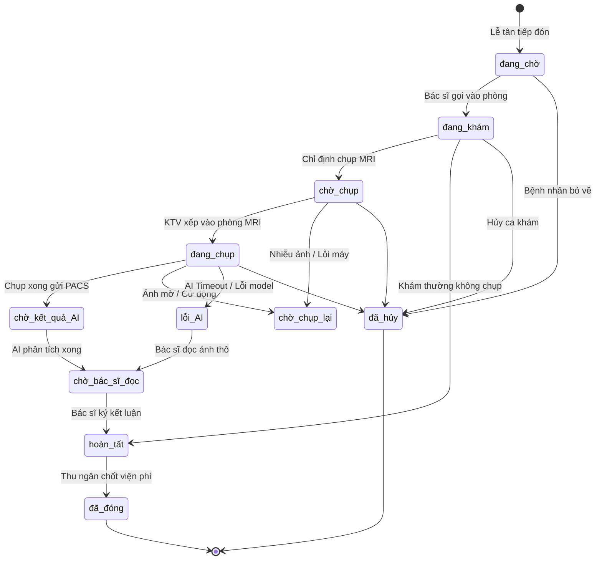

# 🚦 MODULE 03: TIẾP ĐÓN, HÀNG ĐỢI & STATE MACHINE CA KHÁM (VISITS FSM & TIMEZONE)
## DỰ ÁN: NEUROSCAN AI (HEALTHCARE ENTERPRISE PLATFORM)

> **Mục tiêu**: Kiểm toán Vòng đời Ca khám (Patient Visit Lifecycle), Ma trận Kiểm soát Trạng thái Lâm sàng (Clinical Finite State Machine), Thuật toán Phân bổ Hàng đợi Bác sĩ và Xử lý Múi giờ Y tế (Asia/Ho_Chi_Minh GMT+7).

---

## 1. 📂 Danh Mục Mã Nguồn & Vị Trí Trọng Yếu
* **Controllers & Services**:
  - `BE/src/controllers/visit.controller.js` (Quản lý tiếp đón, cập nhật trạng thái, tự động chốt viện phí)
  - `BE/src/services/visit.service.js` (Tải hàng đợi nhân sự, tính số lượng khám ngày, phân luồng bác sĩ/KTV)
* **Routes & Middlewares**:
  - `BE/src/routes/visit.routes.js`
* **Utilities & Timezone**:
  - `BE/src/utils/date.util.js` (`getDayRangeVN`, `formatDateTimeVN`)
* **Data Model**:
  - `BE/src/models/visit.model.js` (Enum trạng thái: `đang chờ`, `đang khám`, `chờ chụp`, `đang chụp`, `chờ kết quả AI`, `chờ bác sĩ đọc`, `hoàn tất`, `đã đóng`, `đã hủy`)

---

## 2. 🏥 Sơ Đồ Chuyển Đổi Trạng Thái Lâm Sàng (Clinical FSM)



---

## 3. 🛡️ Deep Audit Checklist & Các Lỗ Hổng Trọng Điểm

### 3.1. Ma Trận Chặn Nhảy Cóc Trạng Thái (BUG-10)
- **Vấn đề cũ**: Endpoint `PUT /api/v1/visits/:id/status` nhận `status` từ client và gán thẳng `visit.status = status;`.
- **Rủi ro**: Ca khám đang ở trạng thái `đang chờ` có thể bị chuyển thẳng thành `hoàn tất`, tự động sinh hóa đơn viện phí và kết thúc quy trình mà không có bất kỳ dữ liệu khám hay ảnh chụp MRI nào.
- **Giải pháp đã thực hiện**:
  ```javascript
  const ALLOWED_TRANSITIONS = {
    'đang chờ': ['đang khám', 'đã hủy'],
    'đang khám': ['chờ chụp', 'hoàn tất', 'đã hủy'],
    'chờ chụp': ['đang chụp', 'chờ chụp lại', 'đã hủy'],
    'đang chụp': ['chờ kết quả AI', 'chờ chụp lại', 'lỗi AI', 'đã hủy'],
    'chờ kết quả AI': ['chờ bác sĩ đọc', 'chờ chụp lại', 'lỗi AI'],
    'lỗi AI': ['chờ bác sĩ đọc', 'chờ chụp lại'],
    'chờ chụp lại': ['đang chụp', 'đã hủy'],
    'chờ bác sĩ đọc': ['hoàn tất', 'chờ chụp lại'],
    'hoàn tất': ['đã đóng'],
    'đã đóng': [],
    'đã hủy': []
  };
  ```

### 3.2. Lệch Múi Giờ Y Tế Giữa Server Cloud & Việt Nam (BUG-16)
- **Vấn đề**: Docker container chạy mặc định `TZ=UTC`. Lệnh `new Date().setHours(0, 0, 0, 0)` trả về 00:00:00 UTC (tức **07:00:00 sáng tại Việt Nam**).
- **Hậu quả lâm sàng**:
  - Bệnh nhân cấp cứu vào viện trong khoảng **00:00 đến 06:59 sáng giờ VN** có `createdAt` nhỏ hơn 07:00 sáng.
  - Hàng đợi của Điều dưỡng và Bác sĩ dùng bộ lọc `{ createdAt: { $gte: startOfDay } }` sẽ **bỏ sót hoàn toàn** các bệnh nhân này.
  - Hạn mức tiếp đón ngày (`maxPatients`) bị tính lùi về ca trực ngày hôm trước.
- **Giải pháp đã thực hiện**:
  Module [date.util.js](file:///c:/Users/Administrator/OneDrive/Desktop/team5/BE/src/utils/date.util.js) với `getDayRangeVN()`:
  - Format ngày YYYY-MM-DD theo múi giờ `Asia/Ho_Chi_Minh`.
  - Tạo `startOfDay`: `${formattedDate}T00:00:00.000+07:00`
  - Tạo `endOfDay`: `${formattedDate}T23:59:59.999+07:00`

---

## 4. 📋 Copy-Paste Prompt Dành Cho Module 03

```markdown
Bạn là Kỹ sư Trưởng Hệ thống HIS chuyên về Vòng đời Ca khám và Quy trình Lâm sàng.
Hãy kiểm toán toàn bộ Phân hệ Tiếp đón, Hàng đợi và State Machine Ca khám của dự án NeuroScan AI dựa trên file 03_reception_visits_fsm_audit.md.

Tập trung vào:
1. File BE/src/controllers/visit.controller.js: Kiểm tra ma trận ALLOWED_TRANSITIONS trong updateStatus. Có kịch bản lâm sàng nào bị nghẽn luồng không (VD: bệnh nhân chụp lại lần 2, hủy ca giữa chừng)?
2. File BE/src/services/visit.service.js: Rà soát việc sử dụng getDayRangeVN() thay thế cho toàn bộ setHours(0,0,0,0). Có hàm nào còn sót chưa chuẩn hóa múi giờ không?
3. File BE/src/controllers/visit.controller.js: Logic tự động sinh hóa đơn khi ca khám hoàn tất có tính toán đầy đủ tiền khám, tiền chụp MRI, tiền AI và tiền thuốc không?
4. Đưa ra các ca kiểm thử FSM tự động cho các trạng thái kết thúc (Terminal State).
```

---

## 5. 🧪 Kịch Bản Kiểm Thử Xác Minh (Automated Verification)
* **File test**: `BE/src/tests/audit_remediation.test.js` & `clinical_workflow_e2e.test.js`
* **Các ca kiểm thử đã pass**:
  - ✔ `SUITE 1`: `getDayRangeVN` tạo mốc ngày chuẩn xác theo giờ Việt Nam GMT+7.
  - ✔ `SUITE 2`: `ALLOWED_TRANSITIONS` chặn chuyển trạng thái nhảy cóc từ 'đang chờ' sang 'hoàn tất'.
  - ✔ `SUITE 2`: Xác nhận 'đã đóng' và 'đã hủy' là trạng thái đóng hoàn toàn (Terminal States).
