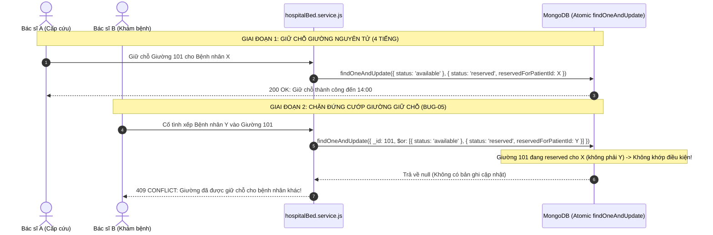

# 🛏️ MODULE 04: BUỒNG BỆNH, GIƯỜNG & CHUYỂN TUYẾN LIÊN BỆNH VIỆN
## DỰ ÁN: NEUROSCAN AI (HEALTHCARE ENTERPRISE PLATFORM)

> **Mục tiêu**: Kiểm toán Phân hệ Quản lý Giường bệnh Nội trú, Cơ chế Khóa Nguyên tử Giữ chỗ Giường cấp cứu (Atomic Bed Reservation), Chống cướp giường (Bed Hijacking) và Quy trình Chuyển viện Liên viện có bảo mật mã hóa token.

---

## 1. 📂 Danh Mục Mã Nguồn & Vị Trí Trọng Yếu
* **Controllers & Services**:
  - `BE/src/modules/hospital/hospitalBed.controller.js` (Thêm giường, giữ chỗ, nhận giường, giải phóng, bản đồ giường)
  - `BE/src/services/hospitalBed.service.js` (Logic nguyên tử Mongoose: `reserveBedAtomicService`, `occupyBedAtomicService`, `releaseBedService`)
  - `BE/src/controllers/transfer.controller.js` (Tạo yêu cầu chuyển viện, kiểm tra năng lực mổ, duyệt/từ chối, cấp token chéo viện)
* **Routes & Guards**:
  - `BE/src/modules/hospital/hospitalBed.routes.js` (Gắn `checkRole` tạo/giữ/nhận/trả giường)
  - `BE/src/routes/transfer.routes.js` (Gắn `checkRole` cho các tuyến chuyển viện)
* **Data Models**:
  - `BE/src/modules/hospital/models/hospitalBed.model.js` (Trạng thái: `available`, `reserved`, `occupied`, `cleaning`, `maintenance`)
  - `BE/src/models/transferForm.model.js` (Phiếu chuyển tuyến y tế)

---

## 2. ⚡ Xử Lý Đồng Thời & Chống Cướp Giường (Concurrency Architecture)



---

## 3. 🛡️ Deep Audit Checklist & Các Lỗ Hổng Trọng Điểm

### 3.1. Thiếu Role Guard Tuyến Giường Bệnh & Chuyển Viện (BUG-04)
- **Vấn đề cũ**: Tuyến API giường bệnh và chuyển viện chỉ dùng `protect`. Bất kỳ người dùng nào có tài khoản (kể cả bệnh nhân hoặc lễ tân) đều có thể gọi:
  - `POST /api/v1/hospital-beds` (Tự ý tạo giường bệnh)
  - `PUT /api/v1/hospital-beds/:id/release` (Tự ý đuổi bệnh nhân ra khỏi giường)
  - `PUT /api/v1/transfers/:id/accept` (Tự ý phê duyệt phiếu chuyển viện liên viện)
- **Giải pháp đã thực hiện**:
  - Gắn `checkRole(["admin", "hospital_admin"])` cho tạo giường.
  - Gắn `checkRole(["doctor", "nurse", "admin", "hospital_admin"])` cho giữ chỗ/nhận giường/trả giường.
  - Gắn `checkRole(["doctor", "admin", "hospital_admin"])` cho tạo và duyệt chuyển viện.

### 3.2. Cướp Giường Giữ Chỗ Tạm Thời (BUG-05)
- **Vấn đề cũ**: `occupyBedAtomicService` cho phép cập nhật nếu `status: { $in: ['available', 'reserved'] }`. Không kiểm tra `reservedForPatientId`.
- **Hậu quả**: Bác sĩ A giữ chỗ riêng cho bệnh nhân tai biến mạch máu não đang trên xe cấp cứu tới viện, nhưng Bác sĩ B ở phòng khám ngoại trú lại bấm xếp bệnh nhân B vào chiếc giường đó thành công.
- **Giải pháp đã thực hiện**:
  ```javascript
  $or: [
    { status: 'available' },
    { 
      status: 'reserved', 
      reservedForPatientId: patientId, 
      reservedUntil: { $gte: new Date() } 
    }
  ]
  ```

### 3.3. Crash Runtime Do Dynamic Import Crypto (BUG-07)
- **Vấn đề cũ**: Tại `transfer.controller.js:grantCrossHospitalView`:
  ```javascript
  // LỖI RUNTIME CRASH 500:
  const { crypto } = await import("crypto");
  const token = crypto.randomBytes(32).toString("hex");
  ```
  Trong Node.js ES Modules, package `"crypto"` không có named export `crypto`. Biến bị `undefined` khiến máy chủ sập mỗi khi cấp quyền xem bệnh án liên viện.
- **Giải pháp đã thực hiện**: Chuyển thành import tĩnh chuẩn `import crypto from "crypto";` ở đầu file.

---

## 4. 📋 Copy-Paste Prompt Dành Cho Module 04

```markdown
Bạn là Chuyên gia Xử lý Đồng thời (Concurrency Specialist) & Kiến trúc sư Ngoại khoa Cấp cứu.
Hãy kiểm toán toàn bộ Phân hệ Buồng bệnh, Giường bệnh và Chuyển viện của dự án NeuroScan AI dựa trên file 04_hospital_beds_transfers_audit.md.

Tập trung vào:
1. File BE/src/services/hospitalBed.service.js: Đánh giá độ an toàn của 3 hàm nguyên tử: reserveBedAtomicService, occupyBedAtomicService, releaseBedService. Có kịch bản Race Condition nào làm 2 bác sĩ cùng nhận 1 giường không?
2. File BE/src/modules/hospital/hospitalBed.routes.js và BE/src/routes/transfer.routes.js: Kiểm tra 100% các endpoint đã được bọc đúng Role Guard chưa?
3. File BE/src/controllers/transfer.controller.js: Kiểm tra luồng cấp token xem chéo viện grantCrossHospitalView. Token có thời hạn không? Có bị thu hồi khi phiếu chuyển viện kết thúc không?
4. Đưa ra test case tự động mô phỏng 10 request đồng thời giữ chỗ cùng 1 giường bệnh.
```

---

## 5. 🧪 Kịch Bản Kiểm Thử Xác Minh (Automated Verification)
* **File test**: `BE/src/tests/audit_remediation.test.js` & `BE/src/services/__tests__/hospitalBed.service.test.js`
* **Các ca kiểm thử đã pass**:
  - ✔ Chặn trùng số giường trong cùng khoa (409 Conflict).
  - ✔ Giữ chỗ giường nguyên tử (Atomic Reserve) thành công.
  - ✔ Chặn Race Condition khi 2 bác sĩ cùng giữ chỗ 1 giường.
  - ✔ `SUITE 3`: Bộ lọc `occupyBedAtomicService` bảo vệ giường giữ chỗ khỏi bị cướp.
