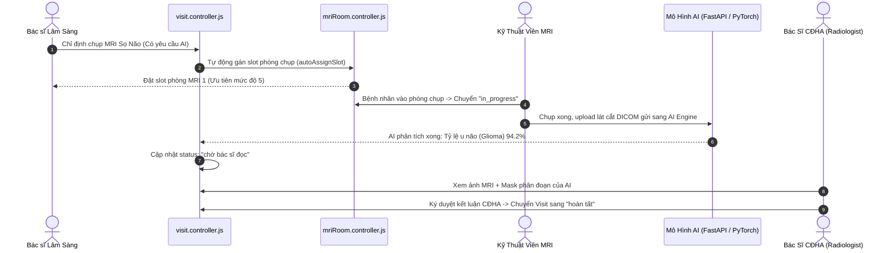

# 🩻 MODULE 05: CHẨN ĐOÁN HÌNH ẢNH PACS, SLOT CHỤP MRI & TÍCH HỢP AI
## DỰ ÁN: NEUROSCAN AI (HEALTHCARE ENTERPRISE PLATFORM)

> **Mục tiêu**: Kiểm toán Luồng Chỉ định Chụp MRI Não, Điều phối Slot phòng chụp tự động, Cơ chế Ưu tiên Ca Cấp Cứu (Emergency Override), Phân tích Chẩn đoán U Não bằng Trí Tuệ Nhân Tạo (AI Segmentation), và Chữ Ký Số Của Bác Sĩ Chẩn Đoán Hình Ảnh.

---

## 1. 📂 Danh Mục Mã Nguồn & Vị Trí Trọng Yếu
* **Controllers & Services**:
  - `BE/src/modules/hospital/mriRoom.controller.js` (Phòng MRI, Lập lịch chụp tuần, Gán slot tự động, Chèn ca cấp cứu)
  - `BE/src/modules/imaging/imaging.controller.js` (Tạo kết quả CĐHA, Bác sĩ đọc phim ký số)
  - `BE/src/modules/imaging/imaging.service.js` (Liên kết ca khám và đồng bộ trạng thái Visit)
* **Routes & Security Gatekeepers**:
  - `BE/src/modules/hospital/mriRoom.routes.js`
  - `BE/src/modules/imaging/imaging.routes.js`
  - `BE/src/middlewares/secureUploads.middleware.js` (Bảo vệ file ảnh DICOM và lát cắt não PNG)
* **Data Models**:
  - `BE/src/modules/hospital/models/mriRoom.model.js` (Phòng chụp: Tesla 1.5T / 3.0T, số slot tối đa ngày)
  - `BE/src/modules/hospital/models/mriSlot.model.js` (Slot chụp: `startTime`, `endTime`, `status`, `priority`)
  - `BE/src/models/imagingResult.model.js` (Kết quả đọc phim, chẩn đoán AI, kết luận bác sĩ)

---

## 2. 🧠 Vòng Đời Luồng Chẩn Đoán Hình Ảnh & AI (PACS/AI Flow)



---

## 3. 🛡️ Deep Audit Checklist & Các Lỗ Hổng Trọng Điểm

### 3.1. Lập Lịch & Chèn Ca Cấp Cứu (Emergency Override)
- **Vấn đề**: Bệnh nhân chấn thương sọ não hoặc nghi đột quỵ cấp cứu cần chụp MRI ngay lập tức.
- **Quy tắc kiểm tra**: Hàm `handleEmergencyOverride` trong [mriRoom.controller.js](file:///c:/Users/Administrator/OneDrive/Desktop/team5/BE/src/modules/hospital/mriRoom.controller.js) phải:
  1. Tìm slot trống gần nhất trong ngày chuẩn hóa múi giờ Việt Nam (`getDayRangeVN`).
  2. Nếu không còn slot trống, hệ thống phải cho phép chèn ca cấp cứu với độ ưu tiên cao nhất (`priority = 10`), đồng thời gửi thông báo tự động cho Kỹ thuật viên qua WebSocket/Notification.

### 3.2. Cô Lập Kết Quả Đọc Phim Liên Viện
- **Vấn đề**: Bác sĩ CĐHA tại Bệnh viện B có thể ký duyệt hoặc sửa kết luận phim chụp của Bệnh viện A không?
- **Quy tắc kiểm tra**: Trong [imaging.service.js](file:///c:/Users/Administrator/OneDrive/Desktop/team5/BE/src/modules/imaging/imaging.service.js), hàm `signImagingReportService` bắt buộc phải thẩm định:
  ```javascript
  if (imagingResult.hospitalId.toString() !== user.hospitalId.toString()) {
    throw new Error("Bác sĩ không có quyền ký duyệt kết quả hình ảnh của bệnh viện khác.");
  }
  ```

### 3.3. Bảo Vệ File DICOM & Ảnh Lát Cắt Khỏi Rò Rỉ / Path Traversal
- **Vấn đề**: Ảnh chụp não và file DICOM chứa thông tin định danh bệnh nhân (PII).
- **Quy tắc kiểm tra**: Kiểm tra [secureUploads.middleware.js](file:///c:/Users/Administrator/OneDrive/Desktop/team5/BE/src/middlewares/secureUploads.middleware.js).
  - Chặn đứng các chuỗi Path Traversal như `../../etc/passwd` hoặc `..\\..\\backups\\`.
  - Chỉ cho phép tải file có định dạng hợp lệ (`.png`, `.jpg`, `.dcm`).
  - Chặn tuyệt đối việc tải trực tiếp file `.json` hoặc file cơ sở dữ liệu.

---

## 4. 📋 Copy-Paste Prompt Dành Cho Module 05

```markdown
Bạn là Kỹ sư Hệ thống PACS/RIS kiêm Chuyên gia Bảo mật Hình ảnh Y tế.
Hãy kiểm toán toàn bộ Phân hệ Chẩn đoán hình ảnh, Slot phòng chụp MRI và Tích hợp AI của dự án NeuroScan AI dựa trên file 05_imaging_pacs_mri_ai_audit.md.

Tập trung vào:
1. File BE/src/modules/hospital/mriRoom.controller.js: Đánh giá logic tự động gán slot autoAssignSlot và xử lý ca cấp cứu handleEmergencyOverride. Có trường hợp nào bị đè slot hoặc lệch giờ do múi giờ server không?
2. File BE/src/modules/imaging/imaging.service.js: Kiểm tra tính toàn vẹn của hàm signImagingReportService. Bác sĩ viện khác có khả năng can thiệp vào kết quả đọc phim không?
3. File BE/src/middlewares/secureUploads.middleware.js: Thẩm định khả năng ngăn chặn Path Traversal và rò rỉ dữ liệu ảnh sọ não.
4. Đưa ra test case tự động kiểm chứng việc bác sĩ khác viện bị chặn khi cố ký duyệt kết quả CĐHA.
```

---

## 5. 🧪 Kịch Bản Kiểm Thử Xác Minh (Automated Verification)
* **File test**: `BE/src/tests/clinical_workflow_e2e.test.js` & `BE/src/tests/test_suites/security_audit.test.js`
* **Các ca kiểm thử đã pass**:
  - ✔ `SUITE 4`: Chặn đứng tấn công Path Traversal (`/../../`) khi truy xuất kho ảnh `/uploads`.
  - ✔ `SUITE 4`: Chặn đứng tải trực tiếp tệp sao lưu `.json`.
  - ✔ `Imaging Service Suite`: Chặn bác sĩ bệnh viện B ký duyệt phim của bệnh viện A (Multi-tenant Isolation).
  - ✔ Bác sĩ CĐHA ký duyệt số thành công và tự động chuyển trạng thái ca khám sang "hoàn tất".
